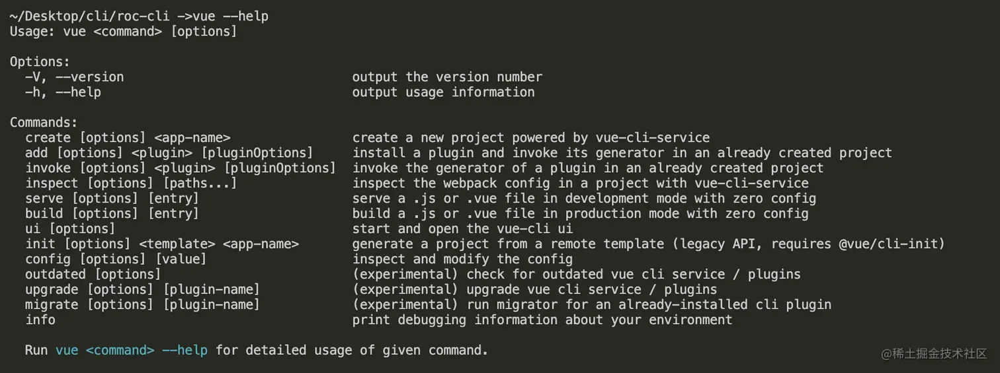
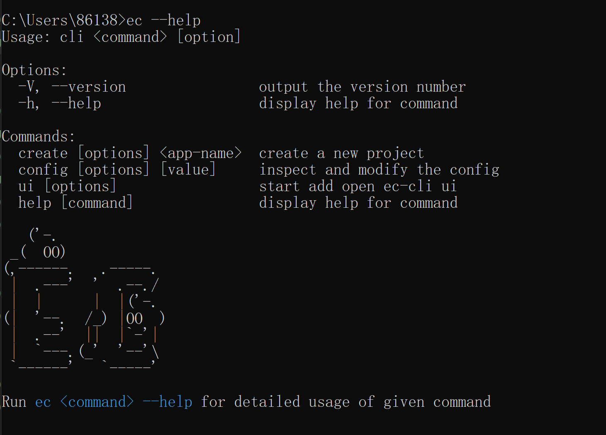
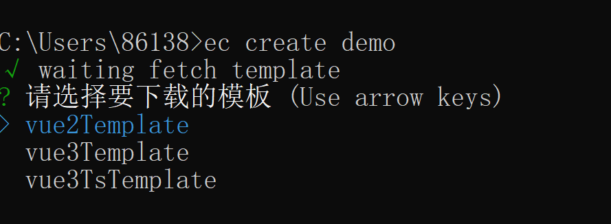
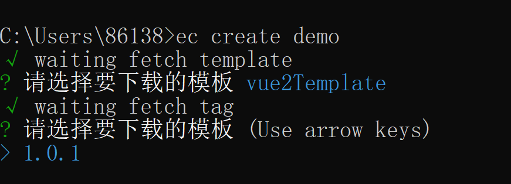
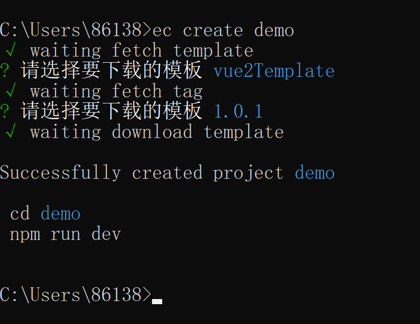
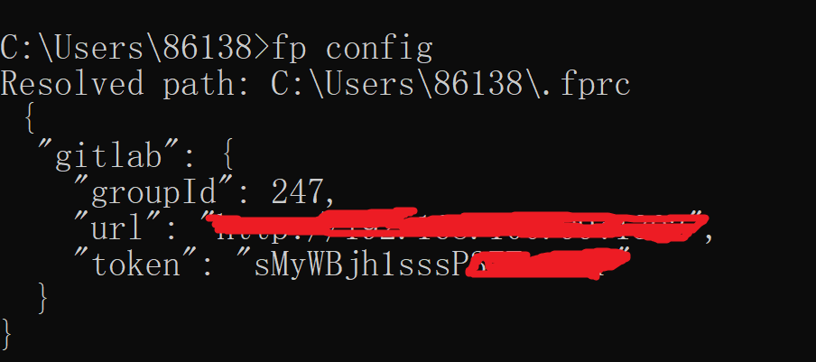

# 搭建脚手架

搭建脚手架的目的就是快速的搭建项目的基本结构并提供项目规范和约定。目前日常工作中常用的脚手架有 vue-cli、create-react-app、angular-cli 等等，都是通过简单的初始化命令，完成内容的快速构建。

本文介绍两种 vue 搭建的脚手架，一种是基于 github 的模板代码进行搭建的，另一种是基于 gitlab 的模板代码进行搭建。

## 1、基于 github （[ec-cli](https://github.com/cl4u/ec-cli)）

### 1.1 创建项目

```
mkdir ec-cli
cd ec-cli
npm init
```

先看下结构

```bash
ec-cli
|── bin
|    ├─ cli.js # 启动文件
|── README.md
└── package.json
```

配置脚手架启动文件

```json
{
  "name": "easycoding-cli",
  "version": "1.0.1",
  "description": "about cli",
  "main": "index.js",
  "bin": {
    "ec": "./bin/cli.js"
  },
  "scripts": {
    "test": "echo \"Error: no test specified\" && exit 1"
  },
  "files": ["bin", "lib"],
  "keywords": ["ec-cli", "ec", "脚手架"],
  "author": "rk",
  "license": "ISC",
  "dependencies": {
    "axios": "^0.21.1",
    "chalk": "^4.1.1",
    "commander": "^7.2.0",
    "download-git-repo": "^3.0.2",
    "figlet": "^1.5.0",
    "fs-extra": "^11.2.0",
    "inquirer": "^8.2.0",
    "ora": "^5.4.0"
  }
}
```

cli.js 文件

```js
#! /usr/bin/env node

console.log("this is ec-cli");
```

为了方便开发调试，我们使用`npm link`链接到全局

```
npm link
```

### 1.2 创建脚手架启动命令

#### 1.2.1 安装依赖

```
npm install commander --save
```

#### 1.2.2 创建命令

打开 cli.js 文件

```js
#! /usr/bin/env node

program
  // 定义命令和参数
  .command("create <app-name>")
  .description("create a new project")
  // -f or --force 为强制创建，如果创建的目录存在则直接覆盖
  .option("-f, --force", "overwrite target directory if it exist")
  .action((name, options) => {
    // 打印执行结果
    console.log("name:", name, "options:", options);
  });

program
  // 配置版本号信息
  .version(`v${require("../package.json").version}`)
  .usage("<command> [option]");

// 解析用户执行命令传入参数
program.parse(process.argv);
```

#### 1.2.3 执行命令

创建 lib 文件夹并在该文件下创建 create.js

```js
module.exports = async function (name, options) {
  // 验证是否正常取到值
  console.log("create.js", name, options);
};
```

在 cli.js 中使用 create.js

```js
#! /usr/bin/env node

program
  // 定义命令和参数
  .command("create <app-name>")
  .description("create a new project")
  // -f or --force 为强制创建，如果创建的目录存在则直接覆盖
  .option("-f, --force", "overwrite target directory if it exist")
  .action((name, options) => {
    // 在 create.js 中执行创建任务
    require("../lib/create.js")(name, options);
  });

program
  // 配置版本号信息
  .version(`v${require("../package.json").version}`)
  .usage("<command> [option]");

// 解析用户执行命令传入参数
program.parse(process.argv);
```

在创建目录的时候，需要考虑目录是否已经存在？

1、如果存在，

- 当 {force: true}时，直接移除原来的目录，直接创建
- 当 {force: false}时，询问用户是否需要覆盖

2、如果不存在，则直接创建

这里用到了 fs 的扩展工具 fs-extra,先安装

```
npm i fs-extra --save
```

接着完善 create.js 内部逻辑

```js
const path = require("path");
const fs = require("fs-extra");
module.exports = async function (name, options) {
  // 当前命令行选择的目录
  const cwd = process.cwd();
  // 需要创建的目录地址
  const targetAir = path.join(cwd, name);

  // 目录是否已经存在？
  if (fs.existsSync(targetAir)) {
    // 是否为强制创建？
    if (options.force) {
      await fs.remove(targetAir);
    } else {
      // TODO：询问用户是否确定要覆盖
    }
  }
};
```

#### 1.2.4 完善帮助信息

我们先看一下 vue-cli 执行 --help 打印的信息



对比 ec-help 打印的结果，结尾处少了一条说明信息，说明信息是带有颜色的，这里就需要用到我们工具库里边的 chalk 来处理.

```js
#! /usr/bin/env node

program
  // 定义命令和参数
  .command("create <app-name>")
  .description("create a new project")
  // -f or --force 为强制创建，如果创建的目录存在则直接覆盖
  .option("-f, --force", "overwrite target directory if it exist")
  .action((name, options) => {
    // 在 create.js 中执行创建任务
    require("../lib/create.js")(name, options);
  });

program
  // 监听 --help 执行
  .on("--help", () => {
    // 新增说明信息
    console.log(
      `\r\nRun ${chalk.cyan(
        `ec <command> --help`
      )} for detailed usage of given command\r\n`
    );
  });

program
  // 配置版本号信息
  .version(`v${require("../package.json").version}`)
  .usage("<command> [option]");

// 解析用户执行命令传入参数
program.parse(process.argv);
```

#### 1.2.5 打印 logo

如果此时我们想给脚手架整个 logo，工具库里的 figlet 可以帮忙。

```js
#! /usr/bin/env node

program
  // 定义命令和参数
  .command("create <app-name>")
  .description("create a new project")
  // -f or --force 为强制创建，如果创建的目录存在则直接覆盖
  .option("-f, --force", "overwrite target directory if it exist")
  .action((name, options) => {
    // 在 create.js 中执行创建任务
    require("../lib/create.js")(name, options);
  });

// 配置config命令
program
  .command("config [value]")
  .description("inspect and modify the config")
  .option("-g, --get <path>", "get value from option")
  .option("-s, --set <path> <value>")
  .option("-d, --delete <path>", "delete option from config")
  .action((value, options) => {
    console.log(value, options);
  });

// 配置ui命令
program
  .command("ui")
  .description("start add open ec-cli ui")
  .option("-p,--port <port>", "Port used for the UI Server")
  .action((option) => {
    console.log(option);
  });

program.on("--help", () => {
  // 使用 figlet 绘制 Logo
  console.log(
    "\r\n" +
      figlet.textSync("ec", {
        font: "Ghost",
        horizontalLayout: "default",
        verticalLayout: "default",
        width: 80,
        whitespaceBreak: true,
      })
  );
  // 新增说明信息
  console.log(`\r\nRun ${chalk.cyan(`ec <command> --help`)} show details\r\n`);
});

program
  // 配置版本号信息
  .version(`v${require("../package.json").version}`)
  .usage("<command> [option]");

// 解析用户执行命令传入参数
program.parse(process.argv);
```



### 1.3 询问用户问题获取创建所需信息

这里使用 inquirer 来解决交互问题。

#### 1.3.1 询问是否覆盖已存在的目录

解决之前遗留的问题，如果目录已存在后续内容：

安装 inquirer

```
npm i inquirer --save
```

```js
const path = require("path");
const fs = require("fs-extra");
const inquirer = require("inquirer");

module.exports = async function (name, options) {
  // 当前命令行选择的目录
  const cwd = process.cwd();
  // 需要创建的目录地址
  const targetAir = path.join(cwd, name);

  // 目录是否已经存在？
  if (fs.existsSync(targetAir)) {
    // 是否为强制创建？
    if (options.force) {
      await fs.remove(targetAir);
    } else {
      // 询问用户是否确定要覆盖
      let { action } = await inquirer.prompt([
        {
          name: "action",
          type: "list",
          message: "Target directory already exists Pick an action:",
          choices: [
            {
              name: "Overwrite",
              value: "overwrite",
            },
            {
              name: "Cancel",
              value: false,
            },
          ],
        },
      ]);

      if (!action) {
        return;
      } else if (action === "overwrite") {
        // 移除已存在的目录
        console.log(`\r\nRemoving...`);
        await fs.remove(targetAir);
      }
    }
  }
};
```

#### 1.3.2 如何获取模板信息

模板我已经上传到远程仓库: [模板地址](https://github.com/orgs/ec-cli/repositories)

github 提供了接口

- 获取模板信息：https://api.github.com/orgs/ec-cli/repos
- 获取版本信息：https://api.github.com/repos/ec-cli/$%7Brepo%7D/tags

我们在 lib 目录下创建一个 http.js 专门处理模板和版本信息的获取

```js
// lib/http.js

// 通过 axios 处理请求
const axios = require("axios");

axios.interceptors.response.use((res) => {
  return res.data;
});

/**
 * 获取模板列表
 * @returns Promise
 */
async function getRepoList() {
  return axios.get("https://api.github.com/orgs/ec-cli/repos");
}

/**
 * 获取版本信息
 * @param {string} repo 模板名称
 * @returns Promise
 */
async function getTagList(repo) {
  return axios.get(`https://api.github.com/repos/ec-cli/${repo}/tags`);
}

module.exports = {
  getRepoList,
  getTagList,
};
```

#### 1.3.3 用户选择模板

新建一个 lib/Generator.js 来处理项目创建逻辑

```js
class Generator {
  constructor(name, targetDir) {
    // 目录名称
    this.name = name;
    // 创建位置
    this.targetDir = targetDir;
  }

  // 核心创建逻辑
  create() {}
}

module.exports = Generator;
```

在 create.js 中引入 Generator 类

```js
// lib/create.js

...
const Generator = require('./Generator')

module.exports = async function (name, options) {
  // 执行创建命令

  // 当前命令行选择的目录
  const cwd  = process.cwd();
  // 需要创建的目录地址
  const targetAir  = path.join(cwd, name)

  // 目录是否已经存在？
  if (fs.existsSync(targetAir)) {
    ...
  }

  // 创建项目
  const generator = new Generator(name, targetAir);

  // 开始创建项目
  generator.create()
}
```

接着来写询问用户选择模版都逻辑

```js
// lib/Generator.js

const { getRepoList } = require("./http");
const ora = require("ora");
const inquirer = require("inquirer");

// 添加加载动画
async function wrapLoading(fn, message, ...args) {
  // 使用 ora 初始化，传入提示信息 message
  const spinner = ora(message);
  // 开始加载动画
  spinner.start();

  try {
    // 执行传入方法 fn
    const result = await fn(...args);
    // 状态为修改为成功
    spinner.succeed();
    return result;
  } catch (error) {
    // 状态为修改为失败
    spinner.fail("Request failed, refetch ...");
  }
}

class Generator {
  constructor(name, targetDir) {
    // 目录名称
    this.name = name;
    // 创建位置
    this.targetDir = targetDir;
  }

  // 获取用户选择的模板
  // 1）从远程拉取模板数据
  // 2）用户选择自己新下载的模板名称
  // 3）return 用户选择的名称

  async getRepo() {
    // 1）从远程拉取模板数据
    const repoList = await wrapLoading(getRepoList, "waiting fetch template");
    if (!repoList) return;

    // 过滤我们需要的模板名称
    const repos = repoList.map((item) => item.name);

    // 2）用户选择自己新下载的模板名称
    const { repo } = await inquirer.prompt({
      name: "repo",
      type: "list",
      choices: repos,
      message: "Please choose a template to create project",
    });

    // 3）return 用户选择的名称
    return repo;
  }

  // 核心创建逻辑
  // 1）获取模板名称
  // 2）获取 tag 名称
  // 3）下载模板到模板目录
  async create() {
    // 1）获取模板名称
    const repo = await this.getRepo();

    console.log("用户选择了，repo=" + repo);
  }
}

module.exports = Generator;
```



#### 1.3.4 用户选择版本

```js
// lib/generator.js

const { getRepoList, getTagList } = require('./http')
...

// 添加加载动画
async function wrapLoading(fn, message, ...args) {
  ...
}

class Generator {
  constructor (name, targetDir){
    // 目录名称
    this.name = name;
    // 创建位置
    this.targetDir = targetDir;
  }

  // 获取用户选择的模板
  // 1）从远程拉取模板数据
  // 2）用户选择自己新下载的模板名称
  // 3）return 用户选择的名称

  async getRepo() {
    ...
  }

  // 获取用户选择的版本
  // 1）基于 repo 结果，远程拉取对应的 tag 列表
  // 2）用户选择自己需要下载的 tag
  // 3）return 用户选择的 tag

  async getTag(repo) {
    // 1）基于 repo 结果，远程拉取对应的 tag 列表
    const tags = await wrapLoading(getTagList, 'waiting fetch tag', repo);
    if (!tags) return;

    // 过滤我们需要的 tag 名称
    const tagsList = tags.map(item => item.name);

    // 2）用户选择自己需要下载的 tag
    const { tag } = await inquirer.prompt({
      name: 'tag',
      type: 'list',
      choices: tagsList,
      message: 'Place choose a tag to create project'
    })

    // 3）return 用户选择的 tag
    return tag
  }

  // 核心创建逻辑
  // 1）获取模板名称
  // 2）获取 tag 名称
  // 3）下载模板到模板目录
  async create(){

    // 1）获取模板名称
    const repo = await this.getRepo()

    // 2) 获取 tag 名称
    const tag = await this.getTag(repo)

    console.log('用户选择了，repo=' + repo + '，tag='+ tag)
  }
}

module.exports = Generator;

```



### 1.4 下载远程模板

下载远程模板需要使用 download-git-repo 工具包，实际上它也在我们上面列的工具菜单上，但是在使用它的时候，需要注意一个问题，就是它不支持 promise 的，所以我们需要使用 util 模块中的 promisify 方法对其进行 promise 化。

#### 1.4.1 安装依赖与 promise 化

```
npm i download-git-repo --save
```

进行 promise 化处理

```js
// lib/Generator.js

...
const util = require('util')
const downloadGitRepo = require('download-git-repo') // 不支持 Promise

class Generator {
  constructor (name, targetDir){
    ...

    // 对 download-git-repo 进行 promise 化改造
    this.downloadGitRepo = util.promisify(downloadGitRepo);
  }

  ...
}
```

#### 1.4.2 核心下载功能

```js
// lib/Generator.js

...
const util = require('util')
const path = require('path')
const downloadGitRepo = require('download-git-repo') // 不支持 Promise

// 添加加载动画
async function wrapLoading(fn, message, ...args) {
  ...
}

class Generator {
  constructor (name, targetDir){
    ...

    // 对 download-git-repo 进行 promise 化改造
    this.downloadGitRepo = util.promisify(downloadGitRepo);
  }
  ...

  // 下载远程模板
  // 1）拼接下载地址
  // 2）调用下载方法
  async download(repo, tag){

    // 1）拼接下载地址
    const requestUrl = `ec-cli/${repo}${tag?'#'+tag:''}`;

    // 2）调用下载方法
    await wrapLoading(
      this.downloadGitRepo, // 远程下载方法
      'waiting download template', // 加载提示信息
      requestUrl, // 参数1: 下载地址
      path.resolve(process.cwd(), this.targetDir)) // 参数2: 创建位置
  }

  // 核心创建逻辑
  // 1）获取模板名称
  // 2）获取 tag 名称
  // 3）下载模板到模板目录
  // 4）模板使用提示
  async create(){

    // 1）获取模板名称
    const repo = await this.getRepo()

    // 2) 获取 tag 名称
    const tag = await this.getTag(repo)

    // 3）下载模板到模板目录
    await this.download(repo, tag)

    // 4）模板使用提示
    console.log(`\r\nSuccessfully created project ${chalk.cyan(this.name)}`)
    console.log(`\r\n  cd ${chalk.cyan(this.name)}`)
    console.log('  npm run dev\r\n')
  }
}

module.exports = Generator;

```



### 1.5 发布项目

实际使用时，需要发布到 npm 仓库，通过全局安装然后创建项目。

```json
{
  "name": "easycoding-cli",
  "version": "1.0.1",
  "description": "about cli",
  "main": "index.js",
  "bin": {
    "ec": "./bin/cli.js"
  },
  "scripts": {
    "test": "echo \"Error: no test specified\" && exit 1"
  },
  "files": ["bin", "lib"],
  "keywords": ["ec-cli", "ec", "脚手架"],
  "author": "rk",
  "license": "ISC",
  "dependencies": {
    "axios": "^0.21.1",
    "chalk": "^4.1.1",
    "commander": "^7.2.0",
    "download-git-repo": "^3.0.2",
    "figlet": "^1.5.0",
    "fs-extra": "^11.2.0",
    "inquirer": "^8.2.0",
    "ora": "^5.4.0"
  }
}
```

使用`npm publish`发布

## 2、基于 gitlab

和第一种大概流程是一致的，只是在获取模板处有差异。

需要将模板放在一个 group 下，需要使用 groupId，设置 token，

- 获取 gitlab 某个组下的所有仓库列表: https://gitlab.xxxxx.cn/api/v4/groups/${groupId}/projects
- 获取 gitlab 某个项目的所有分支: https://gitlab.xxxxx.cn/api/v4//projects/${repoId}/repository/branches



token 设置，在个人 -> settings -> Access Tokens 中进行设置。
