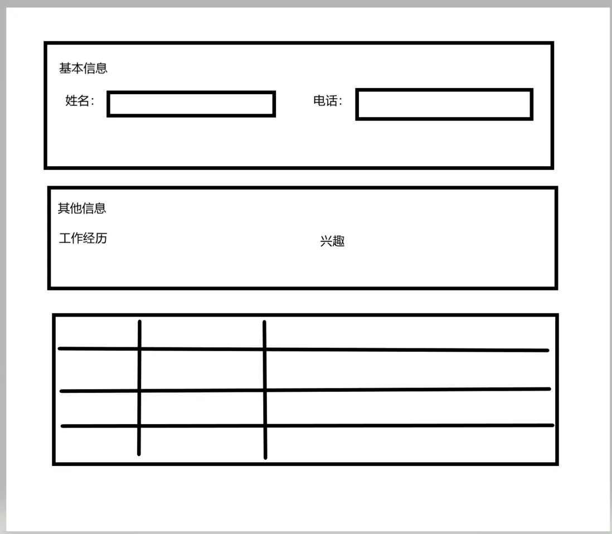

# elementUI 多个表单同时提交校验问题

项目中遇到新增页面时，由于页面内容复杂，不只是表单内容，还有表格等，这时把 form 表单分成多个，但是在提交时会进行校验，再次记录下。
如下所示：



基本信息表单名称是:basicForm

其他信息表单名称是：otherForm

表格中的所有数据都是可编辑的，用一个大的表单包起来，名称是：tableForm

现在提交时，要对页面中的三个 form 进行校验，没有问题之后才能调用接口。

其实中心思想用的是 promise.all，对所有的表单进行校验没问题，进入到.then()中处理提交接口逻辑。

```vue
<script>
  export default {
    methods: {
      async submitForm() {
        try {
          await Promise.all([
            this.$refs.basicForm.validate(),
            this.$refs.otherForm.validate(),
            this.$refs.tableForm.validate(),
          ]);
        } catch (err) {
          return;
        }
      },
    },
  };
</script>
```
