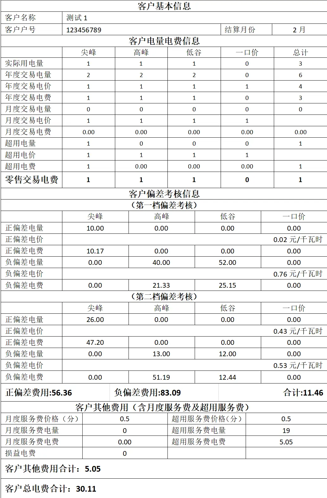

# 用 element 开发一个复杂表格

先上原型图，用 element 制作一个类似这样的表格，刚开始想的是用一个表格去实现，然而...想多了，最后用多个表格堆积完成，（注：只关注表格实现，表格中所有数据都是捏造的。）



我们从上往下对表格进行分解。

## 1、客户基本信息表格

:::tip 说明
此表格主要做以下操作，1、删除生成表格的第一行空表格（为什么会有空行，还没明白，有知道的伙伴可以留言告知），2、合并客户名称值的列，3、将客户名称值字段靠左显示
:::

```vue
<template>
  <el-table
    :data="tableData"
    size="mini"
    class="mt10 tableBaseInfo"
    :header-row-class-name="hiddenHeaderRow"
    :span-method="arraySpanMethod1"
    :cell-class-name="setTextLeft"
  >
    <el-table-column label="客户基本信息" align="center">
      <el-table-column prop="name" align="center"></el-table-column>
      <el-table-column prop="nameValue" align="center"></el-table-column>
      <el-table-column prop="month" align="center"></el-table-column>
      <el-table-column prop="monthValue" align="center"></el-table-column>
    </el-table-column>
  </el-table>
</template>
<script>
  export default {
    data() {
      return {
        tableData: [
          {
            name: "客户名称",
            nameValue: "测试1",
            month: "",
            monthValue: "",
          },
          {
            name: "客户户号",
            nameValue: "123456789",
            month: "结算月份",
            monthValue: "2",
          },
        ],
      };
    },
    methods: {
      // 隐藏表格空的行--这块的原因还没搞清楚，生成的表格会有一行是空的
      hiddenHeaderRow({ rowIndex }) {
        if (rowIndex == 1) {
          //隐藏第二行
          return "hiddenClass";
        }
      },
      // 合并客户基本信息表格客户名称单元格
      arraySpanMethod1({ rowIndex, columnIndex }) {
        if (rowIndex == 0) {
          if (columnIndex != 0) {
            return [1, 3];
          }
        }
      },
      // 设置客户基本信息表格客户名称靠左显示
      setTextLeft({ rowIndex, columnIndex }) {
        if (rowIndex == 0) {
          if (columnIndex != 0) {
            return "textAlignLeft";
          }
        }
      },
    },
  };
</script>
```

## 2、客户电量电费信息表格

:::tip 说明
这个表格和正常表格一样开发就行，只是最后一行是字体加粗，颜色有设置，在 table 上添加:cell-class-name="setTextWeight"属性，在方法中对 setTextWeight 进行设置即可，然后设置 text-set 样式即可。
:::

```javascript
// 设置客户电量电费信息中零售交易电费加粗显示
setTextWeight({ rowIndex, columnIndex }) {
  if (rowIndex == 10) {
    return "text-set";
  }
},

```

## 3、客户偏差考核信息

:::tip 操作
1、合并单元格

2、文案靠右显示
:::

```javascript
// 设置第一档和第二档正偏差电价、负偏差电价靠右显示
setTextRight({ rowIndex, columnIndex }) {
  if (rowIndex == 1 || rowIndex == 4) {
    if (columnIndex != 0) {
      return "textAlignRight";
    }
  }
},
// 设置第一档和第二档正偏差电价、负偏差电价合并单元格
arraySpanMethod2({ rowIndex, columnIndex }) {
  // 表示行数，不包含表头行数
  if (rowIndex == 1 || rowIndex == 4) {
    // 去掉第一列之后的所有列进行合并
    if (columnIndex != 0) {
      return [1, 4];
    }
  }
},

```

## 4、客户其他费用

:::tip 操作

1、合并单元格

2、文案靠左显示

3、文案颜色，宽度设置
:::

```javascript
// 合并客户其他费用中最后两行
arraySpanMethod3({ rowIndex, columnIndex }) {
  if (rowIndex == 4 || rowIndex == 5) {
    return [1, 4];
  }
},
// 设置客户其他费用中最后两行字体加粗
setCustomTextLeft({ rowIndex, columnIndex }) {
  if (rowIndex == 4 || rowIndex == 5) {
    return "textCustomAlignLeft";
  }
},

```

整体代码实现如下：

```vue
<template>
  <el-table
    :data="tableData"
    size="mini"
    class="mt10 tableBaseInfo"
    :header-row-class-name="hiddenHeaderRow"
    :span-method="arraySpanMethod1"
    :cell-class-name="setTextLeft"
  >
    <el-table-column label="客户基本信息" align="center">
      <el-table-column prop="name" align="center"></el-table-column>
      <el-table-column prop="nameValue" align="center"></el-table-column>
      <el-table-column prop="month" align="center"></el-table-column>
      <el-table-column prop="monthValue" align="center"></el-table-column>
    </el-table-column>
  </el-table>
  <el-table
    :data="tableData1"
    size="mini"
    class="no-header-only"
    :cell-class-name="setTextWeight"
  >
    <el-table-column label="客户电量电费信息" align="center">
      <el-table-column prop="name" align="center" lable=""></el-table-column>
      <el-table-column
        prop="sharpVal"
        align="center"
        label="尖峰"
      ></el-table-column>
      <el-table-column
        prop="peakVal"
        align="center"
        label="高峰"
      ></el-table-column>
      <el-table-column
        prop="valleyVal"
        align="center"
        label="低谷"
      ></el-table-column>
      <el-table-column
        prop="fixedVal"
        align="center"
        label="一口价"
      ></el-table-column>
      <el-table-column
        prop="total"
        align="center"
        label="总计"
      ></el-table-column>
    </el-table-column>
  </el-table>
  <el-table size="mini" class="no-data">
    <el-table-column label="客户偏差考核信息" align="center"> </el-table-column>
  </el-table>
  <el-table
    :data="tableData2"
    size="mini"
    class="firstAppraisal no-header-only"
    :span-method="arraySpanMethod2"
    :cell-class-name="setTextRight"
  >
    <el-table-column label="(第一档偏差考核)" align="center">
      <el-table-column prop="name" align="center" lable=""></el-table-column>
      <el-table-column
        prop="sharpVal"
        align="center"
        label="尖峰"
      ></el-table-column>
      <el-table-column
        prop="peakVal"
        align="center"
        label="高峰"
      ></el-table-column>
      <el-table-column
        prop="valleyVal"
        align="center"
        label="低谷"
      ></el-table-column>
      <el-table-column
        prop="fixedVal"
        align="center"
        label="一口价"
      ></el-table-column>
    </el-table-column>
  </el-table>
  <el-table
    :data="tableData3"
    size="mini"
    class="firstAppraisal no-header-only"
    :span-method="arraySpanMethod2"
    :cell-class-name="setTextRight"
  >
    <el-table-column label="(第二档偏差考核)" align="center">
      <el-table-column prop="name" align="center" lable=""></el-table-column>
      <el-table-column
        prop="sharpVal"
        align="center"
        label="尖峰"
      ></el-table-column>
      <el-table-column
        prop="peakVal"
        align="center"
        label="高峰"
      ></el-table-column>
      <el-table-column
        prop="valleyVal"
        align="center"
        label="低谷"
      ></el-table-column>
      <el-table-column
        prop="fixedVal"
        align="center"
        label="一口价"
      ></el-table-column>
    </el-table-column>
  </el-table>
  <el-table size="mini" class="no-header" :data="tableData4" border>
    <el-table-column label="" align="center" prop="positionVal">
      <template slot-scope="scope">
        <span class="text-set">正偏差费用: {{ scope.row.positionVal }}</span>
      </template>
    </el-table-column>
    <el-table-column label="" align="center" prop="nagitiveVal">
      <template slot-scope="scope">
        <span class="text-set">负偏差费用: {{ scope.row.nagitiveVal }}</span>
      </template>
    </el-table-column>
    <el-table-column label="" align="center" prop="totalVal">
      <template slot-scope="scope">
        <span class="text-set">合计: {{ scope.row.totalVal }}</span>
      </template>
    </el-table-column>
  </el-table>
  <el-table
    :data="tableData5"
    size="mini"
    class="tableBaseInfo no-header-only"
    :span-method="arraySpanMethod3"
    :header-cell-style="{ 'text-align': 'center' }"
    :header-row-class-name="hiddenHeaderRow"
    :cell-class-name="setCustomTextLeft"
  >
    <el-table-column label="客户其他费用（含月度服务费及超用服务费）">
      <el-table-column prop="name1" align="center"></el-table-column>
      <el-table-column prop="value1" align="center"></el-table-column>
      <el-table-column prop="name2" align="center"></el-table-column>
      <el-table-column prop="value2" align="center"></el-table-column>
    </el-table-column>
  </el-table>
</template>
<script>
  export default {
    data() {
      return {
        tableData: [
          {
            name: "客户名称",
            nameValue: "xxxxxx",
            month: "",
            monthValue: "",
          },
          {
            name: "客户户号",
            nameValue: "123456",
            month: "结算月份",
            monthValue: "2",
          },
        ],
        tableData1: [
          {
            name: "实际用电量",
            sharpVal: "1",
            peakVal: "1",
            valleyVal: "1",
            fixedVal: "1",
            total: "1",
          },
          {
            name: "年度交易电量",
            sharpVal: "2",
            peakVal: "2",
            valleyVal: "2",
            fixedVal: "2",
            total: "2",
          },
          {
            name: "年度交易电价",
            sharpVal: "2",
            peakVal: "2",
            valleyVal: "2",
            fixedVal: "2",
            total: "2",
          },
          {
            name: "年度交易电费",
            sharpVal: "2",
            peakVal: "2",
            valleyVal: "2",
            fixedVal: "2",
            total: "2",
          },
          {
            name: "月度交易电量",
            sharpVal: "2",
            peakVal: "2",
            valleyVal: "2",
            fixedVal: "2",
            total: "2",
          },
          {
            name: "月度交易电价",
            sharpVal: "2",
            peakVal: "2",
            valleyVal: "2",
            fixedVal: "2",
            total: "2",
          },
          {
            name: "月度交易电费",
            sharpVal: "2",
            peakVal: "2",
            valleyVal: "2",
            fixedVal: "2",
            total: "2",
          },
          {
            name: "超用电量",
            sharpVal: "2",
            peakVal: "2",
            valleyVal: "2",
            fixedVal: "2",
            total: "2",
          },
          {
            name: "超用电价",
            sharpVal: "2",
            peakVal: "2",
            valleyVal: "2",
            fixedVal: "2",
            total: "2",
          },
          {
            name: "超用电费",
            sharpVal: "2",
            peakVal: "2",
            valleyVal: "2",
            fixedVal: "2",
            total: "2",
          },
          {
            name: "零售交易电费",
            sharpVal: "3",
            peakVal: "3",
            valleyVal: "3",
            fixedVal: "3",
            total: "3",
          },
        ],
        tableData2: [
          {
            name: "正偏差电量",
            sharpVal: "1",
            peakVal: "1",
            valleyVal: "1",
            fixedVal: "1",
          },
          {
            name: "正偏差电价",
            sharpVal: "2 元/千瓦时",
            peakVal: "",
            valleyVal: "",
            fixedVal: "",
          },
          {
            name: "正偏差电费",
            sharpVal: "3",
            peakVal: "3",
            valleyVal: "3",
            fixedVal: "3",
          },
          {
            name: "负偏差电量",
            sharpVal: "1",
            peakVal: "1",
            valleyVal: "1",
            fixedVal: "1",
          },
          {
            name: "负偏差电价",
            sharpVal: "2 元/千瓦时",
            peakVal: "",
            valleyVal: "",
            fixedVal: "",
          },
          {
            name: "负偏差电费",
            sharpVal: "3",
            peakVal: "3",
            valleyVal: "3",
            fixedVal: "3",
          },
        ],
        tableData3: [
          {
            name: "正偏差电量",
            sharpVal: "1",
            peakVal: "1",
            valleyVal: "1",
            fixedVal: "1",
          },
          {
            name: "正偏差电价",
            sharpVal: "2 元/千瓦时",
            peakVal: "",
            valleyVal: "",
            fixedVal: "",
          },
          {
            name: "正偏差电费",
            sharpVal: "3",
            peakVal: "3",
            valleyVal: "3",
            fixedVal: "3",
          },
          {
            name: "负偏差电量",
            sharpVal: "1",
            peakVal: "1",
            valleyVal: "1",
            fixedVal: "1",
          },
          {
            name: "负偏差电价",
            sharpVal: "2 元/千瓦时",
            peakVal: "",
            valleyVal: "",
            fixedVal: "",
          },
          {
            name: "负偏差电费",
            sharpVal: "3",
            peakVal: "3",
            valleyVal: "3",
            fixedVal: "3",
          },
        ],
        tableData4: [
          {
            positionVal: "200.03",
            nagitiveVal: "300.05",
            totalVal: "500.09",
          },
        ],
        tableData5: [
          {
            name1: "月度服务费价格（分）",
            value1: "0.5",
            name2: "超用服务费价格（分）",
            value2: "0.5",
          },
          {
            name1: "月度服务费电量",
            value1: "0",
            name2: "超用服务费电量",
            value2: "12345",
          },
          {
            name1: "月度服务费电费",
            value1: "0.5",
            name2: "超用服务费电费",
            value2: "27.95",
          },
          {
            name1: "损益电费",
            value1: "0.5",
            name2: "",
            value2: "",
          },
          {
            name1: "客户其他费用合计：54.05",
            value1: "",
            name2: "",
            value2: "",
          },
          {
            name1: "客户总电费合计：38540.11",
            value1: "",
            name2: "",
            value2: "",
          },
        ],
      };
    },
    methods: {
      // 隐藏表格空的行
      hiddenHeaderRow({ rowIndex }) {
        if (rowIndex == 1) {
          //隐藏第二行
          return "hiddenClass";
        }
      },
      // 合并客户基本信息表格客户名称单元格
      arraySpanMethod1({ rowIndex, columnIndex }) {
        if (rowIndex == 0) {
          if (columnIndex != 0) {
            return [1, 3];
          }
        }
      },
      // 设置客户基本信息表格客户名称靠左显示
      setTextLeft({ rowIndex, columnIndex }) {
        if (rowIndex == 0) {
          if (columnIndex != 0) {
            return "textAlignLeft";
          }
        }
      },
      // 设置客户电量电费信息中零售交易电费加粗显示
      setTextWeight({ rowIndex, columnIndex }) {
        if (rowIndex == 10) {
          return "text-set";
        }
      },
      // 设置第一档和第二档正偏差电价、负偏差电价靠右显示
      setTextRight({ rowIndex, columnIndex }) {
        if (rowIndex == 1 || rowIndex == 4) {
          if (columnIndex != 0) {
            return "textAlignRight";
          }
        }
      },
      // 设置第一档和第二档正偏差电价、负偏差电价合并单元格
      arraySpanMethod2({ rowIndex, columnIndex }) {
        // 表示行数，不包含表头行数
        if (rowIndex == 1 || rowIndex == 4) {
          // 去掉第一列之后的所有列进行合并
          if (columnIndex != 0) {
            return [1, 4];
          }
        }
      },
      // 合并客户其他费用中最后两行
      arraySpanMethod3({ rowIndex, columnIndex }) {
        if (rowIndex == 4 || rowIndex == 5) {
          return [1, 4];
        }
      },
      // 设置客户其他费用中最后两行字体加粗
      setCustomTextLeft({ rowIndex, columnIndex }) {
        if (rowIndex == 4 || rowIndex == 5) {
          return "textCustomAlignLeft";
        }
      },
    },
  };
</script>
<style lang="scss" scoped>
  ::v-deep .tableBaseInfo {
    .hiddenClass {
      display: none !important;
    }
    .textAlignLeft {
      text-align: left !important;
    }
    .textCustomAlignLeft {
      text-align: left !important;
      font-weight: 700;
      color: #000;
    }
  }
  ::v-deep .no-data .el-table__body-wrapper {
    display: none;
  }
  ::v-deep .firstAppraisal .textAlignRight {
    text-align: right !important;
  }
  ::v-deep .no-header.el-table--border {
    border-top: none !important;
  }
  ::v-deep .no-header .el-table__header-wrapper {
    display: none;
  }
  ::v-deep .no-header-only.el-table--border {
    border-top: none !important;
  }
  ::v-deep .text-set {
    color: #000;
    font-weight: 700;
  }
  ::v-deep .el-table::before {
    height: 0;
  }
</style>
```
