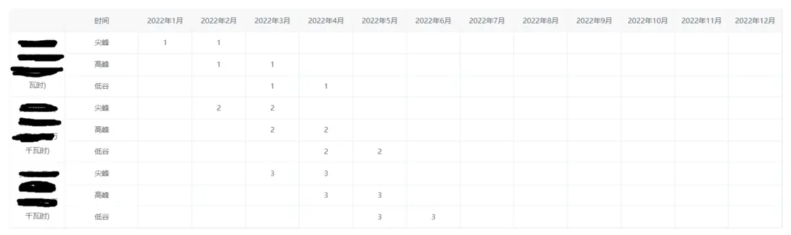

# 记录 elementUI 中表格合并

有个需求是这样的，表格第一列需要合并行，后边的数据是通过接口获取，效果图如下：



首先，列中的时间是前端生成的，尖峰、高峰、低谷是每行数据都会有的，可以写死，具体代码如下：

```html
<el-table :data="tableData" :span-method="arraySpanMethod" border size="mini">
  <el-table-column label prop="company">
    <template slot-scope="scope">{{ scope.row.company }}</template>
  </el-table-column>
  <el-table-column label="时间" prop="symbolType" width="120px">
    <template slot-scope="scope">{{ scope.row.symbolType }}</template>
  </el-table-column>
  <el-table-column
    v-for="(item, index) in timeData"
    :key="index"
    :prop="item.label"
    :label="item.time"
  >
    <template slot-scope="scope">{{ scope.row[item.label] }}</template>
  </el-table-column>
</el-table>
```

```vue
<script>
  export default {
    data() {
      return {
        companyArr: [],
        companyPos: 0,
        typeArr: [],
        typePos: [],
        // 假数据，后期是通过接口获取
        tableData: [
          {
            company: "xxxx1",
            type: 1,
            symbolType: "尖峰",
            m1: "1",
            m2: "1",
            m3: "",
            m4: "",
            m5: "",
            m6: "",
            m7: "",
            m8: "",
            m9: "",
            m10: "",
            m11: "",
            m12: "",
          },
          {
            company: "xxxx1",
            type: 1,
            symbolType: "高峰",
            m1: "",
            m2: "1",
            m3: "1",
            m4: "",
            m5: "",
            m6: "",
            m7: "",
            m8: "",
            m9: "",
            m10: "",
            m11: "",
            m12: "",
          },
          {
            company: "xxxx1",
            type: 1,
            symbolType: "低谷",
            m1: "",
            m2: "",
            m3: "1",
            m4: "1",
            m5: "",
            m6: "",
            m7: "",
            m8: "",
            m9: "",
            m10: "",
            m11: "",
            m12: "",
          },
          {
            company: "xxxx2",
            type: 2,
            symbolType: "尖峰",
            m1: "",
            m2: "2",
            m3: "2",
            m4: "",
            m5: "",
            m6: "",
            m7: "",
            m8: "",
            m9: "",
            m10: "",
            m11: "",
            m12: "",
          },
          {
            company: "xxxx2",
            type: 2,
            symbolType: "高峰",
            m1: "",
            m2: "",
            m3: "2",
            m4: "2",
            m5: "",
            m6: "",
            m7: "",
            m8: "",
            m9: "",
            m10: "",
            m11: "",
            m12: "",
          },
          {
            company: "xxxx2",
            type: 2,
            symbolType: "低谷",
            m1: "",
            m2: "",
            m3: "",
            m4: "2",
            m5: "2",
            m6: "",
            m7: "",
            m8: "",
            m9: "",
            m10: "",
            m11: "",
            m12: "",
          },
          {
            company: "xxxx3",
            type: 3,
            symbolType: "尖峰",
            m1: "",
            m2: "",
            m3: "3",
            m4: "3",
            m5: "",
            m6: "",
            m7: "",
            m8: "",
            m9: "",
            m10: "",
            m11: "",
            m12: "",
          },
          {
            company: "xxxx3",
            type: 3,
            symbolType: "高峰",
            m1: "",
            m2: "",
            m3: "",
            m4: "3",
            m5: "3",
            m6: "",
            m7: "",
            m8: "",
            m9: "",
            m10: "",
            m11: "",
            m12: "",
          },
          {
            company: "xxxx3",
            type: 3,
            symbolType: "低谷",
            m1: "",
            m2: "",
            m3: "",
            m4: "",
            m5: "3",
            m6: "3",
            m7: "",
            m8: "",
            m9: "",
            m10: "",
            m11: "",
            m12: "",
          },
        ],
      };
    },
    computed: {
      timeData() {
        let year = new Date().getFullYear();
        let obj = {};
        let arr = [];
        for (let i = 1; i <= 12; i++) {
          obj = {
            time: year + "年" + i + "月",
            label: "m" + i, // 这块是和后端确认的每个月的字段名
          };
          arr.push(obj);
        }
        return arr;
      },
    },
    created() {
      this.consolidation();
    },
    methods: {
      // 根据type计算出要合并的行数
      consolidation() {
        this.companyArr = [];
        this.companyPos = 0;
        this.typeArr = [];
        this.typePos = 0;
        for (var i = 0; i < this.tableData.length; i++) {
          if (i === 0) {
            //第一行必须存在
            this.companyArr.push(1);
            this.companyPos = 0;
            this.typeArr.push(1);
            this.typePos = 0;
          } else {
            // 判断当前元素与上一个元素是否相同 this.companyPos是companyArr内容的序号
            if (this.tableData[i].type === this.tableData[i - 1].type) {
              this.companyArr[this.companyPos] += 1;
              this.companyArr.push(0);
            } else {
              this.companyArr.push(1);
              this.companyPos = i;
            }
            if (
              this.tableData[i].symbolType ===
                this.tableData[i - 1].symbolType &&
              this.tableData[i].type === this.tableData[i - 1].type
            ) {
              this.typeArr[this.typePos] += 1;
              this.typeArr.push(0);
            } else {
              this.typeArr.push(1);
              this.typePos = i;
            }
          }
        }
      },
      // 合并行方法
      arraySpanMethod({ row, column, rowIndex, columnIndex }) {
        if (columnIndex === 0) {
          const _row_1 = this.companyArr[rowIndex];
          const _col_1 = _row_1 > 0 ? 1 : 0; //如果被合并了_row=0则它这个列需要取消
          return {
            rowspan: _row_1,
            colspan: _col_1,
          };
        } else if (columnIndex === 1) {
          const _row_2 = this.typeArr[rowIndex];
          const _col_2 = _row_2 > 0 ? 1 : 0;
          return {
            rowspan: _row_2,
            colspan: _col_2,
          };
        }
      },
    },
  };
</script>
```
