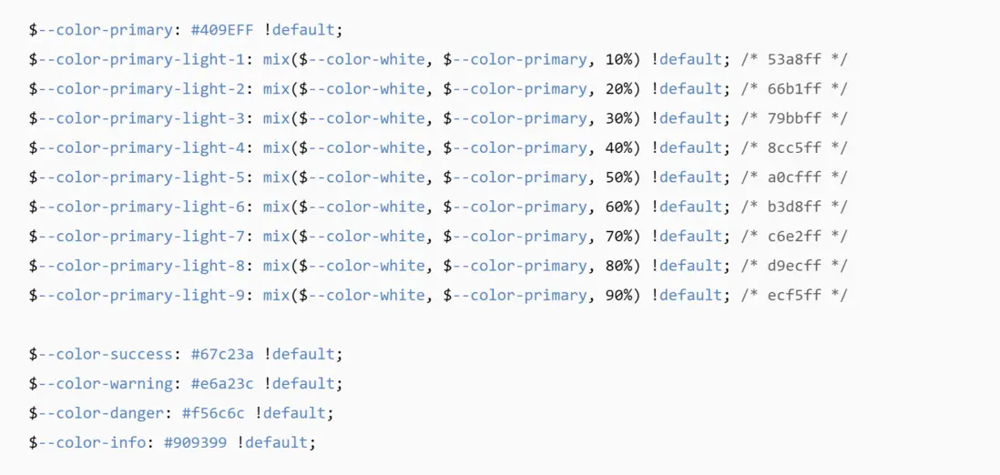

<!--
 * @Author: rk
 * @Description:
 * @Date: 2024-03-01 14:15:52
 * @LastEditors: rk
 * @LastEditTime: 2024-03-26 14:09:54
-->

# 主题切换

在后台管理系统中主题切换是很常见的一种操作，以下是 vue2 项目中的相关配置。

技术栈： vue2 + elementUi

## 1 安装主题生成工具

```
 npm i element-theme -g
```

## 2 安装白垩主题

```
 npm i element-theme-chalk -D
```

## 3 初始化变量文件

```
et -i
```

执行完以上命令后，会在根目录下会生成 element-variables.scss 文件，里边包含了 elementui 中组件所用到的所有变量，像字体大小，颜色，背景颜色等。


如果项目有自己的设计稿，并且对字体颜色、按钮颜色等有严格要求，可以在这个文件找到对应属性进行修改，修改完成之后执行 et 编译主题

```
et
```

这时根目录下会生成 theme 文件夹，里边有 fonts 和一些 css 文件，这里的 fonts 文件会有用，其他 css 文件可以删除了。

:::tip 重点说明：
将 element-variables.scss 修改名称为 element-variables-dark.scss,然后在执行第三步（初始化变量文件），这样根目录会重新生成一份 element-varibles.scss 文件，对里边的颜色、背景颜色更改保存，改名称为 element-variables-light.scss，这里保存的是清亮模式的文件。
:::

## 4 使用 gulp-css-wrap 神器

```
npm install gulp
npm install gulp-clean-css
npm install gulp-css-wrap
```

## 5 在根目录下创建 gulpfile.js 文件


截图中.custom-light 选择器是定义了清亮模式下在 body 中添加的类属性，
src/assets/theme/light 这块是存放清亮模式的主题文件。文件夹中包含 fonts 和 index.css，这里的 fonts 就是之前根目录 theme 下的 fonts，是复制过来的，index.css 文件则是真正的主题引入的文件。

:::tip 重要说明：
不管对暗黑模式还是清亮模式进行修改，首先修改根目录下两种模式对应的 element-variables-light.scss 文件，修改为 element-variables.scss，系统才会识别出来，然后在执行 et -i,修改完之后在执行 et 编译主题。
:::

## 6 执行 gulp 输出

```
gulp css-wrap
```

## 7 在 main.js 中引入


## 8 遇到的坑

因为安装 gulp，gulp 的版本和 node 不兼容,执行 et -i 时报错：primordials is not defined；

:::tip 解决方案：
gulp3.x.x 需要将 node 降低到 11.x.x

要么降低 node 版本为 12 以下，要么升级 gulp 为 4.x 版本。
:::

这个报错终于解决了，又出现了其他报错，没有发现 chalk，我自己单独装了下，还是报错，最后发现还是版本的问题。

node v10.16.0 版本 如下安装:

```
npm i element-theme -g
npm i element-theme-chalk -D
```

node v12.13.0 版本 如下安装:

```
npm i element-themex -g
npm i element-theme-chalk -D
```

版本不同，引入的 element 主题不一样，高版本用的是 element-themex，这个在官网上没有找到，希望可以帮到大家，其他的就是使用主题了，很简单，写一个 el-switch 开关对主题进行设置，利用 vuex 进行全局保存就可以了。
