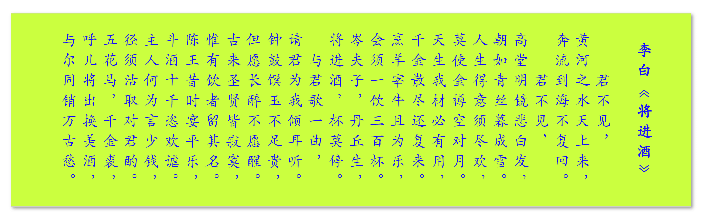

# 其他动画

## 1、模仿玻璃雨滴效果


<details>
  <summary>查看代码</summary>

```html
<div class="container">
  <div class="window"></div>
  <div class="raindrops">
    <div class="borders">
      <div class="border"></div>
      <div class="border"></div>
      <div class="border"></div>
      <div class="border"></div>
      <div class="border"></div>
      <div class="border"></div>
      <div class="border"></div>
      <div class="border"></div>
      <div class="border"></div>
      <div class="border"></div>
      <div class="border"></div>
      <div class="border"></div>
      <div class="border"></div>
      <div class="border"></div>
      <div class="border"></div>
      <div class="border"></div>
      <div class="border"></div>
      <div class="border"></div>
      <div class="border"></div>
      <div class="border"></div>
      <div class="border"></div>
      <div class="border"></div>
      <div class="border"></div>
      <div class="border"></div>
      <div class="border"></div>
      <div class="border"></div>
      <div class="border"></div>
      <div class="border"></div>
      <div class="border"></div>
      <div class="border"></div>
      <div class="border"></div>
      <div class="border"></div>
      <div class="border"></div>
      <div class="border"></div>
      <div class="border"></div>
      <div class="border"></div>
      <div class="border"></div>
      <div class="border"></div>
      <div class="border"></div>
      <div class="border"></div>
      <div class="border"></div>
      <div class="border"></div>
      <div class="border"></div>
      <div class="border"></div>
      <div class="border"></div>
      <div class="border"></div>
      <div class="border"></div>
      <div class="border"></div>
      <div class="border"></div>
      <div class="border"></div>
      <div class="border"></div>
      <div class="border"></div>
      <div class="border"></div>
      <div class="border"></div>
      <div class="border"></div>
      <div class="border"></div>
      <div class="border"></div>
      <div class="border"></div>
      <div class="border"></div>
      <div class="border"></div>
      <div class="border"></div>
      <div class="border"></div>
      <div class="border"></div>
      <div class="border"></div>
      <div class="border"></div>
      <div class="border"></div>
      <div class="border"></div>
      <div class="border"></div>
      <div class="border"></div>
      <div class="border"></div>
      <div class="border"></div>
      <div class="border"></div>
      <div class="border"></div>
      <div class="border"></div>
      <div class="border"></div>
      <div class="border"></div>
      <div class="border"></div>
      <div class="border"></div>
      <div class="border"></div>
      <div class="border"></div>
      <div class="border"></div>
      <div class="border"></div>
      <div class="border"></div>
      <div class="border"></div>
      <div class="border"></div>
      <div class="border"></div>
      <div class="border"></div>
      <div class="border"></div>
      <div class="border"></div>
      <div class="border"></div>
      <div class="border"></div>
      <div class="border"></div>
      <div class="border"></div>
      <div class="border"></div>
      <div class="border"></div>
      <div class="border"></div>
      <div class="border"></div>
      <div class="border"></div>
      <div class="border"></div>
      <div class="border"></div>
      <div class="border"></div>
      <div class="border"></div>
      <div class="border"></div>
      <div class="border"></div>
      <div class="border"></div>
      <div class="border"></div>
      <div class="border"></div>
      <div class="border"></div>
      <div class="border"></div>
      <div class="border"></div>
      <div class="border"></div>
      <div class="border"></div>
      <div class="border"></div>
      <div class="border"></div>
      <div class="border"></div>
      <div class="border"></div>
      <div class="border"></div>
      <div class="border"></div>
      <div class="border"></div>
      <div class="border"></div>
    </div>
    <div class="drops">
      <div class="raindrop"></div>
      <div class="raindrop"></div>
      <div class="raindrop"></div>
      <div class="raindrop"></div>
      <div class="raindrop"></div>
      <div class="raindrop"></div>
      <div class="raindrop"></div>
      <div class="raindrop"></div>
      <div class="raindrop"></div>
      <div class="raindrop"></div>
      <div class="raindrop"></div>
      <div class="raindrop"></div>
      <div class="raindrop"></div>
      <div class="raindrop"></div>
      <div class="raindrop"></div>
      <div class="raindrop"></div>
      <div class="raindrop"></div>
      <div class="raindrop"></div>
      <div class="raindrop"></div>
      <div class="raindrop"></div>
      <div class="raindrop"></div>
      <div class="raindrop"></div>
      <div class="raindrop"></div>
      <div class="raindrop"></div>
      <div class="raindrop"></div>
      <div class="raindrop"></div>
      <div class="raindrop"></div>
      <div class="raindrop"></div>
      <div class="raindrop"></div>
      <div class="raindrop"></div>
      <div class="raindrop"></div>
      <div class="raindrop"></div>
      <div class="raindrop"></div>
      <div class="raindrop"></div>
      <div class="raindrop"></div>
      <div class="raindrop"></div>
      <div class="raindrop"></div>
      <div class="raindrop"></div>
      <div class="raindrop"></div>
      <div class="raindrop"></div>
      <div class="raindrop"></div>
      <div class="raindrop"></div>
      <div class="raindrop"></div>
      <div class="raindrop"></div>
      <div class="raindrop"></div>
      <div class="raindrop"></div>
      <div class="raindrop"></div>
      <div class="raindrop"></div>
      <div class="raindrop"></div>
      <div class="raindrop"></div>
      <div class="raindrop"></div>
      <div class="raindrop"></div>
      <div class="raindrop"></div>
      <div class="raindrop"></div>
      <div class="raindrop"></div>
      <div class="raindrop"></div>
      <div class="raindrop"></div>
      <div class="raindrop"></div>
      <div class="raindrop"></div>
      <div class="raindrop"></div>
      <div class="raindrop"></div>
      <div class="raindrop"></div>
      <div class="raindrop"></div>
      <div class="raindrop"></div>
      <div class="raindrop"></div>
      <div class="raindrop"></div>
      <div class="raindrop"></div>
      <div class="raindrop"></div>
      <div class="raindrop"></div>
      <div class="raindrop"></div>
      <div class="raindrop"></div>
      <div class="raindrop"></div>
      <div class="raindrop"></div>
      <div class="raindrop"></div>
      <div class="raindrop"></div>
      <div class="raindrop"></div>
      <div class="raindrop"></div>
      <div class="raindrop"></div>
      <div class="raindrop"></div>
      <div class="raindrop"></div>
      <div class="raindrop"></div>
      <div class="raindrop"></div>
      <div class="raindrop"></div>
      <div class="raindrop"></div>
      <div class="raindrop"></div>
      <div class="raindrop"></div>
      <div class="raindrop"></div>
      <div class="raindrop"></div>
      <div class="raindrop"></div>
      <div class="raindrop"></div>
      <div class="raindrop"></div>
      <div class="raindrop"></div>
      <div class="raindrop"></div>
      <div class="raindrop"></div>
      <div class="raindrop"></div>
      <div class="raindrop"></div>
      <div class="raindrop"></div>
      <div class="raindrop"></div>
      <div class="raindrop"></div>
      <div class="raindrop"></div>
      <div class="raindrop"></div>
      <div class="raindrop"></div>
      <div class="raindrop"></div>
      <div class="raindrop"></div>
      <div class="raindrop"></div>
      <div class="raindrop"></div>
      <div class="raindrop"></div>
      <div class="raindrop"></div>
      <div class="raindrop"></div>
      <div class="raindrop"></div>
      <div class="raindrop"></div>
      <div class="raindrop"></div>
      <div class="raindrop"></div>
      <div class="raindrop"></div>
      <div class="raindrop"></div>
      <div class="raindrop"></div>
      <div class="raindrop"></div>
      <div class="raindrop"></div>
      <div class="raindrop"></div>
      <div class="raindrop"></div>
    </div>
  </div>
</div>

<style>
  html,
  body {
    width: 100%;
    height: 100%;
    margin: 0;
    padding: 0;
    overflow: hidden;
  }
  body {
    background: #222;
  }
  .container {
    position: relative;
    width: 100vw;
    height: 100vh;
    overflow: hidden;
  }
  .window {
    position: absolute;
    width: 100vw;
    height: 100vh;
    background: url("../../imgs/1.jpg");
    background-size: cover;
    background-position: 50%;
    filter: blur(10px);
  }
  .raindrops,
  .borders,
  .drops {
    position: absolute;
  }
  .drops {
    filter: brightness(1.2);
  }
  .raindrop {
    position: absolute;
    border-radius: 100%;
    background: url("./img/1.jpg");
    background-size: 5vw 5vh;
    background-position: 50%;
    transform: rotate(180deg) rotateY(0);
  }
  .border {
    position: absolute;
    margin-left: 2px;
    margin-top: 1px;
    border-radius: 100%;
    box-shadow: 0 0 0 2px rgba(0, 0, 0, 0.5);
    transform: rotateY(0);
  }
  .raindrop:nth-child(1) {
    left: 10.04698vw;
    top: 91.82078vh;
    width: 6px;
    height: 7.15325px;
    background-position: 10.04698% 91.82078%;
    animation: 3.10099s falling 0.3s ease-in infinite;
  }
  .border:nth-child(1) {
    left: 10.04698vw;
    top: 91.82078vh;
    width: 2px;
    height: 7.15325px;
    animation: 3.10099s falling 0.3s ease-in infinite;
  }
  .raindrop:nth-child(2) {
    left: 12.82745vw;
    top: 77.30419vh;
    width: 14px;
    height: 12.27636px;
    background-position: 12.82745% 77.30419%;
    animation: 1.67971s falling 0.3s ease-in infinite;
  }
  .border:nth-child(2) {
    left: 12.82745vw;
    top: 77.30419vh;
    width: 10px;
    height: 12.27636px;
    animation: 1.67971s falling 0.3s ease-in infinite;
  }
  .raindrop:nth-child(3) {
    left: 99.76471vw;
    top: 20.07903vh;
    width: 8px;
    height: 9.20648px;
    background-position: 99.76471% 20.07903%;
    animation: 1.55576s falling 0.3s ease-in infinite;
  }
  .border:nth-child(3) {
    left: 99.76471vw;
    top: 20.07903vh;
    width: 4px;
    height: 9.20648px;
    animation: 1.55576s falling 0.3s ease-in infinite;
  }
  .raindrop:nth-child(4) {
    left: 14.96301vw;
    top: 99.31952vh;
    width: 13px;
    height: 14.36884px;
    background-position: 14.96301% 99.31952%;
    animation: 2.54729s falling 0.3s ease-in infinite;
  }
  .border:nth-child(4) {
    left: 14.96301vw;
    top: 99.31952vh;
    width: 9px;
    height: 14.36884px;
    animation: 2.54729s falling 0.3s ease-in infinite;
  }
  .raindrop:nth-child(5) {
    left: 96.89809vw;
    top: 18.21613vh;
    width: 13px;
    height: 11.63689px;
    background-position: 96.89809% 18.21613%;
    -webkit-animation: 2.40469s falling 0.3s ease-in infinite;
    animation: 2.40469s falling 0.3s ease-in infinite;
  }

  .border:nth-child(5) {
    left: 96.89809vw;
    top: 18.21613vh;
    width: 9px;
    height: 11.63689px;
    -webkit-animation: 2.40469s falling 0.3s ease-in infinite;
    animation: 2.40469s falling 0.3s ease-in infinite;
  }

  .raindrop:nth-child(6) {
    left: 7.49532vw;
    top: 34.16121vh;
    width: 11px;
    height: 8.02795px;
    background-position: 7.49532% 34.16121%;
    -webkit-animation: 1.82227s falling 0.3s ease-in infinite;
    animation: 1.82227s falling 0.3s ease-in infinite;
  }

  .border:nth-child(6) {
    left: 7.49532vw;
    top: 34.16121vh;
    width: 7px;
    height: 8.02795px;
    -webkit-animation: 1.82227s falling 0.3s ease-in infinite;
    animation: 1.82227s falling 0.3s ease-in infinite;
  }

  .raindrop:nth-child(7) {
    left: 16.83013vw;
    top: 78.48574vh;
    width: 11px;
    height: 8.97741px;
    background-position: 16.83013% 78.48574%;
    -webkit-animation: 1.51951s falling 0.3s ease-in infinite;
    animation: 1.51951s falling 0.3s ease-in infinite;
  }

  .border:nth-child(7) {
    left: 16.83013vw;
    top: 78.48574vh;
    width: 7px;
    height: 8.97741px;
    -webkit-animation: 1.51951s falling 0.3s ease-in infinite;
    animation: 1.51951s falling 0.3s ease-in infinite;
  }

  .raindrop:nth-child(8) {
    left: 27.85806vw;
    top: 25.5479vh;
    width: 8px;
    height: 7.10439px;
    background-position: 27.85806% 25.5479%;
    -webkit-animation: 2.65093s falling 0.3s ease-in infinite;
    animation: 2.65093s falling 0.3s ease-in infinite;
  }

  .border:nth-child(8) {
    left: 27.85806vw;
    top: 25.5479vh;
    width: 4px;
    height: 7.10439px;
    -webkit-animation: 2.65093s falling 0.3s ease-in infinite;
    animation: 2.65093s falling 0.3s ease-in infinite;
  }

  .raindrop:nth-child(9) {
    left: 8.91327vw;
    top: 40.31462vh;
    width: 14px;
    height: 15.98821px;
    background-position: 8.91327% 40.31462%;
    -webkit-animation: 1.18088s falling 0.3s ease-in infinite;
    animation: 1.18088s falling 0.3s ease-in infinite;
  }

  .border:nth-child(9) {
    left: 8.91327vw;
    top: 40.31462vh;
    width: 10px;
    height: 15.98821px;
    -webkit-animation: 1.18088s falling 0.3s ease-in infinite;
    animation: 1.18088s falling 0.3s ease-in infinite;
  }

  .raindrop:nth-child(10) {
    left: 26.45584vw;
    top: 36.95411vh;
    width: 6px;
    height: 6.94801px;
    background-position: 26.45584% 36.95411%;
    -webkit-animation: 2.27066s falling 0.3s ease-in infinite;
    animation: 2.27066s falling 0.3s ease-in infinite;
  }

  .border:nth-child(10) {
    left: 26.45584vw;
    top: 36.95411vh;
    width: 2px;
    height: 6.94801px;
    -webkit-animation: 2.27066s falling 0.3s ease-in infinite;
    animation: 2.27066s falling 0.3s ease-in infinite;
  }

  .raindrop:nth-child(11) {
    left: 62.50966vw;
    top: 16.51731vh;
    width: 9px;
    height: 7.55903px;
    background-position: 62.50966% 16.51731%;
    -webkit-animation: 2.19176s falling 0.3s ease-in infinite;
    animation: 2.19176s falling 0.3s ease-in infinite;
  }

  .border:nth-child(11) {
    left: 62.50966vw;
    top: 16.51731vh;
    width: 5px;
    height: 7.55903px;
    -webkit-animation: 2.19176s falling 0.3s ease-in infinite;
    animation: 2.19176s falling 0.3s ease-in infinite;
  }

  .raindrop:nth-child(12) {
    left: 34.77929vw;
    top: 9.23411vh;
    width: 6px;
    height: 6.50705px;
    background-position: 34.77929% 9.23411%;
    -webkit-animation: 2.20455s falling 0.3s ease-in infinite;
    animation: 2.20455s falling 0.3s ease-in infinite;
  }

  .border:nth-child(12) {
    left: 34.77929vw;
    top: 9.23411vh;
    width: 2px;
    height: 6.50705px;
    -webkit-animation: 2.20455s falling 0.3s ease-in infinite;
    animation: 2.20455s falling 0.3s ease-in infinite;
  }

  .raindrop:nth-child(13) {
    left: 27.24957vw;
    top: 8.1466vh;
    width: 14px;
    height: 12.63108px;
    background-position: 27.24957% 8.1466%;
    -webkit-animation: 2.59341s falling 0.3s ease-in infinite;
    animation: 2.59341s falling 0.3s ease-in infinite;
  }

  .border:nth-child(13) {
    left: 27.24957vw;
    top: 8.1466vh;
    width: 10px;
    height: 12.63108px;
    -webkit-animation: 2.59341s falling 0.3s ease-in infinite;
    animation: 2.59341s falling 0.3s ease-in infinite;
  }

  .raindrop:nth-child(14) {
    left: 96.80416vw;
    top: 48.90807vh;
    width: 12px;
    height: 9.7663px;
    background-position: 96.80416% 48.90807%;
    -webkit-animation: 2.52809s falling 0.3s ease-in infinite;
    animation: 2.52809s falling 0.3s ease-in infinite;
  }

  .border:nth-child(14) {
    left: 96.80416vw;
    top: 48.90807vh;
    width: 8px;
    height: 9.7663px;
    -webkit-animation: 2.52809s falling 0.3s ease-in infinite;
    animation: 2.52809s falling 0.3s ease-in infinite;
  }

  .raindrop:nth-child(15) {
    left: 28.57202vw;
    top: 76.6333vh;
    width: 12px;
    height: 13.33989px;
    background-position: 28.57202% 76.6333%;
    -webkit-animation: 2.03413s falling 0.3s ease-in infinite;
    animation: 2.03413s falling 0.3s ease-in infinite;
  }

  .border:nth-child(15) {
    left: 28.57202vw;
    top: 76.6333vh;
    width: 8px;
    height: 13.33989px;
    -webkit-animation: 2.03413s falling 0.3s ease-in infinite;
    animation: 2.03413s falling 0.3s ease-in infinite;
  }

  .raindrop:nth-child(16) {
    left: 78.37269vw;
    top: 39.20233vh;
    width: 8px;
    height: 9.50339px;
    background-position: 78.37269% 39.20233%;
    -webkit-animation: 1.88546s falling 0.3s ease-in infinite;
    animation: 1.88546s falling 0.3s ease-in infinite;
  }

  .border:nth-child(16) {
    left: 78.37269vw;
    top: 39.20233vh;
    width: 4px;
    height: 9.50339px;
    -webkit-animation: 1.88546s falling 0.3s ease-in infinite;
    animation: 1.88546s falling 0.3s ease-in infinite;
  }

  .raindrop:nth-child(17) {
    left: 67.32862vw;
    top: 21.46694vh;
    width: 9px;
    height: 6.43129px;
    background-position: 67.32862% 21.46694%;
    -webkit-animation: 2.54483s falling 0.3s ease-in infinite;
    animation: 2.54483s falling 0.3s ease-in infinite;
  }

  .border:nth-child(17) {
    left: 67.32862vw;
    top: 21.46694vh;
    width: 5px;
    height: 6.43129px;
    -webkit-animation: 2.54483s falling 0.3s ease-in infinite;
    animation: 2.54483s falling 0.3s ease-in infinite;
  }

  .raindrop:nth-child(18) {
    left: 6.48706vw;
    top: 74.11866vh;
    width: 16px;
    height: 17.34826px;
    background-position: 6.48706% 74.11866%;
    -webkit-animation: 3.4824s falling 0.3s ease-in infinite;
    animation: 3.4824s falling 0.3s ease-in infinite;
  }

  .border:nth-child(18) {
    left: 6.48706vw;
    top: 74.11866vh;
    width: 12px;
    height: 17.34826px;
    -webkit-animation: 3.4824s falling 0.3s ease-in infinite;
    animation: 3.4824s falling 0.3s ease-in infinite;
  }

  .raindrop:nth-child(19) {
    left: 47.47084vw;
    top: 3.63808vh;
    width: 16px;
    height: 13.46968px;
    background-position: 47.47084% 3.63808%;
    -webkit-animation: 2.64643s falling 0.3s ease-in infinite;
    animation: 2.64643s falling 0.3s ease-in infinite;
  }

  .border:nth-child(19) {
    left: 47.47084vw;
    top: 3.63808vh;
    width: 12px;
    height: 13.46968px;
    -webkit-animation: 2.64643s falling 0.3s ease-in infinite;
    animation: 2.64643s falling 0.3s ease-in infinite;
  }

  .raindrop:nth-child(20) {
    left: 95.26701vw;
    top: 7.2519vh;
    width: 16px;
    height: 18.00949px;
    background-position: 95.26701% 7.2519%;
    -webkit-animation: 2.29859s falling 0.3s ease-in infinite;
    animation: 2.29859s falling 0.3s ease-in infinite;
  }

  .border:nth-child(20) {
    left: 95.26701vw;
    top: 7.2519vh;
    width: 12px;
    height: 18.00949px;
    -webkit-animation: 2.29859s falling 0.3s ease-in infinite;
    animation: 2.29859s falling 0.3s ease-in infinite;
  }

  .raindrop:nth-child(21) {
    left: 50.74041vw;
    top: 19.29607vh;
    width: 15px;
    height: 16.51675px;
    background-position: 50.74041% 19.29607%;
    -webkit-animation: 2.41131s falling 0.3s ease-in infinite;
    animation: 2.41131s falling 0.3s ease-in infinite;
  }

  .border:nth-child(21) {
    left: 50.74041vw;
    top: 19.29607vh;
    width: 11px;
    height: 16.51675px;
    -webkit-animation: 2.41131s falling 0.3s ease-in infinite;
    animation: 2.41131s falling 0.3s ease-in infinite;
  }

  .raindrop:nth-child(22) {
    left: 5.64536vw;
    top: 66.39351vh;
    width: 7px;
    height: 6.26128px;
    background-position: 5.64536% 66.39351%;
    -webkit-animation: 2.62917s falling 0.3s ease-in infinite;
    animation: 2.62917s falling 0.3s ease-in infinite;
  }

  .border:nth-child(22) {
    left: 5.64536vw;
    top: 66.39351vh;
    width: 3px;
    height: 6.26128px;
    -webkit-animation: 2.62917s falling 0.3s ease-in infinite;
    animation: 2.62917s falling 0.3s ease-in infinite;
  }

  .raindrop:nth-child(23) {
    left: 9.07355vw;
    top: 72.60998vh;
    width: 13px;
    height: 15.22784px;
    background-position: 9.07355% 72.60998%;
    -webkit-animation: 2.94513s falling 0.3s ease-in infinite;
    animation: 2.94513s falling 0.3s ease-in infinite;
  }

  .border:nth-child(23) {
    left: 9.07355vw;
    top: 72.60998vh;
    width: 9px;
    height: 15.22784px;
    -webkit-animation: 2.94513s falling 0.3s ease-in infinite;
    animation: 2.94513s falling 0.3s ease-in infinite;
  }

  .raindrop:nth-child(24) {
    left: 10.12111vw;
    top: 26.86273vh;
    width: 6px;
    height: 5.05314px;
    background-position: 10.12111% 26.86273%;
    -webkit-animation: 2.57854s falling 0.3s ease-in infinite;
    animation: 2.57854s falling 0.3s ease-in infinite;
  }

  .border:nth-child(24) {
    left: 10.12111vw;
    top: 26.86273vh;
    width: 2px;
    height: 5.05314px;
    -webkit-animation: 2.57854s falling 0.3s ease-in infinite;
    animation: 2.57854s falling 0.3s ease-in infinite;
  }

  .raindrop:nth-child(25) {
    left: 48.53756vw;
    top: 59.33722vh;
    width: 12px;
    height: 9.7405px;
    background-position: 48.53756% 59.33722%;
    -webkit-animation: 1.59563s falling 0.3s ease-in infinite;
    animation: 1.59563s falling 0.3s ease-in infinite;
  }

  .border:nth-child(25) {
    left: 48.53756vw;
    top: 59.33722vh;
    width: 8px;
    height: 9.7405px;
    -webkit-animation: 1.59563s falling 0.3s ease-in infinite;
    animation: 1.59563s falling 0.3s ease-in infinite;
  }

  .raindrop:nth-child(26) {
    left: 64.25713vw;
    top: 97.75651vh;
    width: 9px;
    height: 10.62307px;
    background-position: 64.25713% 97.75651%;
    -webkit-animation: 1.93975s falling 0.3s ease-in infinite;
    animation: 1.93975s falling 0.3s ease-in infinite;
  }

  .border:nth-child(26) {
    left: 64.25713vw;
    top: 97.75651vh;
    width: 5px;
    height: 10.62307px;
    -webkit-animation: 1.93975s falling 0.3s ease-in infinite;
    animation: 1.93975s falling 0.3s ease-in infinite;
  }

  .raindrop:nth-child(27) {
    left: 36.04033vw;
    top: 72.92218vh;
    width: 6px;
    height: 4.73592px;
    background-position: 36.04033% 72.92218%;
    -webkit-animation: 2.88779s falling 0.3s ease-in infinite;
    animation: 2.88779s falling 0.3s ease-in infinite;
  }

  .border:nth-child(27) {
    left: 36.04033vw;
    top: 72.92218vh;
    width: 2px;
    height: 4.73592px;
    -webkit-animation: 2.88779s falling 0.3s ease-in infinite;
    animation: 2.88779s falling 0.3s ease-in infinite;
  }

  .raindrop:nth-child(28) {
    left: 51.49115vw;
    top: 37.36542vh;
    width: 7px;
    height: 6.58546px;
    background-position: 51.49115% 37.36542%;
    -webkit-animation: 1.50044s falling 0.3s ease-in infinite;
    animation: 1.50044s falling 0.3s ease-in infinite;
  }

  .border:nth-child(28) {
    left: 51.49115vw;
    top: 37.36542vh;
    width: 3px;
    height: 6.58546px;
    -webkit-animation: 1.50044s falling 0.3s ease-in infinite;
    animation: 1.50044s falling 0.3s ease-in infinite;
  }

  .raindrop:nth-child(29) {
    left: 84.9836vw;
    top: 17.497vh;
    width: 13px;
    height: 9.50666px;
    background-position: 84.9836% 17.497%;
    -webkit-animation: 2.07243s falling 0.3s ease-in infinite;
    animation: 2.07243s falling 0.3s ease-in infinite;
  }

  .border:nth-child(29) {
    left: 84.9836vw;
    top: 17.497vh;
    width: 9px;
    height: 9.50666px;
    -webkit-animation: 2.07243s falling 0.3s ease-in infinite;
    animation: 2.07243s falling 0.3s ease-in infinite;
  }

  .raindrop:nth-child(30) {
    left: 86.3673vw;
    top: 58.0922vh;
    width: 8px;
    height: 7.53888px;
    background-position: 86.3673% 58.0922%;
    -webkit-animation: 2.51866s falling 0.3s ease-in infinite;
    animation: 2.51866s falling 0.3s ease-in infinite;
  }

  .border:nth-child(30) {
    left: 86.3673vw;
    top: 58.0922vh;
    width: 4px;
    height: 7.53888px;
    -webkit-animation: 2.51866s falling 0.3s ease-in infinite;
    animation: 2.51866s falling 0.3s ease-in infinite;
  }

  .raindrop:nth-child(31) {
    left: 28.38763vw;
    top: 4.97887vh;
    width: 16px;
    height: 13.42529px;
    background-position: 28.38763% 4.97887%;
    -webkit-animation: 1.74631s falling 0.3s ease-in infinite;
    animation: 1.74631s falling 0.3s ease-in infinite;
  }

  .border:nth-child(31) {
    left: 28.38763vw;
    top: 4.97887vh;
    width: 12px;
    height: 13.42529px;
    -webkit-animation: 1.74631s falling 0.3s ease-in infinite;
    animation: 1.74631s falling 0.3s ease-in infinite;
  }

  .raindrop:nth-child(32) {
    left: 56.83646vw;
    top: 66.56558vh;
    width: 10px;
    height: 7.67686px;
    background-position: 56.83646% 66.56558%;
    -webkit-animation: 2.58629s falling 0.3s ease-in infinite;
    animation: 2.58629s falling 0.3s ease-in infinite;
  }

  .border:nth-child(32) {
    left: 56.83646vw;
    top: 66.56558vh;
    width: 6px;
    height: 7.67686px;
    -webkit-animation: 2.58629s falling 0.3s ease-in infinite;
    animation: 2.58629s falling 0.3s ease-in infinite;
  }

  .raindrop:nth-child(33) {
    left: 79.13957vw;
    top: 11.41727vh;
    width: 8px;
    height: 6.21316px;
    background-position: 79.13957% 11.41727%;
    -webkit-animation: 2.66106s falling 0.3s ease-in infinite;
    animation: 2.66106s falling 0.3s ease-in infinite;
  }

  .border:nth-child(33) {
    left: 79.13957vw;
    top: 11.41727vh;
    width: 4px;
    height: 6.21316px;
    -webkit-animation: 2.66106s falling 0.3s ease-in infinite;
    animation: 2.66106s falling 0.3s ease-in infinite;
  }

  .raindrop:nth-child(34) {
    left: 45.21148vw;
    top: 37.1654vh;
    width: 9px;
    height: 10.76434px;
    background-position: 45.21148% 37.1654%;
    -webkit-animation: 3.2146s falling 0.3s ease-in infinite;
    animation: 3.2146s falling 0.3s ease-in infinite;
  }

  .border:nth-child(34) {
    left: 45.21148vw;
    top: 37.1654vh;
    width: 5px;
    height: 10.76434px;
    -webkit-animation: 3.2146s falling 0.3s ease-in infinite;
    animation: 3.2146s falling 0.3s ease-in infinite;
  }

  .raindrop:nth-child(35) {
    left: 50.02184vw;
    top: 40.59314vh;
    width: 13px;
    height: 10.73909px;
    background-position: 50.02184% 40.59314%;
    -webkit-animation: 1.84915s falling 0.3s ease-in infinite;
    animation: 1.84915s falling 0.3s ease-in infinite;
  }

  .border:nth-child(35) {
    left: 50.02184vw;
    top: 40.59314vh;
    width: 9px;
    height: 10.73909px;
    -webkit-animation: 1.84915s falling 0.3s ease-in infinite;
    animation: 1.84915s falling 0.3s ease-in infinite;
  }

  .raindrop:nth-child(36) {
    left: 59.01533vw;
    top: 79.31974vh;
    width: 6px;
    height: 4.60668px;
    background-position: 59.01533% 79.31974%;
    -webkit-animation: 3.37333s falling 0.3s ease-in infinite;
    animation: 3.37333s falling 0.3s ease-in infinite;
  }

  .border:nth-child(36) {
    left: 59.01533vw;
    top: 79.31974vh;
    width: 2px;
    height: 4.60668px;
    -webkit-animation: 3.37333s falling 0.3s ease-in infinite;
    animation: 3.37333s falling 0.3s ease-in infinite;
  }

  .raindrop:nth-child(37) {
    left: 93.52692vw;
    top: 21.69911vh;
    width: 16px;
    height: 16.76807px;
    background-position: 93.52692% 21.69911%;
    -webkit-animation: 1.47578s falling 0.3s ease-in infinite;
    animation: 1.47578s falling 0.3s ease-in infinite;
  }

  .border:nth-child(37) {
    left: 93.52692vw;
    top: 21.69911vh;
    width: 12px;
    height: 16.76807px;
    -webkit-animation: 1.47578s falling 0.3s ease-in infinite;
    animation: 1.47578s falling 0.3s ease-in infinite;
  }

  .raindrop:nth-child(38) {
    left: 29.40268vw;
    top: 56.07803vh;
    width: 11px;
    height: 11.01865px;
    background-position: 29.40268% 56.07803%;
    -webkit-animation: 3.13656s falling 0.3s ease-in infinite;
    animation: 3.13656s falling 0.3s ease-in infinite;
  }

  .border:nth-child(38) {
    left: 29.40268vw;
    top: 56.07803vh;
    width: 7px;
    height: 11.01865px;
    -webkit-animation: 3.13656s falling 0.3s ease-in infinite;
    animation: 3.13656s falling 0.3s ease-in infinite;
  }

  .raindrop:nth-child(39) {
    left: 61.75068vw;
    top: 15.08214vh;
    width: 8px;
    height: 6.02559px;
    background-position: 61.75068% 15.08214%;
    -webkit-animation: 1.16132s falling 0.3s ease-in infinite;
    animation: 1.16132s falling 0.3s ease-in infinite;
  }

  .border:nth-child(39) {
    left: 61.75068vw;
    top: 15.08214vh;
    width: 4px;
    height: 6.02559px;
    -webkit-animation: 1.16132s falling 0.3s ease-in infinite;
    animation: 1.16132s falling 0.3s ease-in infinite;
  }

  .raindrop:nth-child(40) {
    left: 74.33622vw;
    top: 89.21578vh;
    width: 9px;
    height: 8.11386px;
    background-position: 74.33622% 89.21578%;
    -webkit-animation: 1.77772s falling 0.3s ease-in infinite;
    animation: 1.77772s falling 0.3s ease-in infinite;
  }

  .border:nth-child(40) {
    left: 74.33622vw;
    top: 89.21578vh;
    width: 5px;
    height: 8.11386px;
    -webkit-animation: 1.77772s falling 0.3s ease-in infinite;
    animation: 1.77772s falling 0.3s ease-in infinite;
  }

  .raindrop:nth-child(41) {
    left: 85.70258vw;
    top: 64.19973vh;
    width: 10px;
    height: 11.24429px;
    background-position: 85.70258% 64.19973%;
    -webkit-animation: 2.95057s falling 0.3s ease-in infinite;
    animation: 2.95057s falling 0.3s ease-in infinite;
  }

  .border:nth-child(41) {
    left: 85.70258vw;
    top: 64.19973vh;
    width: 6px;
    height: 11.24429px;
    -webkit-animation: 2.95057s falling 0.3s ease-in infinite;
    animation: 2.95057s falling 0.3s ease-in infinite;
  }

  .raindrop:nth-child(42) {
    left: 16.69013vw;
    top: 10.7918vh;
    width: 16px;
    height: 12.71325px;
    background-position: 16.69013% 10.7918%;
    -webkit-animation: 3.03993s falling 0.3s ease-in infinite;
    animation: 3.03993s falling 0.3s ease-in infinite;
  }

  .border:nth-child(42) {
    left: 16.69013vw;
    top: 10.7918vh;
    width: 12px;
    height: 12.71325px;
    -webkit-animation: 3.03993s falling 0.3s ease-in infinite;
    animation: 3.03993s falling 0.3s ease-in infinite;
  }

  .raindrop:nth-child(43) {
    left: 8.50224vw;
    top: 20.21958vh;
    width: 15px;
    height: 12.64801px;
    background-position: 8.50224% 20.21958%;
    -webkit-animation: 1.92279s falling 0.3s ease-in infinite;
    animation: 1.92279s falling 0.3s ease-in infinite;
  }

  .border:nth-child(43) {
    left: 8.50224vw;
    top: 20.21958vh;
    width: 11px;
    height: 12.64801px;
    -webkit-animation: 1.92279s falling 0.3s ease-in infinite;
    animation: 1.92279s falling 0.3s ease-in infinite;
  }

  .raindrop:nth-child(44) {
    left: 82.06158vw;
    top: 84.34299vh;
    width: 12px;
    height: 13.30798px;
    background-position: 82.06158% 84.34299%;
    -webkit-animation: 1.31889s falling 0.3s ease-in infinite;
    animation: 1.31889s falling 0.3s ease-in infinite;
  }

  .border:nth-child(44) {
    left: 82.06158vw;
    top: 84.34299vh;
    width: 8px;
    height: 13.30798px;
    -webkit-animation: 1.31889s falling 0.3s ease-in infinite;
    animation: 1.31889s falling 0.3s ease-in infinite;
  }

  .raindrop:nth-child(45) {
    left: 45.31586vw;
    top: 68.59014vh;
    width: 12px;
    height: 14.37019px;
    background-position: 45.31586% 68.59014%;
    -webkit-animation: 2.49808s falling 0.3s ease-in infinite;
    animation: 2.49808s falling 0.3s ease-in infinite;
  }

  .border:nth-child(45) {
    left: 45.31586vw;
    top: 68.59014vh;
    width: 8px;
    height: 14.37019px;
    -webkit-animation: 2.49808s falling 0.3s ease-in infinite;
    animation: 2.49808s falling 0.3s ease-in infinite;
  }

  .raindrop:nth-child(46) {
    left: 45.00332vw;
    top: 64.97602vh;
    width: 11px;
    height: 12.05813px;
    background-position: 45.00332% 64.97602%;
    -webkit-animation: 2.47618s falling 0.3s ease-in infinite;
    animation: 2.47618s falling 0.3s ease-in infinite;
  }

  .border:nth-child(46) {
    left: 45.00332vw;
    top: 64.97602vh;
    width: 7px;
    height: 12.05813px;
    -webkit-animation: 2.47618s falling 0.3s ease-in infinite;
    animation: 2.47618s falling 0.3s ease-in infinite;
  }

  .raindrop:nth-child(47) {
    left: 24.29523vw;
    top: 97.97024vh;
    width: 16px;
    height: 18.41519px;
    background-position: 24.29523% 97.97024%;
    -webkit-animation: 3.31584s falling 0.3s ease-in infinite;
    animation: 3.31584s falling 0.3s ease-in infinite;
  }

  .border:nth-child(47) {
    left: 24.29523vw;
    top: 97.97024vh;
    width: 12px;
    height: 18.41519px;
    -webkit-animation: 3.31584s falling 0.3s ease-in infinite;
    animation: 3.31584s falling 0.3s ease-in infinite;
  }

  .raindrop:nth-child(48) {
    left: 68.77092vw;
    top: 2.59879vh;
    width: 12px;
    height: 13.03424px;
    background-position: 68.77092% 2.59879%;
    -webkit-animation: 2.70973s falling 0.3s ease-in infinite;
    animation: 2.70973s falling 0.3s ease-in infinite;
  }

  .border:nth-child(48) {
    left: 68.77092vw;
    top: 2.59879vh;
    width: 8px;
    height: 13.03424px;
    -webkit-animation: 2.70973s falling 0.3s ease-in infinite;
    animation: 2.70973s falling 0.3s ease-in infinite;
  }

  .raindrop:nth-child(49) {
    left: 48.86033vw;
    top: 70.71638vh;
    width: 15px;
    height: 11.12122px;
    background-position: 48.86033% 70.71638%;
    -webkit-animation: 2.94634s falling 0.3s ease-in infinite;
    animation: 2.94634s falling 0.3s ease-in infinite;
  }

  .border:nth-child(49) {
    left: 48.86033vw;
    top: 70.71638vh;
    width: 11px;
    height: 11.12122px;
    -webkit-animation: 2.94634s falling 0.3s ease-in infinite;
    animation: 2.94634s falling 0.3s ease-in infinite;
  }

  .raindrop:nth-child(50) {
    left: 27.74012vw;
    top: 28.50559vh;
    width: 9px;
    height: 7.48643px;
    background-position: 27.74012% 28.50559%;
    -webkit-animation: 2.62661s falling 0.3s ease-in infinite;
    animation: 2.62661s falling 0.3s ease-in infinite;
  }

  .border:nth-child(50) {
    left: 27.74012vw;
    top: 28.50559vh;
    width: 5px;
    height: 7.48643px;
    -webkit-animation: 2.62661s falling 0.3s ease-in infinite;
    animation: 2.62661s falling 0.3s ease-in infinite;
  }

  .raindrop:nth-child(51) {
    left: 75.93748vw;
    top: 92.85856vh;
    width: 11px;
    height: 8.95822px;
    background-position: 75.93748% 92.85856%;
    -webkit-animation: 1.78315s falling 0.3s ease-in infinite;
    animation: 1.78315s falling 0.3s ease-in infinite;
  }

  .border:nth-child(51) {
    left: 75.93748vw;
    top: 92.85856vh;
    width: 7px;
    height: 8.95822px;
    -webkit-animation: 1.78315s falling 0.3s ease-in infinite;
    animation: 1.78315s falling 0.3s ease-in infinite;
  }

  .raindrop:nth-child(52) {
    left: 27.84149vw;
    top: 13.87355vh;
    width: 15px;
    height: 17.11468px;
    background-position: 27.84149% 13.87355%;
    -webkit-animation: 1.14568s falling 0.3s ease-in infinite;
    animation: 1.14568s falling 0.3s ease-in infinite;
  }

  .border:nth-child(52) {
    left: 27.84149vw;
    top: 13.87355vh;
    width: 11px;
    height: 17.11468px;
    -webkit-animation: 1.14568s falling 0.3s ease-in infinite;
    animation: 1.14568s falling 0.3s ease-in infinite;
  }

  .raindrop:nth-child(53) {
    left: 80.92217vw;
    top: 1.65345vh;
    width: 7px;
    height: 6.12176px;
    background-position: 80.92217% 1.65345%;
    -webkit-animation: 3.17515s falling 0.3s ease-in infinite;
    animation: 3.17515s falling 0.3s ease-in infinite;
  }

  .border:nth-child(53) {
    left: 80.92217vw;
    top: 1.65345vh;
    width: 3px;
    height: 6.12176px;
    -webkit-animation: 3.17515s falling 0.3s ease-in infinite;
    animation: 3.17515s falling 0.3s ease-in infinite;
  }

  .raindrop:nth-child(54) {
    left: 69.56336vw;
    top: 18.96042vh;
    width: 16px;
    height: 11.50175px;
    background-position: 69.56336% 18.96042%;
    -webkit-animation: 3.25321s falling 0.3s ease-in infinite;
    animation: 3.25321s falling 0.3s ease-in infinite;
  }

  .border:nth-child(54) {
    left: 69.56336vw;
    top: 18.96042vh;
    width: 12px;
    height: 11.50175px;
    -webkit-animation: 3.25321s falling 0.3s ease-in infinite;
    animation: 3.25321s falling 0.3s ease-in infinite;
  }

  .raindrop:nth-child(55) {
    left: 52.66342vw;
    top: 7.81599vh;
    width: 14px;
    height: 14.04463px;
    background-position: 52.66342% 7.81599%;
    -webkit-animation: 2.09037s falling 0.3s ease-in infinite;
    animation: 2.09037s falling 0.3s ease-in infinite;
  }

  .border:nth-child(55) {
    left: 52.66342vw;
    top: 7.81599vh;
    width: 10px;
    height: 14.04463px;
    -webkit-animation: 2.09037s falling 0.3s ease-in infinite;
    animation: 2.09037s falling 0.3s ease-in infinite;
  }

  .raindrop:nth-child(56) {
    left: 25.91435vw;
    top: 96.01223vh;
    width: 12px;
    height: 13.51435px;
    background-position: 25.91435% 96.01223%;
    -webkit-animation: 3.29345s falling 0.3s ease-in infinite;
    animation: 3.29345s falling 0.3s ease-in infinite;
  }

  .border:nth-child(56) {
    left: 25.91435vw;
    top: 96.01223vh;
    width: 8px;
    height: 13.51435px;
    -webkit-animation: 3.29345s falling 0.3s ease-in infinite;
    animation: 3.29345s falling 0.3s ease-in infinite;
  }

  .raindrop:nth-child(57) {
    left: 41.93633vw;
    top: 97.84497vh;
    width: 10px;
    height: 9.39389px;
    background-position: 41.93633% 97.84497%;
    -webkit-animation: 2.36114s falling 0.3s ease-in infinite;
    animation: 2.36114s falling 0.3s ease-in infinite;
  }

  .border:nth-child(57) {
    left: 41.93633vw;
    top: 97.84497vh;
    width: 6px;
    height: 9.39389px;
    -webkit-animation: 2.36114s falling 0.3s ease-in infinite;
    animation: 2.36114s falling 0.3s ease-in infinite;
  }

  .raindrop:nth-child(58) {
    left: 86.97432vw;
    top: 56.34594vh;
    width: 13px;
    height: 13.0644px;
    background-position: 86.97432% 56.34594%;
    -webkit-animation: 3.41393s falling 0.3s ease-in infinite;
    animation: 3.41393s falling 0.3s ease-in infinite;
  }

  .border:nth-child(58) {
    left: 86.97432vw;
    top: 56.34594vh;
    width: 9px;
    height: 13.0644px;
    -webkit-animation: 3.41393s falling 0.3s ease-in infinite;
    animation: 3.41393s falling 0.3s ease-in infinite;
  }

  .raindrop:nth-child(59) {
    left: 82.62335vw;
    top: 89.0262vh;
    width: 7px;
    height: 8.10034px;
    background-position: 82.62335% 89.0262%;
    -webkit-animation: 2.58179s falling 0.3s ease-in infinite;
    animation: 2.58179s falling 0.3s ease-in infinite;
  }

  .border:nth-child(59) {
    left: 82.62335vw;
    top: 89.0262vh;
    width: 3px;
    height: 8.10034px;
    -webkit-animation: 2.58179s falling 0.3s ease-in infinite;
    animation: 2.58179s falling 0.3s ease-in infinite;
  }

  .raindrop:nth-child(60) {
    left: 2.20114vw;
    top: 7.18378vh;
    width: 15px;
    height: 12.16847px;
    background-position: 2.20114% 7.18378%;
    -webkit-animation: 1.34496s falling 0.3s ease-in infinite;
    animation: 1.34496s falling 0.3s ease-in infinite;
  }

  .border:nth-child(60) {
    left: 2.20114vw;
    top: 7.18378vh;
    width: 11px;
    height: 12.16847px;
    -webkit-animation: 1.34496s falling 0.3s ease-in infinite;
    animation: 1.34496s falling 0.3s ease-in infinite;
  }

  .raindrop:nth-child(61) {
    left: 44.93915vw;
    top: 8.53612vh;
    width: 10px;
    height: 8.184px;
    background-position: 44.93915% 8.53612%;
    -webkit-animation: 2.04923s falling 0.3s ease-in infinite;
    animation: 2.04923s falling 0.3s ease-in infinite;
  }

  .border:nth-child(61) {
    left: 44.93915vw;
    top: 8.53612vh;
    width: 6px;
    height: 8.184px;
    -webkit-animation: 2.04923s falling 0.3s ease-in infinite;
    animation: 2.04923s falling 0.3s ease-in infinite;
  }

  .raindrop:nth-child(62) {
    left: 61.2984vw;
    top: 40.38956vh;
    width: 13px;
    height: 10.01324px;
    background-position: 61.2984% 40.38956%;
    -webkit-animation: 1.88316s falling 0.3s ease-in infinite;
    animation: 1.88316s falling 0.3s ease-in infinite;
  }

  .border:nth-child(62) {
    left: 61.2984vw;
    top: 40.38956vh;
    width: 9px;
    height: 10.01324px;
    -webkit-animation: 1.88316s falling 0.3s ease-in infinite;
    animation: 1.88316s falling 0.3s ease-in infinite;
  }

  .raindrop:nth-child(63) {
    left: 87.20186vw;
    top: 34.44305vh;
    width: 7px;
    height: 7.60035px;
    background-position: 87.20186% 34.44305%;
    -webkit-animation: 2.8797s falling 0.3s ease-in infinite;
    animation: 2.8797s falling 0.3s ease-in infinite;
  }

  .border:nth-child(63) {
    left: 87.20186vw;
    top: 34.44305vh;
    width: 3px;
    height: 7.60035px;
    -webkit-animation: 2.8797s falling 0.3s ease-in infinite;
    animation: 2.8797s falling 0.3s ease-in infinite;
  }

  .raindrop:nth-child(64) {
    left: 84.75448vw;
    top: 84.75272vh;
    width: 14px;
    height: 15.65549px;
    background-position: 84.75448% 84.75272%;
    -webkit-animation: 2.69735s falling 0.3s ease-in infinite;
    animation: 2.69735s falling 0.3s ease-in infinite;
  }

  .border:nth-child(64) {
    left: 84.75448vw;
    top: 84.75272vh;
    width: 10px;
    height: 15.65549px;
    -webkit-animation: 2.69735s falling 0.3s ease-in infinite;
    animation: 2.69735s falling 0.3s ease-in infinite;
  }

  .raindrop:nth-child(65) {
    left: 3.87076vw;
    top: 56.84846vh;
    width: 7px;
    height: 7.17103px;
    background-position: 3.87076% 56.84846%;
    -webkit-animation: 2.84737s falling 0.3s ease-in infinite;
    animation: 2.84737s falling 0.3s ease-in infinite;
  }

  .border:nth-child(65) {
    left: 3.87076vw;
    top: 56.84846vh;
    width: 3px;
    height: 7.17103px;
    -webkit-animation: 2.84737s falling 0.3s ease-in infinite;
    animation: 2.84737s falling 0.3s ease-in infinite;
  }

  .raindrop:nth-child(66) {
    left: 42.88626vw;
    top: 82.43512vh;
    width: 16px;
    height: 17.03695px;
    background-position: 42.88626% 82.43512%;
    -webkit-animation: 3.19734s falling 0.3s ease-in infinite;
    animation: 3.19734s falling 0.3s ease-in infinite;
  }

  .border:nth-child(66) {
    left: 42.88626vw;
    top: 82.43512vh;
    width: 12px;
    height: 17.03695px;
    -webkit-animation: 3.19734s falling 0.3s ease-in infinite;
    animation: 3.19734s falling 0.3s ease-in infinite;
  }

  .raindrop:nth-child(67) {
    left: 76.20717vw;
    top: 77.05213vh;
    width: 16px;
    height: 15.60132px;
    background-position: 76.20717% 77.05213%;
    -webkit-animation: 2.70382s falling 0.3s ease-in infinite;
    animation: 2.70382s falling 0.3s ease-in infinite;
  }

  .border:nth-child(67) {
    left: 76.20717vw;
    top: 77.05213vh;
    width: 12px;
    height: 15.60132px;
    -webkit-animation: 2.70382s falling 0.3s ease-in infinite;
    animation: 2.70382s falling 0.3s ease-in infinite;
  }

  .raindrop:nth-child(68) {
    left: 58.92757vw;
    top: 17.23369vh;
    width: 16px;
    height: 14.61934px;
    background-position: 58.92757% 17.23369%;
    -webkit-animation: 3.07682s falling 0.3s ease-in infinite;
    animation: 3.07682s falling 0.3s ease-in infinite;
  }

  .border:nth-child(68) {
    left: 58.92757vw;
    top: 17.23369vh;
    width: 12px;
    height: 14.61934px;
    -webkit-animation: 3.07682s falling 0.3s ease-in infinite;
    animation: 3.07682s falling 0.3s ease-in infinite;
  }

  .raindrop:nth-child(69) {
    left: 83.60396vw;
    top: 35.26707vh;
    width: 10px;
    height: 11.79981px;
    background-position: 83.60396% 35.26707%;
    -webkit-animation: 1.43435s falling 0.3s ease-in infinite;
    animation: 1.43435s falling 0.3s ease-in infinite;
  }

  .border:nth-child(69) {
    left: 83.60396vw;
    top: 35.26707vh;
    width: 6px;
    height: 11.79981px;
    -webkit-animation: 1.43435s falling 0.3s ease-in infinite;
    animation: 1.43435s falling 0.3s ease-in infinite;
  }

  .raindrop:nth-child(70) {
    left: 96.32694vw;
    top: 73.35822vh;
    width: 16px;
    height: 19.17071px;
    background-position: 96.32694% 73.35822%;
    -webkit-animation: 3.45583s falling 0.3s ease-in infinite;
    animation: 3.45583s falling 0.3s ease-in infinite;
  }

  .border:nth-child(70) {
    left: 96.32694vw;
    top: 73.35822vh;
    width: 12px;
    height: 19.17071px;
    -webkit-animation: 3.45583s falling 0.3s ease-in infinite;
    animation: 3.45583s falling 0.3s ease-in infinite;
  }

  .raindrop:nth-child(71) {
    left: 29.84169vw;
    top: 91.94946vh;
    width: 7px;
    height: 7.03631px;
    background-position: 29.84169% 91.94946%;
    -webkit-animation: 3.46672s falling 0.3s ease-in infinite;
    animation: 3.46672s falling 0.3s ease-in infinite;
  }

  .border:nth-child(71) {
    left: 29.84169vw;
    top: 91.94946vh;
    width: 3px;
    height: 7.03631px;
    -webkit-animation: 3.46672s falling 0.3s ease-in infinite;
    animation: 3.46672s falling 0.3s ease-in infinite;
  }

  .raindrop:nth-child(72) {
    left: 15.17411vw;
    top: 86.79605vh;
    width: 12px;
    height: 10.75697px;
    background-position: 15.17411% 86.79605%;
    -webkit-animation: 2.7145s falling 0.3s ease-in infinite;
    animation: 2.7145s falling 0.3s ease-in infinite;
  }

  .border:nth-child(72) {
    left: 15.17411vw;
    top: 86.79605vh;
    width: 8px;
    height: 10.75697px;
    -webkit-animation: 2.7145s falling 0.3s ease-in infinite;
    animation: 2.7145s falling 0.3s ease-in infinite;
  }

  .raindrop:nth-child(73) {
    left: 52.46853vw;
    top: 57.66087vh;
    width: 10px;
    height: 10.43422px;
    background-position: 52.46853% 57.66087%;
    -webkit-animation: 2.35841s falling 0.3s ease-in infinite;
    animation: 2.35841s falling 0.3s ease-in infinite;
  }

  .border:nth-child(73) {
    left: 52.46853vw;
    top: 57.66087vh;
    width: 6px;
    height: 10.43422px;
    -webkit-animation: 2.35841s falling 0.3s ease-in infinite;
    animation: 2.35841s falling 0.3s ease-in infinite;
  }

  .raindrop:nth-child(74) {
    left: 31.0703vw;
    top: 33.45292vh;
    width: 13px;
    height: 14.83954px;
    background-position: 31.0703% 33.45292%;
    -webkit-animation: 1.63222s falling 0.3s ease-in infinite;
    animation: 1.63222s falling 0.3s ease-in infinite;
  }

  .border:nth-child(74) {
    left: 31.0703vw;
    top: 33.45292vh;
    width: 9px;
    height: 14.83954px;
    -webkit-animation: 1.63222s falling 0.3s ease-in infinite;
    animation: 1.63222s falling 0.3s ease-in infinite;
  }

  .raindrop:nth-child(75) {
    left: 68.40229vw;
    top: 0.12784vh;
    width: 14px;
    height: 13.58209px;
    background-position: 68.40229% 0.12784%;
    -webkit-animation: 1.98665s falling 0.3s ease-in infinite;
    animation: 1.98665s falling 0.3s ease-in infinite;
  }

  .border:nth-child(75) {
    left: 68.40229vw;
    top: 0.12784vh;
    width: 10px;
    height: 13.58209px;
    -webkit-animation: 1.98665s falling 0.3s ease-in infinite;
    animation: 1.98665s falling 0.3s ease-in infinite;
  }

  .raindrop:nth-child(76) {
    left: 31.44196vw;
    top: 66.30429vh;
    width: 8px;
    height: 9.01619px;
    background-position: 31.44196% 66.30429%;
    -webkit-animation: 3.34512s falling 0.3s ease-in infinite;
    animation: 3.34512s falling 0.3s ease-in infinite;
  }

  .border:nth-child(76) {
    left: 31.44196vw;
    top: 66.30429vh;
    width: 4px;
    height: 9.01619px;
    -webkit-animation: 3.34512s falling 0.3s ease-in infinite;
    animation: 3.34512s falling 0.3s ease-in infinite;
  }

  .raindrop:nth-child(77) {
    left: 68.84795vw;
    top: 14.04595vh;
    width: 12px;
    height: 10.82268px;
    background-position: 68.84795% 14.04595%;
    -webkit-animation: 2.87368s falling 0.3s ease-in infinite;
    animation: 2.87368s falling 0.3s ease-in infinite;
  }

  .border:nth-child(77) {
    left: 68.84795vw;
    top: 14.04595vh;
    width: 8px;
    height: 10.82268px;
    -webkit-animation: 2.87368s falling 0.3s ease-in infinite;
    animation: 2.87368s falling 0.3s ease-in infinite;
  }

  .raindrop:nth-child(78) {
    left: 29.98166vw;
    top: 6.77698vh;
    width: 6px;
    height: 6.70287px;
    background-position: 29.98166% 6.77698%;
    -webkit-animation: 2.60479s falling 0.3s ease-in infinite;
    animation: 2.60479s falling 0.3s ease-in infinite;
  }

  .border:nth-child(78) {
    left: 29.98166vw;
    top: 6.77698vh;
    width: 2px;
    height: 6.70287px;
    -webkit-animation: 2.60479s falling 0.3s ease-in infinite;
    animation: 2.60479s falling 0.3s ease-in infinite;
  }

  .raindrop:nth-child(79) {
    left: 14.11432vw;
    top: 51.92934vh;
    width: 9px;
    height: 8.4256px;
    background-position: 14.11432% 51.92934%;
    -webkit-animation: 1.2546s falling 0.3s ease-in infinite;
    animation: 1.2546s falling 0.3s ease-in infinite;
  }

  .border:nth-child(79) {
    left: 14.11432vw;
    top: 51.92934vh;
    width: 5px;
    height: 8.4256px;
    -webkit-animation: 1.2546s falling 0.3s ease-in infinite;
    animation: 1.2546s falling 0.3s ease-in infinite;
  }

  .raindrop:nth-child(80) {
    left: 27.31425vw;
    top: 72.54373vh;
    width: 10px;
    height: 8.58417px;
    background-position: 27.31425% 72.54373%;
    -webkit-animation: 1.6607s falling 0.3s ease-in infinite;
    animation: 1.6607s falling 0.3s ease-in infinite;
  }

  .border:nth-child(80) {
    left: 27.31425vw;
    top: 72.54373vh;
    width: 6px;
    height: 8.58417px;
    -webkit-animation: 1.6607s falling 0.3s ease-in infinite;
    animation: 1.6607s falling 0.3s ease-in infinite;
  }

  .raindrop:nth-child(81) {
    left: 98.53794vw;
    top: 30.22008vh;
    width: 9px;
    height: 8.66677px;
    background-position: 98.53794% 30.22008%;
    -webkit-animation: 2.59371s falling 0.3s ease-in infinite;
    animation: 2.59371s falling 0.3s ease-in infinite;
  }

  .border:nth-child(81) {
    left: 98.53794vw;
    top: 30.22008vh;
    width: 5px;
    height: 8.66677px;
    -webkit-animation: 2.59371s falling 0.3s ease-in infinite;
    animation: 2.59371s falling 0.3s ease-in infinite;
  }

  .raindrop:nth-child(82) {
    left: 15.72282vw;
    top: 57.20892vh;
    width: 14px;
    height: 16.25881px;
    background-position: 15.72282% 57.20892%;
    -webkit-animation: 3.09625s falling 0.3s ease-in infinite;
    animation: 3.09625s falling 0.3s ease-in infinite;
  }

  .border:nth-child(82) {
    left: 15.72282vw;
    top: 57.20892vh;
    width: 10px;
    height: 16.25881px;
    -webkit-animation: 3.09625s falling 0.3s ease-in infinite;
    animation: 3.09625s falling 0.3s ease-in infinite;
  }

  .raindrop:nth-child(83) {
    left: 53.70523vw;
    top: 37.00386vh;
    width: 15px;
    height: 14.15506px;
    background-position: 53.70523% 37.00386%;
    -webkit-animation: 2.74315s falling 0.3s ease-in infinite;
    animation: 2.74315s falling 0.3s ease-in infinite;
  }

  .border:nth-child(83) {
    left: 53.70523vw;
    top: 37.00386vh;
    width: 11px;
    height: 14.15506px;
    -webkit-animation: 2.74315s falling 0.3s ease-in infinite;
    animation: 2.74315s falling 0.3s ease-in infinite;
  }

  .raindrop:nth-child(84) {
    left: 71.9532vw;
    top: 19.3577vh;
    width: 9px;
    height: 10.6083px;
    background-position: 71.9532% 19.3577%;
    -webkit-animation: 2.80282s falling 0.3s ease-in infinite;
    animation: 2.80282s falling 0.3s ease-in infinite;
  }

  .border:nth-child(84) {
    left: 71.9532vw;
    top: 19.3577vh;
    width: 5px;
    height: 10.6083px;
    -webkit-animation: 2.80282s falling 0.3s ease-in infinite;
    animation: 2.80282s falling 0.3s ease-in infinite;
  }

  .raindrop:nth-child(85) {
    left: 36.96938vw;
    top: 86.17863vh;
    width: 14px;
    height: 10.39366px;
    background-position: 36.96938% 86.17863%;
    -webkit-animation: 1.19995s falling 0.3s ease-in infinite;
    animation: 1.19995s falling 0.3s ease-in infinite;
  }

  .border:nth-child(85) {
    left: 36.96938vw;
    top: 86.17863vh;
    width: 10px;
    height: 10.39366px;
    -webkit-animation: 1.19995s falling 0.3s ease-in infinite;
    animation: 1.19995s falling 0.3s ease-in infinite;
  }

  .raindrop:nth-child(86) {
    left: 46.53941vw;
    top: 80.83138vh;
    width: 10px;
    height: 9.48549px;
    background-position: 46.53941% 80.83138%;
    -webkit-animation: 1.65886s falling 0.3s ease-in infinite;
    animation: 1.65886s falling 0.3s ease-in infinite;
  }

  .border:nth-child(86) {
    left: 46.53941vw;
    top: 80.83138vh;
    width: 6px;
    height: 9.48549px;
    -webkit-animation: 1.65886s falling 0.3s ease-in infinite;
    animation: 1.65886s falling 0.3s ease-in infinite;
  }

  .raindrop:nth-child(87) {
    left: 31.68936vw;
    top: 83.92432vh;
    width: 7px;
    height: 5.10689px;
    background-position: 31.68936% 83.92432%;
    -webkit-animation: 1.89889s falling 0.3s ease-in infinite;
    animation: 1.89889s falling 0.3s ease-in infinite;
  }

  .border:nth-child(87) {
    left: 31.68936vw;
    top: 83.92432vh;
    width: 3px;
    height: 5.10689px;
    -webkit-animation: 1.89889s falling 0.3s ease-in infinite;
    animation: 1.89889s falling 0.3s ease-in infinite;
  }

  .raindrop:nth-child(88) {
    left: 89.76166vw;
    top: 66.7342vh;
    width: 6px;
    height: 6.20851px;
    background-position: 89.76166% 66.7342%;
    -webkit-animation: 3.06803s falling 0.3s ease-in infinite;
    animation: 3.06803s falling 0.3s ease-in infinite;
  }

  .border:nth-child(88) {
    left: 89.76166vw;
    top: 66.7342vh;
    width: 2px;
    height: 6.20851px;
    -webkit-animation: 3.06803s falling 0.3s ease-in infinite;
    animation: 3.06803s falling 0.3s ease-in infinite;
  }

  .raindrop:nth-child(89) {
    left: 78.04319vw;
    top: 84.73565vh;
    width: 15px;
    height: 12.17349px;
    background-position: 78.04319% 84.73565%;
    -webkit-animation: 2.79542s falling 0.3s ease-in infinite;
    animation: 2.79542s falling 0.3s ease-in infinite;
  }

  .border:nth-child(89) {
    left: 78.04319vw;
    top: 84.73565vh;
    width: 11px;
    height: 12.17349px;
    -webkit-animation: 2.79542s falling 0.3s ease-in infinite;
    animation: 2.79542s falling 0.3s ease-in infinite;
  }

  .raindrop:nth-child(90) {
    left: 71.77881vw;
    top: 62.10617vh;
    width: 10px;
    height: 7.40048px;
    background-position: 71.77881% 62.10617%;
    -webkit-animation: 3.23659s falling 0.3s ease-in infinite;
    animation: 3.23659s falling 0.3s ease-in infinite;
  }

  .border:nth-child(90) {
    left: 71.77881vw;
    top: 62.10617vh;
    width: 6px;
    height: 7.40048px;
    -webkit-animation: 3.23659s falling 0.3s ease-in infinite;
    animation: 3.23659s falling 0.3s ease-in infinite;
  }

  .raindrop:nth-child(91) {
    left: 50.10793vw;
    top: 76.0951vh;
    width: 13px;
    height: 11.99954px;
    background-position: 50.10793% 76.0951%;
    -webkit-animation: 1.28112s falling 0.3s ease-in infinite;
    animation: 1.28112s falling 0.3s ease-in infinite;
  }

  .border:nth-child(91) {
    left: 50.10793vw;
    top: 76.0951vh;
    width: 9px;
    height: 11.99954px;
    -webkit-animation: 1.28112s falling 0.3s ease-in infinite;
    animation: 1.28112s falling 0.3s ease-in infinite;
  }

  .raindrop:nth-child(92) {
    left: 56.65848vw;
    top: 37.38749vh;
    width: 11px;
    height: 10.81779px;
    background-position: 56.65848% 37.38749%;
    -webkit-animation: 2.767s falling 0.3s ease-in infinite;
    animation: 2.767s falling 0.3s ease-in infinite;
  }

  .border:nth-child(92) {
    left: 56.65848vw;
    top: 37.38749vh;
    width: 7px;
    height: 10.81779px;
    -webkit-animation: 2.767s falling 0.3s ease-in infinite;
    animation: 2.767s falling 0.3s ease-in infinite;
  }

  .raindrop:nth-child(93) {
    left: 5.95161vw;
    top: 23.07926vh;
    width: 15px;
    height: 14.54051px;
    background-position: 5.95161% 23.07926%;
    -webkit-animation: 2.24254s falling 0.3s ease-in infinite;
    animation: 2.24254s falling 0.3s ease-in infinite;
  }

  .border:nth-child(93) {
    left: 5.95161vw;
    top: 23.07926vh;
    width: 11px;
    height: 14.54051px;
    -webkit-animation: 2.24254s falling 0.3s ease-in infinite;
    animation: 2.24254s falling 0.3s ease-in infinite;
  }

  .raindrop:nth-child(94) {
    left: 21.69519vw;
    top: 70.88564vh;
    width: 10px;
    height: 9.53618px;
    background-position: 21.69519% 70.88564%;
    -webkit-animation: 3.21541s falling 0.3s ease-in infinite;
    animation: 3.21541s falling 0.3s ease-in infinite;
  }

  .border:nth-child(94) {
    left: 21.69519vw;
    top: 70.88564vh;
    width: 6px;
    height: 9.53618px;
    -webkit-animation: 3.21541s falling 0.3s ease-in infinite;
    animation: 3.21541s falling 0.3s ease-in infinite;
  }

  .raindrop:nth-child(95) {
    left: 20.4569vw;
    top: 5.34172vh;
    width: 6px;
    height: 4.21296px;
    background-position: 20.4569% 5.34172%;
    -webkit-animation: 1.79543s falling 0.3s ease-in infinite;
    animation: 1.79543s falling 0.3s ease-in infinite;
  }

  .border:nth-child(95) {
    left: 20.4569vw;
    top: 5.34172vh;
    width: 2px;
    height: 4.21296px;
    -webkit-animation: 1.79543s falling 0.3s ease-in infinite;
    animation: 1.79543s falling 0.3s ease-in infinite;
  }

  .raindrop:nth-child(96) {
    left: 8.15197vw;
    top: 14.40609vh;
    width: 11px;
    height: 12.47488px;
    background-position: 8.15197% 14.40609%;
    -webkit-animation: 1.06576s falling 0.3s ease-in infinite;
    animation: 1.06576s falling 0.3s ease-in infinite;
  }

  .border:nth-child(96) {
    left: 8.15197vw;
    top: 14.40609vh;
    width: 7px;
    height: 12.47488px;
    -webkit-animation: 1.06576s falling 0.3s ease-in infinite;
    animation: 1.06576s falling 0.3s ease-in infinite;
  }

  .raindrop:nth-child(97) {
    left: 68.54343vw;
    top: 24.78698vh;
    width: 12px;
    height: 12.96813px;
    background-position: 68.54343% 24.78698%;
    -webkit-animation: 2.58564s falling 0.3s ease-in infinite;
    animation: 2.58564s falling 0.3s ease-in infinite;
  }

  .border:nth-child(97) {
    left: 68.54343vw;
    top: 24.78698vh;
    width: 8px;
    height: 12.96813px;
    -webkit-animation: 2.58564s falling 0.3s ease-in infinite;
    animation: 2.58564s falling 0.3s ease-in infinite;
  }

  .raindrop:nth-child(98) {
    left: 51.22552vw;
    top: 72.88737vh;
    width: 12px;
    height: 13.17885px;
    background-position: 51.22552% 72.88737%;
    -webkit-animation: 3.48724s falling 0.3s ease-in infinite;
    animation: 3.48724s falling 0.3s ease-in infinite;
  }

  .border:nth-child(98) {
    left: 51.22552vw;
    top: 72.88737vh;
    width: 8px;
    height: 13.17885px;
    -webkit-animation: 3.48724s falling 0.3s ease-in infinite;
    animation: 3.48724s falling 0.3s ease-in infinite;
  }

  .raindrop:nth-child(99) {
    left: 75.44635vw;
    top: 55.09395vh;
    width: 12px;
    height: 13.46791px;
    background-position: 75.44635% 55.09395%;
    -webkit-animation: 2.07625s falling 0.3s ease-in infinite;
    animation: 2.07625s falling 0.3s ease-in infinite;
  }

  .border:nth-child(99) {
    left: 75.44635vw;
    top: 55.09395vh;
    width: 8px;
    height: 13.46791px;
    -webkit-animation: 2.07625s falling 0.3s ease-in infinite;
    animation: 2.07625s falling 0.3s ease-in infinite;
  }

  .raindrop:nth-child(100) {
    left: 99.66997vw;
    top: 65.61026vh;
    width: 9px;
    height: 9.27478px;
    background-position: 99.66997% 65.61026%;
    -webkit-animation: 1.5133s falling 0.3s ease-in infinite;
    animation: 1.5133s falling 0.3s ease-in infinite;
  }

  .border:nth-child(100) {
    left: 99.66997vw;
    top: 65.61026vh;
    width: 5px;
    height: 9.27478px;
    -webkit-animation: 1.5133s falling 0.3s ease-in infinite;
    animation: 1.5133s falling 0.3s ease-in infinite;
  }

  .raindrop:nth-child(101) {
    left: 0.88359vw;
    top: 81.3655vh;
    width: 8px;
    height: 8.57579px;
    background-position: 0.88359% 81.3655%;
    -webkit-animation: 3.30898s falling 0.3s ease-in infinite;
    animation: 3.30898s falling 0.3s ease-in infinite;
  }

  .border:nth-child(101) {
    left: 0.88359vw;
    top: 81.3655vh;
    width: 4px;
    height: 8.57579px;
    -webkit-animation: 3.30898s falling 0.3s ease-in infinite;
    animation: 3.30898s falling 0.3s ease-in infinite;
  }

  .raindrop:nth-child(102) {
    left: 20.97372vw;
    top: 79.04777vh;
    width: 9px;
    height: 10.32701px;
    background-position: 20.97372% 79.04777%;
    -webkit-animation: 2.6531s falling 0.3s ease-in infinite;
    animation: 2.6531s falling 0.3s ease-in infinite;
  }

  .border:nth-child(102) {
    left: 20.97372vw;
    top: 79.04777vh;
    width: 5px;
    height: 10.32701px;
    -webkit-animation: 2.6531s falling 0.3s ease-in infinite;
    animation: 2.6531s falling 0.3s ease-in infinite;
  }

  .raindrop:nth-child(103) {
    left: 69.08405vw;
    top: 75.1311vh;
    width: 15px;
    height: 10.52816px;
    background-position: 69.08405% 75.1311%;
    -webkit-animation: 1.48031s falling 0.3s ease-in infinite;
    animation: 1.48031s falling 0.3s ease-in infinite;
  }

  .border:nth-child(103) {
    left: 69.08405vw;
    top: 75.1311vh;
    width: 11px;
    height: 10.52816px;
    -webkit-animation: 1.48031s falling 0.3s ease-in infinite;
    animation: 1.48031s falling 0.3s ease-in infinite;
  }

  .raindrop:nth-child(104) {
    left: 14.89248vw;
    top: 63.11558vh;
    width: 14px;
    height: 13.98893px;
    background-position: 14.89248% 63.11558%;
    -webkit-animation: 2.96736s falling 0.3s ease-in infinite;
    animation: 2.96736s falling 0.3s ease-in infinite;
  }

  .border:nth-child(104) {
    left: 14.89248vw;
    top: 63.11558vh;
    width: 10px;
    height: 13.98893px;
    -webkit-animation: 2.96736s falling 0.3s ease-in infinite;
    animation: 2.96736s falling 0.3s ease-in infinite;
  }

  .raindrop:nth-child(105) {
    left: 70.5897vw;
    top: 29.34566vh;
    width: 16px;
    height: 12.81143px;
    background-position: 70.5897% 29.34566%;
    -webkit-animation: 2.6374s falling 0.3s ease-in infinite;
    animation: 2.6374s falling 0.3s ease-in infinite;
  }

  .border:nth-child(105) {
    left: 70.5897vw;
    top: 29.34566vh;
    width: 12px;
    height: 12.81143px;
    -webkit-animation: 2.6374s falling 0.3s ease-in infinite;
    animation: 2.6374s falling 0.3s ease-in infinite;
  }

  .raindrop:nth-child(106) {
    left: 25.558vw;
    top: 74.06946vh;
    width: 10px;
    height: 9.45812px;
    background-position: 25.558% 74.06946%;
    -webkit-animation: 1.67174s falling 0.3s ease-in infinite;
    animation: 1.67174s falling 0.3s ease-in infinite;
  }

  .border:nth-child(106) {
    left: 25.558vw;
    top: 74.06946vh;
    width: 6px;
    height: 9.45812px;
    -webkit-animation: 1.67174s falling 0.3s ease-in infinite;
    animation: 1.67174s falling 0.3s ease-in infinite;
  }

  .raindrop:nth-child(107) {
    left: 97.68681vw;
    top: 19.77495vh;
    width: 12px;
    height: 10.50998px;
    background-position: 97.68681% 19.77495%;
    -webkit-animation: 1.03548s falling 0.3s ease-in infinite;
    animation: 1.03548s falling 0.3s ease-in infinite;
  }

  .border:nth-child(107) {
    left: 97.68681vw;
    top: 19.77495vh;
    width: 8px;
    height: 10.50998px;
    -webkit-animation: 1.03548s falling 0.3s ease-in infinite;
    animation: 1.03548s falling 0.3s ease-in infinite;
  }

  .raindrop:nth-child(108) {
    left: 96.85862vw;
    top: 5.18816vh;
    width: 12px;
    height: 11.24897px;
    background-position: 96.85862% 5.18816%;
    -webkit-animation: 1.47275s falling 0.3s ease-in infinite;
    animation: 1.47275s falling 0.3s ease-in infinite;
  }

  .border:nth-child(108) {
    left: 96.85862vw;
    top: 5.18816vh;
    width: 8px;
    height: 11.24897px;
    -webkit-animation: 1.47275s falling 0.3s ease-in infinite;
    animation: 1.47275s falling 0.3s ease-in infinite;
  }

  .raindrop:nth-child(109) {
    left: 39.49735vw;
    top: 76.58442vh;
    width: 6px;
    height: 6.33923px;
    background-position: 39.49735% 76.58442%;
    -webkit-animation: 1.52272s falling 0.3s ease-in infinite;
    animation: 1.52272s falling 0.3s ease-in infinite;
  }

  .border:nth-child(109) {
    left: 39.49735vw;
    top: 76.58442vh;
    width: 2px;
    height: 6.33923px;
    -webkit-animation: 1.52272s falling 0.3s ease-in infinite;
    animation: 1.52272s falling 0.3s ease-in infinite;
  }

  .raindrop:nth-child(110) {
    left: 36.28757vw;
    top: 18.79009vh;
    width: 14px;
    height: 10.50712px;
    background-position: 36.28757% 18.79009%;
    -webkit-animation: 2.21967s falling 0.3s ease-in infinite;
    animation: 2.21967s falling 0.3s ease-in infinite;
  }

  .border:nth-child(110) {
    left: 36.28757vw;
    top: 18.79009vh;
    width: 10px;
    height: 10.50712px;
    -webkit-animation: 2.21967s falling 0.3s ease-in infinite;
    animation: 2.21967s falling 0.3s ease-in infinite;
  }

  .raindrop:nth-child(111) {
    left: 31.35096vw;
    top: 92.59902vh;
    width: 6px;
    height: 4.20951px;
    background-position: 31.35096% 92.59902%;
    -webkit-animation: 1.3895s falling 0.3s ease-in infinite;
    animation: 1.3895s falling 0.3s ease-in infinite;
  }

  .border:nth-child(111) {
    left: 31.35096vw;
    top: 92.59902vh;
    width: 2px;
    height: 4.20951px;
    -webkit-animation: 1.3895s falling 0.3s ease-in infinite;
    animation: 1.3895s falling 0.3s ease-in infinite;
  }

  .raindrop:nth-child(112) {
    left: 21.54vw;
    top: 32.25891vh;
    width: 8px;
    height: 5.91073px;
    background-position: 21.54% 32.25891%;
    -webkit-animation: 2.14075s falling 0.3s ease-in infinite;
    animation: 2.14075s falling 0.3s ease-in infinite;
  }

  .border:nth-child(112) {
    left: 21.54vw;
    top: 32.25891vh;
    width: 4px;
    height: 5.91073px;
    -webkit-animation: 2.14075s falling 0.3s ease-in infinite;
    animation: 2.14075s falling 0.3s ease-in infinite;
  }

  .raindrop:nth-child(113) {
    left: 34.30547vw;
    top: 29.62075vh;
    width: 7px;
    height: 7.31131px;
    background-position: 34.30547% 29.62075%;
    -webkit-animation: 1.71805s falling 0.3s ease-in infinite;
    animation: 1.71805s falling 0.3s ease-in infinite;
  }

  .border:nth-child(113) {
    left: 34.30547vw;
    top: 29.62075vh;
    width: 3px;
    height: 7.31131px;
    -webkit-animation: 1.71805s falling 0.3s ease-in infinite;
    animation: 1.71805s falling 0.3s ease-in infinite;
  }

  .raindrop:nth-child(114) {
    left: 1.61816vw;
    top: 2.68022vh;
    width: 12px;
    height: 11.34744px;
    background-position: 1.61816% 2.68022%;
    -webkit-animation: 2.4831s falling 0.3s ease-in infinite;
    animation: 2.4831s falling 0.3s ease-in infinite;
  }

  .border:nth-child(114) {
    left: 1.61816vw;
    top: 2.68022vh;
    width: 8px;
    height: 11.34744px;
    -webkit-animation: 2.4831s falling 0.3s ease-in infinite;
    animation: 2.4831s falling 0.3s ease-in infinite;
  }

  .raindrop:nth-child(115) {
    left: 36.37022vw;
    top: 50.05441vh;
    width: 6px;
    height: 6.86802px;
    background-position: 36.37022% 50.05441%;
    -webkit-animation: 2.17748s falling 0.3s ease-in infinite;
    animation: 2.17748s falling 0.3s ease-in infinite;
  }

  .border:nth-child(115) {
    left: 36.37022vw;
    top: 50.05441vh;
    width: 2px;
    height: 6.86802px;
    -webkit-animation: 2.17748s falling 0.3s ease-in infinite;
    animation: 2.17748s falling 0.3s ease-in infinite;
  }

  .raindrop:nth-child(116) {
    left: 97.61317vw;
    top: 46.135vh;
    width: 12px;
    height: 9.62984px;
    background-position: 97.61317% 46.135%;
    -webkit-animation: 3.35865s falling 0.3s ease-in infinite;
    animation: 3.35865s falling 0.3s ease-in infinite;
  }

  .border:nth-child(116) {
    left: 97.61317vw;
    top: 46.135vh;
    width: 8px;
    height: 9.62984px;
    -webkit-animation: 3.35865s falling 0.3s ease-in infinite;
    animation: 3.35865s falling 0.3s ease-in infinite;
  }

  .raindrop:nth-child(117) {
    left: 11.4446vw;
    top: 27.61235vh;
    width: 12px;
    height: 10.66203px;
    background-position: 11.4446% 27.61235%;
    -webkit-animation: 1.15064s falling 0.3s ease-in infinite;
    animation: 1.15064s falling 0.3s ease-in infinite;
  }

  .border:nth-child(117) {
    left: 11.4446vw;
    top: 27.61235vh;
    width: 8px;
    height: 10.66203px;
    -webkit-animation: 1.15064s falling 0.3s ease-in infinite;
    animation: 1.15064s falling 0.3s ease-in infinite;
  }

  .raindrop:nth-child(118) {
    left: 79.13745vw;
    top: 78.69818vh;
    width: 6px;
    height: 5.92697px;
    background-position: 79.13745% 78.69818%;
    -webkit-animation: 1.90687s falling 0.3s ease-in infinite;
    animation: 1.90687s falling 0.3s ease-in infinite;
  }

  .border:nth-child(118) {
    left: 79.13745vw;
    top: 78.69818vh;
    width: 2px;
    height: 5.92697px;
    -webkit-animation: 1.90687s falling 0.3s ease-in infinite;
    animation: 1.90687s falling 0.3s ease-in infinite;
  }

  .raindrop:nth-child(119) {
    left: 34.28919vw;
    top: 36.54779vh;
    width: 12px;
    height: 11.63842px;
    background-position: 34.28919% 36.54779%;
    -webkit-animation: 2.29109s falling 0.3s ease-in infinite;
    animation: 2.29109s falling 0.3s ease-in infinite;
  }

  .border:nth-child(119) {
    left: 34.28919vw;
    top: 36.54779vh;
    width: 8px;
    height: 11.63842px;
    -webkit-animation: 2.29109s falling 0.3s ease-in infinite;
    animation: 2.29109s falling 0.3s ease-in infinite;
  }

  .raindrop:nth-child(120) {
    left: 36.45717vw;
    top: 93.81791vh;
    width: 11px;
    height: 9.66507px;
    background-position: 36.45717% 93.81791%;
    -webkit-animation: 2.34547s falling 0.3s ease-in infinite;
    animation: 2.34547s falling 0.3s ease-in infinite;
  }

  .border:nth-child(120) {
    left: 36.45717vw;
    top: 93.81791vh;
    width: 7px;
    height: 9.66507px;
    -webkit-animation: 2.34547s falling 0.3s ease-in infinite;
    animation: 2.34547s falling 0.3s ease-in infinite;
  }
  @keyframes falling {
    to {
      transform: translateY(500px);
    }
  }
</style>
```

</details>

## 2、悬浮下划线效果


<details>
  <summary>查看代码</summary>

```html
<div class="box">
  <h1>悬浮下划线</h1>
</div>

<style>
  .box {
    width: 160px;
    margin: 150px;
    position: relative;
  }
  h1::before {
    content: "";
    height: 3px;
    background: linear-gradient(to right, lawngreen 40%, blueviolet 100%);
    /* 伪元素默认样式 display: inline;所以需要转成inline-block宽高才会生效 */
    display: inline-block;
    position: absolute;
    bottom: -6px;
    width: 0;
    /* 加上一个过渡效果，使之丝滑一些 */
    transition: width 0.36s;
  }
  h1:hover::before {
    /* 悬浮时候，让下划线伪元素宽度变成100%即可出现效果 */
    width: 100%;
  }
</style>
```

</details>

## 3、文字颜色渐变流光效果


<details>
  <summary>查看代码</summary>

```html
<p>文字颜色渐变流光效果</p>

<style>
  p {
    margin: 200px;
    font-size: 48px;
    background: linear-gradient(
      135deg,
      #0eaf6d,
      #ff6ac6 25%,
      #147b96 50%,
      #e6d205 55%,
      #2cc4e0 60%,
      #8b2ce0 80%,
      #ff6384 95%,
      #08dfb4
    );
    /* 文字颜色填充设置为透明 */
    -webkit-text-fill-color: transparent;
    /* 背景裁剪，即让文字使用背景色 */
    -webkit-background-clip: text;
    /* 背景图放大一下，看着柔和一些 */
    -webkit-background-size: 200% 100%;
    /* 应用动画flowCss 12秒速度 无限循环 线性匀速动画*/
    -webkit-animation: flowCss 12s linear infinite;
  }
  @keyframes flowCss {
    0% {
      background-position: 0 0;
    }
    100% {
      background-position: -400% 0;
    }
  }
  p:hover {
    -webkit-animation: flowCss 4s linear infinite;
  }
</style>
```

</details>

## 4、打字机效果


<details>
  <summary>查看代码</summary>

```html
<p>打字机效果展示</p>

<style>
  p {
    margin: 150px;
    font-size: 36px;
    /* 本例7个文字(加标点符号)；有多少个文字，width就是多少个em */
    width: 8em;
    /* 加上两个动画，一个是打字动画，使用steps让字一个一个的出现，
             注意step和字数保持一致，光标动画也是同理，*/
    animation: typingWords 5s steps(8) infinite, cursor 0.5s steps(1) infinite;
    /* 要设置不允许换行，且溢出隐藏 */
    white-space: nowrap;
    overflow: hidden;
    /* 使用右边框作为打印的指针光标 */
    border-right: 1px solid #000;
  }
  @keyframes typingWords {
    0% {
      width: 0;
    }
  }
  @keyframes cursor {
    50% {
      border-color: transparent;
    }
  }
</style>
```

</details>

## 5、音频波纹加载效果


<details>
  <summary>查看代码</summary>

```html
<div class="music">
  <span></span>
  <span></span>
  <span></span>
  <span></span>
  <span></span>
  <span></span>
  <span></span>
  <span></span>
  <span></span>
</div>

<style>
  body {
    margin: 200px;
  }
  .music {
    width: 175px;
    height: 100px;
    display: flex;
  }
  span {
    width: 6px;
    border-radius: 18px;
    margin-right: 6px;
  }
  span:nth-child(1) {
    /* 时间递增，参差不齐的效果 */
    animation: bar1 2s 0.2s infinite linear;
  }
  span:nth-child(2) {
    animation: bar2 2s 0.4s infinite linear;
  }
  span:nth-child(3) {
    animation: bar3 2s 0.6s infinite linear;
  }
  span:nth-child(4) {
    animation: bar4 2s 0.8s infinite linear;
  }
  span:nth-child(5) {
    animation: bar5 2s 1s infinite linear;
  }
  span:nth-child(6) {
    animation: bar6 2s 1.2s infinite linear;
  }
  span:nth-child(7) {
    animation: bar7 2s 1.4s infinite linear;
  }
  span:nth-child(8) {
    animation: bar8 2s 1.6s infinite linear;
  }
  span:nth-child(9) {
    animation: bar9 2s 1.8s infinite linear;
  }
  @keyframes bar1 {
    0% {
      background: #f677b0;
      margin-top: 25%;
      height: 10%;
    }
    50% {
      background: #f677b0;
      height: 100%;
      margin-top: 0%;
    }
    100% {
      background: #f677b0;
      height: 10%;
      margin-top: 25%;
    }
  }
  @keyframes bar2 {
    0% {
      background: #df7ff2;
      margin-top: 25%;
      height: 10%;
    }
    50% {
      background: #df7ff2;
      height: 100%;
      margin-top: 0%;
    }
    100% {
      background: #df7ff2;
      height: 10%;
      margin-top: 25%;
    }
  }
  @keyframes bar3 {
    0% {
      background: #8c7ff2;
      margin-top: 25%;
      height: 10%;
    }
    50% {
      background: #8c7ff2;
      height: 100%;
      margin-top: 0%;
    }
    100% {
      background: #8c7ff2;
      height: 10%;
      margin-top: 25%;
    }
  }
  @keyframes bar4 {
    0% {
      background: #7fd0f2;
      margin-top: 25%;
      height: 10%;
    }
    50% {
      background: #7fd0f2;
      height: 100%;
      margin-top: 0%;
    }
    100% {
      background: #7fd0f2;
      height: 10%;
      margin-top: 25%;
    }
  }
  @keyframes bar5 {
    0% {
      background: #7ff2d3;
      margin-top: 25%;
      height: 10%;
    }
    50% {
      background: #7ff2d3;
      height: 100%;
      margin-top: 0%;
    }
    100% {
      background: #7ff2d3;
      height: 10%;
      margin-top: 25%;
    }
  }
  @keyframes bar6 {
    0% {
      background: #7ff2a0;
      margin-top: 25%;
      height: 10%;
    }
    50% {
      background: #7ff2a0;
      height: 100%;
      margin-top: 0%;
    }
    100% {
      background: #7ff2a0;
      height: 10%;
      margin-top: 25%;
    }
  }
  @keyframes bar7 {
    0% {
      background: #adf27f;
      margin-top: 25%;
      height: 10%;
    }
    50% {
      background: #adf27f;
      height: 100%;
      margin-top: 0%;
    }
    100% {
      background: #adf27f;
      height: 10%;
      margin-top: 25%;
    }
  }
  @keyframes bar8 {
    0% {
      background: #e7f27f;
      margin-top: 25%;
      height: 10%;
    }
    50% {
      background: #e7f27f;
      height: 100%;
      margin-top: 0%;
    }
    100% {
      background: #e7f27f;
      height: 10%;
      margin-top: 25%;
    }
  }
  @keyframes bar9 {
    0% {
      background: #ecaa64;
      margin-top: 25%;
      height: 10%;
    }
    50% {
      background: #ecaa64;
      height: 100%;
      margin-top: 0%;
    }
    100% {
      background: #ecaa64;
      height: 10%;
      margin-top: 25%;
    }
  }
</style>
```

</details>

## 6、鼠标悬浮开关门效果


<details>
  <summary>查看代码</summary>

```html
<div class="door">
  <div class="left">left</div>
  <div class="right">right</div>
  <div class="content">来了老弟...</div>
</div>

<style>
  body {
    box-sizing: border-box;
    padding: 160px 0 0 240px;
  }
  .door {
    width: 320px;
    height: 320px;
    border: 1px solid gold;
    perspective: 500px;
    position: relative;
    display: flex;
  }
  .left,
  .right {
    width: 50%;
    height: 100%;
    background: greenyellow;
    transition: 1.2s;
    z-index: 2;
    display: flex;
    justify-content: center;
    align-items: center;
    border: 1px solid navajowhite;
  }
  .left {
    transform-origin: left;
  }
  .right {
    transform-origin: right;
  }
  .door:hover .left {
    transform: rotateY(-130deg);
  }
  .door:hover .right {
    transform: rotateY(130deg);
  }
  .content {
    position: absolute;
    z-index: 1;
    width: 100%;
    height: 100%;
    background: rebeccapurple;
    display: flex;
    justify-content: center;
    align-items: center;
  }
</style>
```

</details>

## 7、小球转圈加载效果


<details>
  <summary>查看代码</summary>

```html
<div class="wrap">
  <div class="round"></div>
  <div class="round"></div>
  <div class="round"></div>
  <div class="round"></div>
  <div class="round"></div>
  <div class="round"></div>
  <div class="round"></div>
</div>

<style>
  .wrap {
    margin: 150px 0 0 240px;
    width: 75px;
    height: 75px;
    position: relative;
  }
  .round {
    position: absolute;
    width: 13px;
    height: 13px;
    border-radius: 50%;
    background: crimson;
    animation: circle 2.8s ease infinite;
    transform-origin: 50% 75px;
  }
  .round:nth-child(1) {
    z-index: 7;
  }
  .round:nth-child(2) {
    z-index: 6;
    height: 12px;
    width: 12px;
    background: rebeccapurple;
    animation-delay: 0.2s;
  }
  .round:nth-child(3) {
    z-index: 5;
    height: 11px;
    width: 11px;
    background: tomato;
    animation-delay: 0.4s;
  }
  .round:nth-child(4) {
    z-index: 4;
    height: 10px;
    width: 10px;
    background: orange;
    animation-delay: 0.6s;
  }
  .round:nth-child(5) {
    z-index: 3;
    height: 9px;
    width: 9px;
    background: hotpink;
    animation-delay: 0.8s;
  }
  .round:nth-child(6) {
    z-index: 2;
    height: 8px;
    width: 8px;
    background: gold;
    animation-delay: 1s;
  }
  .round:nth-child(7) {
    z-index: 1;
    height: 7px;
    width: 7px;
    background: greenyellow;
    animation-delay: 1.2s;
  }
  @keyframes circle {
    to {
      transform: rotate(1turn);
    }
  }
</style>
```

</details>

## 8、渐变进度条

:::tip 重点说明：

drop-shadow(offset-x,offset-y,blur-radius,color):设置图片的阴影。

- 第一个参数为 offset-x（必填） 控制阴影的 X 轴位置，如果为负则向左偏移

- 第二个参数为 offset-y（必填）控制阴影的 Y 轴位置，如果为负则向上偏移

- 第三个参数为 blur-radius （可选参数）用来控制阴影的模糊度，值越大，越模糊，不允许负值，默认为 0

- 第四个参数为 color （可选参数）用来控制阴影颜色

hue-rotate(angle):是一个内置函数，用于对图像应用滤镜以设置图像的色调旋转。该函数接受单参数角度，该角度保持 hue-rotation 的角度。正色相角会增加色相值，而负角会降低色相值。

:::


<details>
  <summary>查看代码</summary>

```html
<div class="progress"></div>

<style>
  body {
    padding: 120px;
    background-color: wheat;
  }
  .progress {
    width: 240px;
    height: 15px;
    border-radius: 20px;
    background: #fff;
    z-index: 1;
    filter: drop-shadow(0 1px 3px rgba(0, 0, 0, 0.22));
  }
  .progress::after {
    content: "";
    position: absolute;
    left: 0;
    top: 0;
    bottom: 0;
    right: 90%;
    background: linear-gradient(
      to right,
      #7abcff,
      0%,
      #00bcd4 44%,
      #2196f3 100%
    );
    border-radius: 20px;
    box-shadow: 0 14px 28px rgba(33, 150, 243, 0), 0 10px 10px rgba(9, 188, 215, 0.08);
    animation: loading 4s linear infinite;
    filter: hue-rotate(90deg);
  }
  @keyframes loading {
    70% {
      filter: hue-rotate(0);
    }
    100% {
      right: 0;
      filter: hue-rotate(-90deg);
    }
  }
</style>
```

</details>

## 9、文本逐字展示效果


<details>
  <summary>查看代码</summary>

```html
<p></p>

<style>
  p {
    margin: 200px;
    background: lightblue;
    font-size: 16px;
    box-sizing: border-box;
    padding: 12px;
  }
</style>
<script>
  let str = `先帝创业未半而中道崩殂，今天下三分，益州疲弊，此诚危急存亡之秋也。然侍卫之臣不懈于内，忠志之士忘身于外者，盖追先帝之殊遇，欲报之于陛下也。
				   诚宜开张圣听，以光先帝遗德，恢弘志士之气，不宜妄自菲薄，引喻失义，以塞忠谏之路也。宫中府中，俱为一体；陟罚臧否，不宜异同。
				   若有作奸犯科及为忠善者，宜付有司论其刑赏，以昭陛下平明之理，不宜偏私，使内外异法也。
				   侍中、侍郎郭攸之、费祎、董允等，此皆良实，志虑忠纯，是以先帝简拔以遗陛下。愚以为宫中之事，事无大小，悉以咨之，然后施行，必能裨补阙漏，有所广益。
				   将军向宠，性行淑均，晓畅军事，试用于昔日，先帝称之曰能，是以众议举宠为督。愚以为营中之事，悉以咨之，必能使行阵和睦，优劣得所。`;
  let i = 0;
  let pNode = document.querySelector("p");

  function fn() {
    if (i < str.length - 1) {
      pNode.innerHTML = pNode.innerHTML + str[i];
      i += 1;
      window.requestAnimationFrame(fn);
    }
  }
  window.requestAnimationFrame(fn);
</script>
```

</details>

## 10、3D 立体字体效果


<details>
  <summary>查看代码</summary>

```html
<p>制作3D立体文字</p>

<style>
  body {
    background: #fff;
    color: gold;
    text-align: center;
  }
  p {
    font-size: 60px;
    font-weight: 700;
    text-shadow: 1px 0 #009916, 1px 2px #006615, 3px 1px #009916, 2px 3px
        #006615, 4px 2px #009916, 4px 4px #006615, 5px 3px #009916, 5px 5px
        #006615, 7px 4px #009916, 6px 6px #006615, 8px 5px #009916, 7px 7px
        #006615, 9px 6px #009916, 9px 8px #006615, 11px 7px #009916;
  }
</style>
```

</details>

## 11、文字显示两种颜色


<details>
  <summary>查看代码</summary>

```html
<div class="box">
  <span class="half">以两种不同颜色显示文字</span>以两种不同颜色显示文字
</div>

<style>
  div {
    margin-top: 200px;
    font-family: "微软雅黑";
    font-size: 60px;
    color: turquoise;
    text-align: center;
  }
  .half {
    height: 45px;
    position: absolute;
    overflow: hidden;
    color: lawngreen;
  }
</style>
```

</details>

## 12、文字镂空效果


<details>
  <summary>查看代码</summary>

```html
<p>文字镂空效果展示</p>

<style>
  body {
    margin: 200px;
    text-align: center;
  }
  p {
    font-family: "华文彩云";
    font-size: 60px;
    font-weight: 600;
    -webkit-text-stroke: 1px #0000ff;
    -webkit-text-fill-color: transparent;
  }
</style>
```

</details>

## 13、垂直显示文本效果

:::tip 说明
writing-mode: 属性定义了文本水平或垂直排布以及在块级元素中文本的行进方向。

- horizontal-tb（默认：水平方向，文字 从左到右，行 从上到下）
- vertical-rl（垂直方向，文字 从上到下，行 从右到左）
- vertical-lr（垂直方向，文字 从上到下，行 从左到右）

:::


<details>
  <summary>查看代码</summary>

```html
<div>
  <h4>李白《将进酒》</h4>
  <p>
    君不见，<br />黄河之水天上来，<br />奔流到海不复回。<br />
    君不见，<br />高堂明镜悲白发，<br />朝如青丝暮成雪。<br />
    人生得意须尽欢，<br />莫使金樽空对月。<br />
    天生我材必有用，<br />千金散尽还复来。<br />
    烹羊宰牛且为乐，<br />会须一饮三百杯。<br />
    岑夫子，丹丘生，<br />将进酒，杯莫停。<br />
    与君歌一曲，<br />请君为我倾耳听。<br />
    钟鼓馔玉不足贵，<br />但愿长醉不愿醒。<br />
    古来圣贤皆寂寞，<br />惟有饮者留其名。<br />
    陈王昔时宴平乐，<br />斗酒十千恣欢谑。<br />
    主人何为言少钱，<br />径须沽取对君酌。<br />
    五花马，千金裘，<br />呼儿将出换美酒，<br />与尔同销万古愁。
  </p>
</div>

<style>
  div {
    font-family: "华文楷体";
    width: 1250px;
    margin: 150px auto;
    padding: 30px;
    background: greenyellow;
    font-size: 30px;
    color: blue;
    text-align: center;
    border: 1px solid #ccc;
    box-shadow: 3px 3px 6px #999;
    /*设置以垂直方式从右向左显示*/
    writing-mode: vertical-rl;
  }
</style>
```

</details>

## 14、文字舞台灯光效果


<details>
  <summary>查看代码</summary>

```html
<div class="bg">
  <p class="shine">天生我材必有用，千金散尽还复来</p>
</div>

<style>
  .bg {
    height: 300px;
    line-height: 300px;
    background: #000;
  }
  .shine {
    font-family: "Microsoft YaHei";
    font-size: 60px;
    text-align: center;
    background: -webkit-linear-gradient(left, #0f0, #00f) 0 0 no-repeat; /*设置线性渐变*/
    -webkit-background-size: 160px; /*设置背景大小*/
    -webkit-background-clip: text;
    -webkit-text-fill-color: rgba(255, 255, 255, 0.3);
    -webkit-animation: shine 3s infinite;
  }
  @keyframes shine {
    0% {
      background-position: 0 0;
    }
    100% {
      background-position: 100% 100%;
    }
  }
</style>
```

</details>

## 15、文字闪烁效果


<details>
  <summary>查看代码</summary>

```html
<p>天生我材必有用，千金散尽还复来</p>

<style>
  body {
    background: #000;
    text-align: center;
    margin-top: 200px;
  }
  p {
    color: blueviolet;
    font-size: 50px;
    font-weight: 700;
    animation: flicker 2s infinite;
  }
  @keyframes flicker {
    0% {
      opacity: 1;
    }
    50% {
      opacity: 0.5;
    }
    100% {
      opacity: 1;
    }
  }
</style>
```

</details>

## 16、使用 SVG 实现线性渐变空心文字效果

:::tip 技术要点：
在本实例中，实现文字线性渐变的效果应用了 SVG 中的 `linearGradient` 标签。应用`linearGradient`标签定义线性渐变可以设置 4 个属性：x1、x2、y1 和 y2。通过这 4 个属性可以定义水平、垂直或角形渐变。当 y1 和 y2 相等，而 x1 和 x2 不同时，可以创建水平渐变。当 x1 和 x2 相等，而 y1 和 y2 不同时，可以创建垂直渐变。当 x1 和 x2 不同，并且 y1 和 y2 不同时，可以创建角形渐变。渐变的颜色范围可由两种或多种颜色组成。每种颜色通过一个`stop`标签来规定。该标签中的 offset 属性用来定义渐变的开始和结束位置，stop-color 属性用来定义渐变的每种颜色。
:::


<details>
  <summary>查看代码</summary>

```html
<svg width="600" height="300">
  <defs>
    <linearGradient id="linear" x1="0%" y1="0%" x2="100%" y2="0%">
      <stop offset="0%" stop-color="red"></stop>
      <stop offset="50%" stop-color="green"></stop>
      <stop offset="100%" stop-color="blue"></stop>
    </linearGradient>
  </defs>
  <text x="30" y="150" fill="transparent" stroke="url(#linear)">
    天生我材必有用
  </text>
</svg>

<style>
  text {
    font-size: 60px;
    font-weight: 700;
    font-family: SimHei;
  }
</style>
```

</details>

## 17、使用 SVG 实现文字的圆弧显示效果

:::tip 技术要点：
在本实例中，为了实现文字的圆弧显示效果，需要定义一个圆弧的路径。定义一个路径使用的是 SVG 中的 `path` 标签，该标签的 d 属性用于定义路径的命令，根据不同的命令可以定义不同的路径。定义一个圆弧的路径需要使用的路径命令是 M(moveto)和 A(elliptical Arc)。M 命令用于设置路径的开始点坐标，A 命令用于设置圆弧的半长轴长度、半短轴长度、圆弧的方向以及终点坐标等参数。定义路径后，应用 `textPath` 标签的 xlink:href 属性引用该路径，实现文本沿指定路径显示的效果
:::


<details>
  <summary>查看代码</summary>

```html
<svg width="1000" height="800">
  <defs>
    <path id="path" d="M100,300 A100,100 0 0 0 395,300"></path>
  </defs>
  <text x="50" y="100">
    <textPath xlink:href="#path">会当凌绝顶一览众山小</textPath>
  </text>
</svg>

<style>
  text {
    font-size: 36px;
    fill: gold;
    font-family: SimHei;
  }
</style>
```

</details>

## 18、霓虹灯文字效果


<details>
  <summary>查看代码</summary>

```html
<script>
  let str = "天生我材必有用,千金散尽还复来";
  document.write(
    `<div id="a" style="font-size:40px;margin:200px">${str}</div>`
  );
  let col = ["#FFCC00", "#3333FF", "#FFCC00", "#FF0000", "#FFCC00", "#CC33FF"];
  let i = 0;
  function dColor() {
    let strName = "";
    for (let j = 0; j < str.length; ++j) {
      strName += `<font color="${col[i]}">${str.substring(j, j + 1)}</font>`;
      i = i + 1;
      if (i === col.length) {
        i = 0;
      }
    }
    a.innerHTML = strName;
    setTimeout(() => {
      dColor();
    }, 200);
  }
  dColor();
</script>
```

</details>

## 19、电池充电效果


<details>
  <summary>查看代码</summary>

```html
<div class="container">
  <div class="header"></div>
  <div class="battery"></div>
  <div class="battery-copy">
    <div class="g-wave"></div>
    <div class="g-wave"></div>
    <div class="g-wave"></div>
  </div>
</div>

<style>
  body {
    background: #e4e4e4;
  }
  .container {
    position: relative;
    width: 140px;
    margin: 200px auto;
  }
  .header {
    position: absolute;
    width: 26px;
    height: 10px;
    left: 50%;
    top: 0;
    transform: translate(-50%, -10px);
    border-radius: 5px 5px 0 0;
    background: rgba(255, 255, 255, 0.88);
  }
  .battery-copy {
    position: absolute;
    top: 0;
    left: 0;
    height: 220px;
    width: 140px;
    border-radius: 15px 15px 5px 5px;
    overflow: hidden;
  }
  .battery {
    position: relative;
    height: 220px;
    box-sizing: border-box;
    border-radius: 15px 15px 5px 5px;
    box-shadow: 0 0 5px 2px rgba(255, 255, 255, 0.22);
    background: #fff;
    z-index: 1;
  }
  .battery::after {
    content: "";
    position: absolute;
    left: 0;
    right: 0;
    bottom: 0;
    top: 80%;
    background: linear-gradient(
      to bottom,
      #7abcff 0%,
      #00bcd4 44%,
      #2196f3 100%
    );
    border-radius: 0 0 5px 5px;
    box-shadow: 0 14px 28px rgba(33, 150, 243, 0), 0 10px 10px rgba(9, 188, 215, 0.08);
    animation: charging 10s linear infinite;
    filter: hue-rotate(90deg);
  }
  .g-wave {
    position: absolute;
    width: 300px;
    height: 300px;
    background: rgba(255, 255, 255, 0.8);
    border-radius: 45% 47% 44% 42%;
    bottom: 25px;
    left: 50%;
    transform: translate(-50%, 0);
    z-index: 1;
    animation: move 10s linear infinite;
  }
  .g-wave:nth-child(2) {
    border-radius: 38% 46% 43% 47%;
    transform: translate(-50%, 0) rotate(-135deg);
  }
  .g-wave:nth-child(3) {
    border-radius: 42% 46% 37% 40%;
    transform: translate(-50%, 0) rotate(135deg);
  }
  @keyframes charging {
    50% {
      box-shadow: 0 14px 28px rgba(0, 150, 136, 0.83), 0 4px 10px rgba(9, 188, 215, 0.4);
    }
    95% {
      top: 5%;
      border-radius: 0 0 5px 5px;
      filter: hue-rotate(0deg);
      box-shadow: 0 14px 28px rgba(4, 188, 213, 0.2), 0 10px 10px rgba(9, 188, 215, 0.08);
    }
    100% {
      top: 0%;
      border-radius: 15px 15px 5px 5px;
      box-shadow: 0 14px 28px rgba(4, 188, 213, 0), 0 10px 10px rgba(9, 188, 215, 0.4);
    }
  }
  @keyframes move {
    100% {
      transform: translate(-50%, -160px) rotate(720deg);
    }
  }
</style>
```

</details>

## 20、角向渐变实现光影 border 效果


<details>
  <summary>查看代码</summary>

```html
<div class="conic"></div>
<div class="conic conic-demo"></div>

<style>
  body {
    display: flex;
    justify-content: center;
    align-items: center;
    height: 100vh;
    background: #000;
  }
  *,
  *::before,
  *::after {
    box-sizing: border-box;
  }
  .conic {
    position: relative;
    z-index: 0;
    width: 400px;
    height: 300px;
    margin: 20px;
    border-radius: 10px;
    overflow: hidden;
    padding: 2rem;
  }
  .conic::before {
    content: "";
    position: absolute;
    z-index: -2;
    left: -50%;
    top: -50%;
    width: 200%;
    height: 200%;
    background: #1a232a;
    background-repeat: no-repeat;
    background-position: 0 0;
    background-image: conic-gradient(
      transparent,
      rgba(168, 239, 255, 1),
      transparent 30%
    );
    animation: rotate 4s linear infinite;
  }
  .conic::after {
    content: "";
    position: absolute;
    z-index: -1;
    left: 6px;
    top: 6px;
    width: calc(100% - 12px);
    height: calc(100% - 12px);
    background: #000;
    border-radius: 5px;
  }
  .conic-demo::after {
    animation: opacityChange 5s infinite linear;
  }
  @keyframes rotate {
    100% {
      transform: rotate(1turn);
    }
  }
  @keyframes opacityChange {
    50% {
      opacity: 0.5;
    }
    100% {
      opacity: 1;
    }
  }
</style>
```

</details>

## 21、mask-image 实现图片变幻 效果


<details>
  <summary>查看代码</summary>

```html
<div class="a"></div>
<div class="b"></div>

<style lang="scss">
  $count: 360;
  div {
    position: absolute;
    top: 0;
    left: 0;
    width: 100vw;
    height: 100vh;
  }

  .a {
    background: url(../../imgs/bg1.jpg);
    background-size: 100% auto;
  }

  .b {
    background: url(../../imgs/animate1.jpg);
    background-size: 100% auto;
    mask-image: linear-gradient(0, rgba(0, 0, 0, 1) 40%, transparent 60%);
    mask-image-position: 50% 50%;
    animation: move 10s infinite;
  }

  @keyframes move {
    @for $i from 0 through $count {
      #{$i / $count * 100}% {
        mask-image: linear-gradient(
          $i / $count * 360deg,
          rgba(0, 0, 0, 1) 40%,
          transparent 60%
        );
      }
    }
  }
</style>
```

</details>

## 22、使用 mix-blend-mode 实现图片任意颜色赋值技术


<details>
  <summary>查看代码</summary>

```html
<div class="pic"></div>
<div class="pic pic1"></div>
<div class="pic pic2"></div>
<div class="pic pic3"></div>

<style>
  .pic {
    width: 300px;
    height: 300px;
    float: left;
    background-image: url(./animate1.jpg);
    background-size: cover;
    margin: 20px;
  }
  .pic1 {
    background-image: url(./animate1.jpg), linear-gradient(#f00, #f00);
    background-blend-mode: lighten;
    background-size: cover;
  }
  .pic2 {
    background-image: url(./animate1.jpg), linear-gradient(purple, purple);
    background-blend-mode: lighten;
    background-size: cover;
  }
  .pic3 {
    background-image: url(./animate1.jpg), linear-gradient(lawngreen, lawngreen);
    background-blend-mode: lighten;
    background-size: cover;
  }
</style>
```

</details>

## 23、3D 数字计数动画


<details>
  <summary>查看代码</summary>

```html
<script src="https://cdn.bootcdn.net/ajax/libs/jquery/3.7.1/jquery.min.js"></script>

<div class="g-number-container vision preserve">
  <div class="g-number-rotate preserve">
    <div class="g-number preserve" data-digit="1">
      <div class="g-line preserve translate"></div>
      <div class="g-line preserve translate"></div>
      <div class="g-line preserve translate"></div>
      <div class="g-line preserve translate"></div>
      <div class="g-line preserve translate"></div>
      <div class="g-line preserve translate"></div>
      <div class="g-line preserve translate"></div>
    </div>
    <div class="g-number preserve" data-digit="2">
      <div class="g-line preserve translate"></div>
      <div class="g-line preserve translate"></div>
      <div class="g-line preserve translate"></div>
      <div class="g-line preserve translate"></div>
      <div class="g-line preserve translate"></div>
      <div class="g-line preserve translate"></div>
      <div class="g-line preserve translate"></div>
    </div>
    <div class="g-number preserve" data-digit="3">
      <div class="g-line preserve translate"></div>
      <div class="g-line preserve translate"></div>
      <div class="g-line preserve translate"></div>
      <div class="g-line preserve translate"></div>
      <div class="g-line preserve translate"></div>
      <div class="g-line preserve translate"></div>
      <div class="g-line preserve translate"></div>
    </div>
    <div class="g-comma preserve"></div>
    <div class="g-number preserve" data-digit="4">
      <div class="g-line preserve translate"></div>
      <div class="g-line preserve translate"></div>
      <div class="g-line preserve translate"></div>
      <div class="g-line preserve translate"></div>
      <div class="g-line preserve translate"></div>
      <div class="g-line preserve translate"></div>
      <div class="g-line preserve translate"></div>
    </div>
    <div class="g-number preserve" data-digit="5">
      <div class="g-line preserve translate"></div>
      <div class="g-line preserve translate"></div>
      <div class="g-line preserve translate"></div>
      <div class="g-line preserve translate"></div>
      <div class="g-line preserve translate"></div>
      <div class="g-line preserve translate"></div>
      <div class="g-line preserve translate"></div>
    </div>
    <div class="g-number preserve" data-digit="6">
      <div class="g-line preserve translate"></div>
      <div class="g-line preserve translate"></div>
      <div class="g-line preserve translate"></div>
      <div class="g-line preserve translate"></div>
      <div class="g-line preserve translate"></div>
      <div class="g-line preserve translate"></div>
      <div class="g-line preserve translate"></div>
    </div>
  </div>
</div>

<style>
  html,
  body {
    width: 100%;
    height: 100%;
    background-color: #000;
    overflow: hidden;
  }

  .g-number-container {
    position: relative;
    margin-top: 10vh;
    text-align: center;
    z-index: 999;
  }

  .g-number-rotate {
    transform: rotateX(10deg) rotateZ(0);
  }

  .preserve {
    transform-style: preserve-3d;
    perspective: 1000px;
  }

  .g-number {
    position: relative;
    width: 3vw;
    height: 12vw;
    display: inline-block;
    margin: 3vw 3vw 0 0;
  }
  .g-number .g-line {
    position: absolute;
    top: 0;
    left: 0;
    width: 3vw;
    height: 2px;
    background: #181919;
  }
  .g-number .g-line:nth-child(1) {
    transform: translateY(-0.2vw);
  }
  .g-number .g-line:nth-child(2) {
    top: 3.2vw;
  }
  .g-number .g-line:nth-child(3) {
    transform: rotate(180deg) translateY(-0.2vw);
    top: 6.4vw;
  }
  .g-number .g-line:nth-child(4) {
    transform: rotate(90deg) translateY(0.2vw);
    transform-origin: 0 center;
  }
  .g-number .g-line:nth-child(5) {
    transform: rotate(-90deg) translateY(0.2vw);
    transform-origin: 100% center;
  }
  .g-number .g-line:nth-child(6) {
    top: 3.4vw;
    transform: rotate(90deg) translateY(0.2vw);
    transform-origin: 0 center;
  }
  .g-number .g-line:nth-child(7) {
    top: 3.4vw;
    transform: rotate(-90deg) translateY(0.2vw);
    transform-origin: 100% center;
  }
  .g-number .g-line::before,
  .g-number .g-line::after {
    content: "";
    position: absolute;
    top: 0;
    bottom: 0;
    background-color: #34eabc;
    box-shadow: 0 0 1vw #0bfdfd, inset 0 0 0.125vmin #0bfdfd;
  }
  .g-number .g-line::before {
    left: 0;
    right: 50%;
    transition: all 0.5s ease-in;
  }
  .g-number .g-line::after {
    left: 50%;
    right: 0;
    transition: all 0.5s ease-out;
  }
  .g-number .translate::before,
  .g-number .translate::after {
    transform: translateZ(50px);
  }

  .g-comma {
    position: relative;
    top: -5.4vw;
    display: inline-block;
    width: 1vw;
    height: 1vw;
    background: #181919;
    margin: 3vw 3vw 0 -0.8vw;
  }
  .g-comma::before {
    content: "";
    position: absolute;
    top: 0;
    left: 0;
    right: 0;
    bottom: 0;
    background-color: #34eabc;
    transform: translateZ(50px);
  }
  .g-comma::after {
    content: "";
    position: absolute;
    bottom: -0.8vw;
    right: 0.3vw;
    border: 0.2vw solid transparent;
    border-top: 0.9vw solid #34eabc;
    transform: translateZ(50px) rotate(40deg);
  }

  .g-number[data-digit="1"] .g-line:nth-child(1)::before,
  .g-number[data-digit="1"] .g-line:nth-child(1)::after,
  .g-number[data-digit="1"] .g-line:nth-child(2)::before,
  .g-number[data-digit="1"] .g-line:nth-child(2)::after,
  .g-number[data-digit="1"] .g-line:nth-child(3)::before,
  .g-number[data-digit="1"] .g-line:nth-child(3)::after,
  .g-number[data-digit="1"] .g-line:nth-child(4)::before,
  .g-number[data-digit="1"] .g-line:nth-child(4)::after,
  .g-number[data-digit="1"] .g-line:nth-child(6)::before,
  .g-number[data-digit="1"] .g-line:nth-child(6)::after,
  .g-number[data-digit="2"] .g-line:nth-child(4)::before,
  .g-number[data-digit="2"] .g-line:nth-child(4)::after,
  .g-number[data-digit="2"] .g-line:nth-child(7)::before,
  .g-number[data-digit="2"] .g-line:nth-child(7)::after,
  .g-number[data-digit="3"] .g-line:nth-child(4)::before,
  .g-number[data-digit="3"] .g-line:nth-child(4)::after,
  .g-number[data-digit="3"] .g-line:nth-child(6)::before,
  .g-number[data-digit="3"] .g-line:nth-child(6)::after,
  .g-number[data-digit="4"] .g-line:nth-child(1)::before,
  .g-number[data-digit="4"] .g-line:nth-child(1)::after,
  .g-number[data-digit="4"] .g-line:nth-child(3)::before,
  .g-number[data-digit="4"] .g-line:nth-child(3)::after,
  .g-number[data-digit="4"] .g-line:nth-child(6)::before,
  .g-number[data-digit="4"] .g-line:nth-child(6)::after,
  .g-number[data-digit="5"] .g-line:nth-child(5)::before,
  .g-number[data-digit="5"] .g-line:nth-child(5)::after,
  .g-number[data-digit="5"] .g-line:nth-child(6)::before,
  .g-number[data-digit="5"] .g-line:nth-child(6)::after,
  .g-number[data-digit="6"] .g-line:nth-child(5)::before,
  .g-number[data-digit="6"] .g-line:nth-child(5)::after,
  .g-number[data-digit="7"] .g-line:nth-child(2)::before,
  .g-number[data-digit="7"] .g-line:nth-child(2)::after,
  .g-number[data-digit="7"] .g-line:nth-child(3)::before,
  .g-number[data-digit="7"] .g-line:nth-child(3)::after,
  .g-number[data-digit="7"] .g-line:nth-child(4)::before,
  .g-number[data-digit="7"] .g-line:nth-child(4)::after,
  .g-number[data-digit="7"] .g-line:nth-child(6)::before,
  .g-number[data-digit="7"] .g-line:nth-child(6)::after,
  .g-number[data-digit="9"] .g-line:nth-child(6)::before,
  .g-number[data-digit="9"] .g-line:nth-child(6)::after,
  .g-number[data-digit="0"] .g-line:nth-child(2)::before,
  .g-number[data-digit="0"] .g-line:nth-child(2)::after {
    transform: translateZ(25px);
    background: #3c4444;
    box-shadow: 0 0 1vw #425454;
  }
</style>
<script>
  $(function () {
    let numbers = $(".g-number");

    setInterval(() => {
      Array.prototype.slice.call(numbers).forEach((key) => {
        $(key).attr("data-digit", parseInt(Math.random() * 9));
      });
    }, 2000);
  });
</script>
```

</details>
