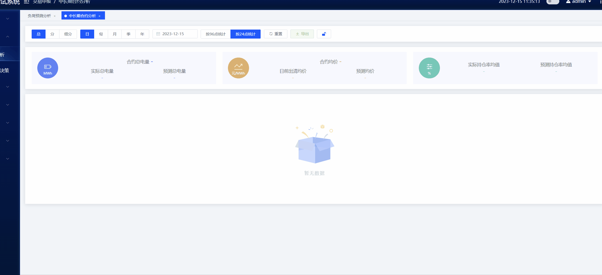
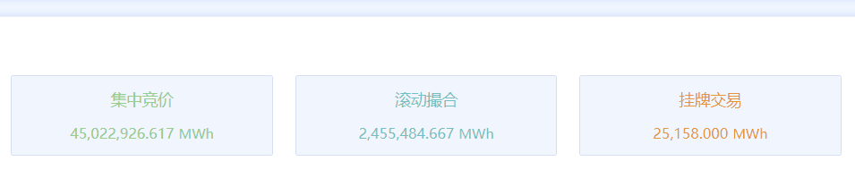
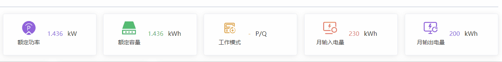
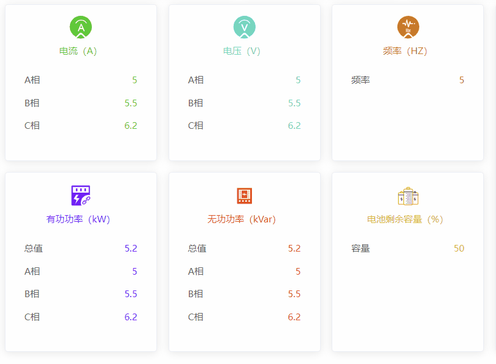
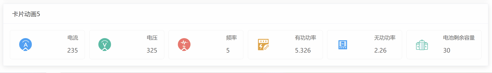

# 卡片动画

将常用的卡片动画进行收集，方便后期使用

## 1、动效 1



<details>
  <summary>查看代码</summary>

```vue
<template>
  <div class="info">
    <div class="info-item" v-for="(item, index) in cardList" :key="index">
      <div class="info-item-left">
        <div class="info-icon" :style="{ background: item.color }">
          <svg-icon :icon-class="item.icon" :class="item.iconStyle"></svg-icon>
          <div class="unit">{{ item.unit }}</div>
        </div>
      </div>
      <div class="info-text">
        <div class="info-top" v-if="item.title">
          {{ item.title }}
          <span :style="{ color: item.color }">{{
            item.value | numberToCurrencyNo
          }}</span>
        </div>
        <div class="info-bottom">
          <div v-for="(v, i) in item.list" :key="i">
            <p>{{ v.text }}</p>
            <p :style="{ color: item.color }">
              {{ v.value | numberToCurrencyNo
              }}<span
                v-if="v.value !== null && v.value !== 'null' && v.value !== ''"
                class="unit"
                >{{ index === 2 ? item.unit : "" }}</span
              >
            </p>
          </div>
        </div>
      </div>
    </div>
  </div>
</template>
<script>
  export default {
    data() {
      return {
        cardList: [
          {
            color: "#5b84f5",
            title: "合约总电量",
            value: 11,
            icon: "battery",
            iconStyle: "fIcon",
            unit: "MWh",
            list: [
              {
                text: "实际总电量",
                value: 22,
              },
              {
                text: "预测总电量",
                value: 33,
              },
            ],
          },
          {
            color: "#dead6a",
            title: "合约均价",
            value: 44,
            icon: "sy",
            iconStyle: "pIcon",
            unit: "元/MWh",
            list: [
              {
                text: "日前出清均价",
                value: 55,
              },
              {
                text: "预测均价",
                value: 66,
              },
            ],
          },
          {
            color: "#60cab8",
            icon: "sets",
            iconStyle: "dIcon",
            unit: "%",
            list: [
              {
                text: "实际持仓率均值 ",
                value: 77,
              },
              {
                text: "预测持仓率均值 ",
                value: 88,
              },
            ],
          },
        ];
      }
    }
  }
</script>

<style lang="scss" scoped>
  @import "@/assets/css/mixin.scss";

  .info {
    width: 100%;
    min-width: 1100px;
    @include flex-between;

    .info-item {
      margin: 0 10px;
      height: 100px;
      background: $background-color-lighter;
      border-radius: 2px;
      @include flex-center;
      transition: all 0.5s;
      &:hover {
        transform: translateY(-5px);
        box-shadow: 0 2px 12px 0 rgba(0, 0, 0, 0.1);
      }

      &:first-child {
        margin-left: 0;
        width: 33%;
      }

      &:nth-child(2) {
        width: 33%;
      }
      &:last-child {
        width: 33%;
        margin-right: 0;
      }

      .info-item-left {
        width: 100px;
        @include flex-center;
        flex-direction: column;
        .info-icon {
          width: 65px;
          height: 65px;
          border-radius: 50%;
          line-height: 65px;
          text-align: center;
          position: relative;
          overflow: hidden;
          .unit {
            position: absolute;
            height: 30px;
            line-height: 30px;
            left: 0;
            bottom: 0;
            right: 0;
            text-align: center;
            font-size: $fs12;
            font-weight: 400;
            color: #fff;
            transform: scale(0.85);
            transition: all 0.5s;
          }
          .svg-icon {
            display: inline-block !important;
            vertical-align: middle;
            transition: all 0.5s;
            margin-bottom: 10px;
            &.fIcon {
              color: #e3eaff;
              width: 25px;
              height: 25px;
            }

            &.dIcon {
              color: #dffaf5;
              width: 31px;
              height: 31px;
            }

            &.pIcon {
              color: #f6ede0;
              width: 25px;
              height: 25px;
            }

            &.cIcon {
              color: #e3f9e3;
              width: 33px;
              height: 33px;
            }
          }
        }
      }

      .info-text {
        flex: 1;
        @include flex-center;
        flex-direction: column;
        color: $font-regular;

        .info-top {
          height: 40px;
          line-height: 40px;
          width: 100%;
          text-align: center;

          span {
            font-size: $fs18;
            &.unit {
              font-size: $fs12;
              margin-left: 5px;
            }
          }
        }

        .info-bottom {
          flex: 1;
          @include flex-between;
          font-size: $fs14;
          text-align: center;
          padding: 0 12px;
          width: 100%;

          div {
            width: 100%;

            &:nth-child(2) {
              margin: 0 10px;
            }
          }
        }

        .info-height {
          line-height: 2em;
        }
        .unit {
          font-size: $fs12;
          margin-left: 5px;
        }
        &.column {
          align-items: flex-start;
        }
      }
    }
  }
</style>
```

</details>

## 2、动效 2



<details>
  <summary>查看代码</summary>

```vue
<template>
  <div class="info-box">
    <div class="info-item" v-for="(item, k) in dataList" :key="k">
      <h2
        :style="'color:' + colorList[item.index !== undefined ? item.index : k]"
      >
        <el-popover v-if="item.tip" placement="bottom" trigger="hover">
          <el-table :data="item.tableData" size="mini" border>
            <el-table-column
              v-for="(column, i) in item.tableHeader"
              align="center"
              :key="i"
              :property="column.prop"
              :label="column.label"
              :min-width="column.width || 120"
            ></el-table-column>
          </el-table>
          <i class="el-icon-info hover" slot="reference"> {{ item.name }}</i>
        </el-popover>

        <span v-else>{{ item.name }}</span>
      </h2>
      <p
        class="mt10"
        :style="'color:' + colorList[item.index !== undefined ? item.index : k]"
      >
        {{ item.value | numberToCurrencyNo }}
        <span
          class="unit"
          v-if="
            item.value !== null && item.value !== '' && item.value !== undefined
          "
          >{{ item.unit }}</span
        >
      </p>
    </div>
  </div>
</template>
<style lang="scss" scoped>
  .info-box {
    display: flex;
    justify-content: space-between;
    .info-item {
      flex: 1;
      margin: 0 10px;
      background: $background-color-lighter;
      border: 1px solid $border-color-light;
      border-radius: 2px;
      padding: 10px;
      transition: all 0.28s;
      text-align: center;
      display: flex;
      flex-direction: column;
      justify-content: space-between;
      &:hover {
        box-shadow: 0 0 6px 2px $box-shadow-color;
      }
      h2 {
        font-size: $fs14;
      }
      p {
        font-size: 13px;
        .unit {
          font-size: 12px;
        }
      }
    }
  }
</style>
```

</details>

## 3、动效 3



<details>
  <summary>查看代码</summary>

```vue
<template>
  <el-card class="base-right-item" v-for="(item, i) in runningInfo" :key="i">
    <div class="item-content">
      <div class="left">
        <base-svg-icon :icon-class="item.icon" :style="'color:' + item.color" />
        <p>{{ item.name }}</p>
      </div>
      <div class="right">
        <span class="value" :style="'color:' + item.color">{{
          item.value
        }}</span>
        <span class="unit">{{ item.unit }}</span>
      </div>
    </div>
  </el-card>
</template>
<script>
  export default {
    data() {
      return {
        runningInfo: [
          {
            name: "额定功率",
            icon: "shishigonglv",
            value: "1.436",
            unit: "kW",
            color: "#9860df",
          },
          {
            name: "额定容量",
            icon: "rongliang",
            value: "1.436",
            unit: "kWh",
            color: "#19be6b",
          },
          {
            name: "工作模式",
            icon: "shebeishouming",
            value: "-",
            unit: "P/Q",
            color: "#e6a23c",
          },
          {
            name: "月输入电量",
            icon: "down_elec",
            value: "230",
            unit: "kWh",
            color: "#f56c6c",
          },
          {
            name: "月输出电量",
            icon: "shuchudianliang",
            value: "200",
            unit: "kWh",
            color: "#9860df",
          },
        ],
      };
    },
  };
</script>
<style lang="scss" scoped>
  .base-right-item {
    margin: 0 7.5px;
    flex: 1;

    &:last-child {
      margin-right: 0;
    }
    &:hover {
      transform: translateY(-5px);
      .svg-icon {
        transform: scale(1.1);
      }
    }
    .item-content {
      display: flex;
      justify-content: space-between;
      align-items: center;
      .left {
        width: 80px;
        text-align: center;
        .svg-icon {
          font-size: 30px;
          transition: all 0.5s;
        }
        p {
          font-size: $fs12;
          margin-top: 6px;
        }
      }
      .right {
        flex: 1;
        font-size: 13px;
        span {
          &.unit {
            margin-left: 10px;
          }
        }
      }
    }
  }
</style>
```

</details>

## 4、动效 4



<details>
  <summary>查看代码</summary>

```vue
<template>
  <div class="detail-info-left">
    <el-card class="left-item" v-for="(item, i) in detailInfo" :key="i">
      <div class="item-top" :style="'color:' + item.color">
        <base-svg-icon :icon-class="item.icon"></base-svg-icon>
        <p>{{ item.name }}</p>
      </div>
      <div class="item-list">
        <p v-for="(child, k) in item.list" :key="k">
          <span class="label">{{ child.label }}</span>
          <span class="value" :style="'color:' + item.color">{{
            child.value
          }}</span>
        </p>
      </div>
    </el-card>
  </div>
</template>
<script>
  export default {
    data() {
      return {
        detailInfo: [
          {
            name: "电流（A）",
            icon: "dianliu",
            color: "#32cd20",
            list: [
              { label: "A相", value: "5" },
              { label: "B相", value: "5.5" },
              { label: "C相", value: "6.2" },
            ],
          },
          {
            name: "电压（V）",
            icon: "dianya",
            color: "#57d9c0",
            list: [
              { label: "A相", value: "5" },
              { label: "B相", value: "5.5" },
              { label: "C相", value: "6.2" },
            ],
          },
          {
            name: "频率（HZ）",
            icon: "pinlv",
            color: "#d27314",
            list: [{ label: "频率", value: "5" }],
          },

          {
            name: "有功功率（kW）",
            icon: "yougonggonglv",
            color: "#7914fb",
            list: [
              { label: "总值", value: "5.2" },
              { label: "A相", value: "5" },
              { label: "B相", value: "5.5" },
              { label: "C相", value: "6.2" },
            ],
          },
          {
            name: "无功功率（kVar）",
            icon: "wugonggonglv",
            color: "#ef4105",
            list: [
              { label: "总值", value: "5.2" },
              { label: "A相", value: "5" },
              { label: "B相", value: "5.5" },
              { label: "C相", value: "6.2" },
            ],
          },
          {
            name: "电池剩余容量（%）",
            icon: "rongliang1",
            color: "#e0b707",
            list: [{ label: "容量", value: "50" }],
          },
        ],
      };
    },
  };
</script>
<style lang="scss" scoped>
  .detail-info-left {
    width: 630px;
    display: flex;
    flex-wrap: wrap;
    .left-item {
      width: 200px;
      transition: all 0.5s;
      &:hover {
        transform: translateY(-5px);
        .svg-icon {
          transform: rotateY(180deg);
        }
      }
      &:nth-child(n + 4) {
        margin-top: 15px;
      }
      &:not(:nth-child(3n)) {
        margin-right: calc(30px / 2);
      }
      .item-top {
        text-align: center;
        .svg-icon {
          font-size: 30px;
          transition: all 0.5s;
        }
        p {
          font-size: $fs12;
          margin-top: 6px;
        }
      }
      .item-list {
        font-size: $fs12;
        margin-top: 15px;
        p {
          line-height: 30px;
          padding: 0 10px;
          display: flex;
          justify-content: space-between;
          color: $font-secondary;
        }
      }
    }
  }
</style>
```

</details>

## 5、动效 5



<details>
  <summary>查看代码</summary>

```vue
<template>
  <div class="detail-info">
    <div class="card-panel" v-for="(item, i) in cardDataList1" :key="i">
      <div class="card-panel-icon-wrapper" :class="item.iconClass">
        <base-svg-icon :icon-class="item.icon" class-name="card-panel-icon" />
      </div>
      <div class="card-panel-description">
        <div class="card-panel-text">{{ item.name }}</div>
        <span>{{ item.num }}</span>
      </div>
    </div>
  </div>
</template>
<script>
  export default {
    data() {
      return {
        detailInfo: [
          { name: "电流", num: 235, icon: "dianliu", iconClass: "icon-blue" },
          { name: "电压", num: 325, icon: "dianya", iconClass: "icon-green" },
          { name: "频率", num: 5, icon: "pinlv", iconClass: "icon-red" },
          {
            name: "有功功率",
            num: 5.326,
            icon: "yougong",
            iconClass: "icon-orange",
          },
          {
            name: "无功功率",
            num: 2.26,
            icon: "wugong",
            iconClass: "icon-blue",
          },
          {
            name: "电池剩余容量",
            num: 30,
            icon: "rongliang1",
            iconClass: "icon-green",
          },
        ],
      };
    },
  };
</script>
<style lang="scss" scoped>
  .detail-info {
    display: flex;
    flex-wrap: wrap;
    gap: 10px;

    .card-panel {
      flex: 1;
      height: 68px;
      cursor: pointer;
      position: relative;
      overflow: hidden;
      color: #666;
      border: 1px solid #eee;
      border-radius: 5px;
      background-color: #fff;
      display: flex;
      justify-content: space-between;
      align-items: center;

      &:hover {
        .card-panel-icon-wrapper {
          color: #fff;
        }

        .icon-blue {
          background: #36a3f7;
        }

        .icon-green {
          background: #34bfa3;
        }

        .icon-red {
          background: #f56c6c;
        }

        .icon-orange {
          background: #e6a23c;
        }
      }

      .icon-blue {
        color: #36a3f7;
      }

      .icon-green {
        color: #34bfa3;
      }

      .icon-red {
        color: #f56c6c;
      }

      .icon-orange {
        color: #e6a23c;
      }

      .card-panel-icon-wrapper {
        margin: 10px;
        padding: 10px;
        transition: all 0.38s ease-out;
        border-radius: 6px;
      }

      .card-panel-icon {
        font-size: 30px;
      }

      .card-panel-description {
        margin: 15px;
        margin-left: 0px;

        .card-panel-text {
          line-height: 14px;
          font-size: $fs12;
          margin-bottom: 12px;
          text-align: right;
        }

        .card-panel-num {
          font-size: 18px;
        }
      }
    }
  }
</style>
```

</details>
