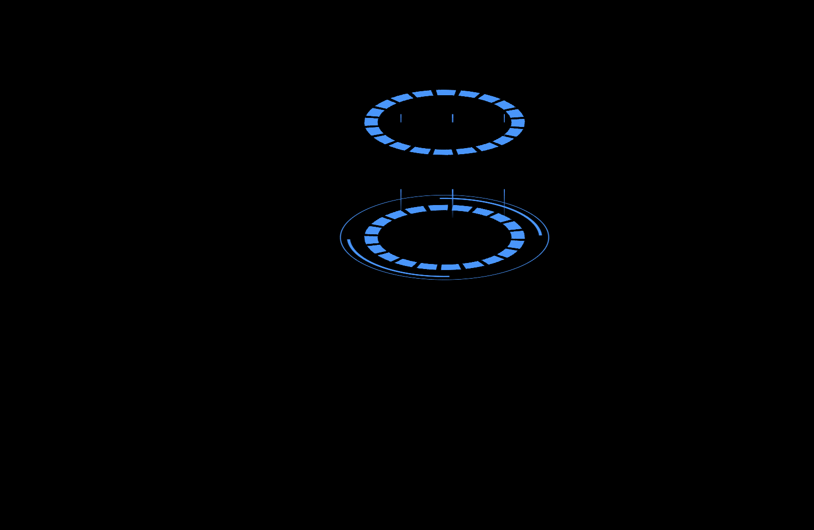
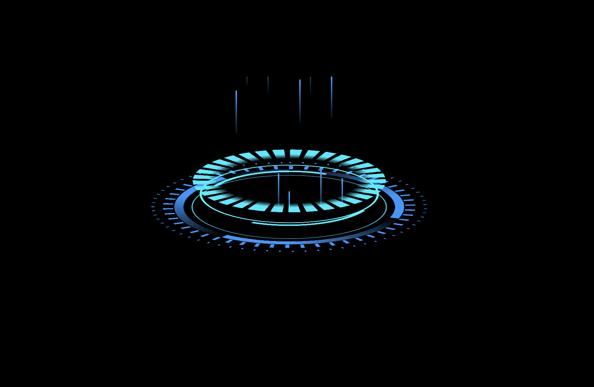
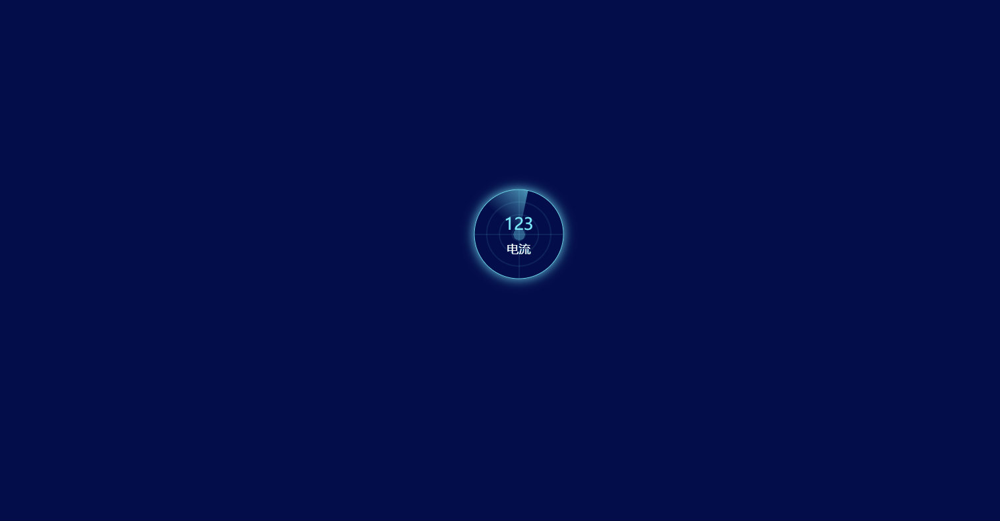
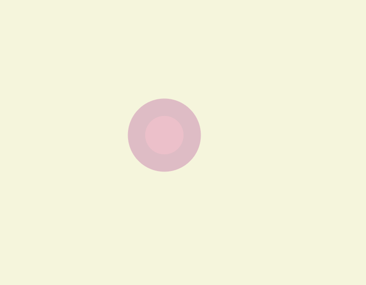
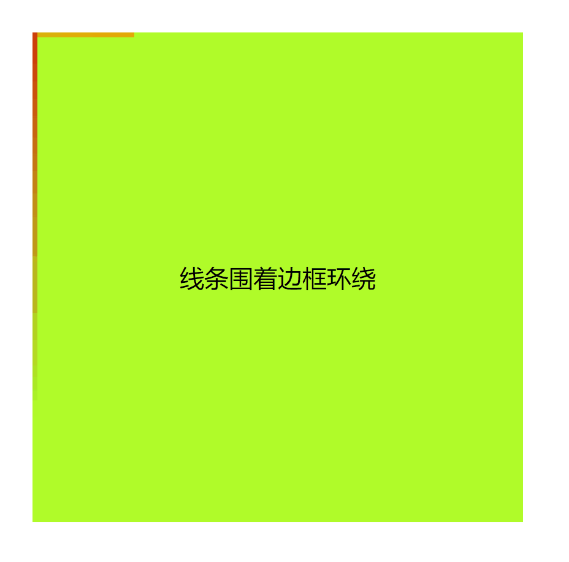

# 其他动画

## 1、动画 1



<details>
  <summary>查看代码</summary>

```html
<div class="box"></div>

<style>
  body {
    background: #000;
    display: flex;
    align-items: center;
    justify-content: center;
    padding-top: 300px;
    transform: translateZ(-150px);
    transform-style: preserve-3d;
    transform: rotateX(
      66deg
    ); /* 固定角度后，页面直接呈现3d效果，可以不需要下边的js代码*/
  }
  .box {
    width: 300px;
    height: 300px;
    transform-style: preserve-3d;
    position: relative;
    border-radius: 50%;
    outline: 2px solid rgb(42, 153, 255);
    outline-offset: 10px;
    border: 5px solid rgb(42, 153, 255);
    border-left-color: transparent;
    border-right-color: transparent;
    background: repeating-radial-gradient(
        #000,
        #000 50%,
        transparent 50%,
        transparent 60%,
        #000 60%,
        #000 100%
      ), repeating-conic-gradient(rgb(42, 153, 255) 0, rgb(42, 153, 255) 4%, transparent
          4%, transparent 5%);
    animation: rotate2 2s linear infinite;
  }
  .box::before {
    content: "";
    position: absolute;
    width: 300px;
    height: 300px;
    top: 0;
    left: 0;
    background: repeating-radial-gradient(
        #000,
        #000 50%,
        transparent 50%,
        transparent 60%,
        #000 60%,
        #000 100%
      ), repeating-conic-gradient(rgb(42, 153, 255) 0, rgb(42, 153, 255) 4%, transparent
          4%, transparent 5%);
    animation: rotate1 2s linear infinite;
  }
  .box::after {
    content: "";
    position: absolute;
    width: 300px;
    height: 300px;
    top: 0;
    left: 0;
    background: repeating-linear-gradient(
      to bottom,
      transparent 0,
      transparent 80px,
      rgba(42, 135, 255, 0.1) 80px,
      rgb(42, 135, 255) 130px
    );
    -webkit-mask: repeating-linear-gradient(
      to right,
      transparent 0px,
      transparent 80px,
      #000 80px,
      #000 82px
    );
    transform: rotateX(90deg);
    animation: line 2s linear infinite;
  }

  @keyframes line {
    0% {
      transform: translateZ(-50px) rotateX(90deg) rotateY(0deg);
    }
    100% {
      transform: translateZ(200px) rotateX(90deg) rotateY(-360deg);
    }
  }
  @keyframes rotate1 {
    0% {
      transform: translateZ(200px) rotateZ(0deg);
    }
    100% {
      transform: translateZ(200px) rotateZ(-720deg);
    }
  }
  @keyframes rotate2 {
    0% {
      transform: rotateZ(0deg);
    }
    100% {
      transform: rotateZ(360deg);
    }
  }
</style>
```

</details>

## 2、动画 2



<details>
  <summary>查看代码</summary>

```html
<div class="bg_item">
  <div class="main2">
    <div class="firstCircle position center"></div>
    <div class="secondCircle position center"></div>
    <div class="thirdCircle position center"></div>
    <div class="fourthCircle position center"></div>
    <div class="fifthCircle position center"></div>
    <div class="sixthCircle position center"></div>
    <div class="seventhCircle position center"></div>
    <div class="bar position flex">
      <div class="line line1"></div>
      <div class="line line2"></div>
      <div class="line line3"></div>
      <div class="line line4"></div>
      <div class="line line5"></div>
      <div class="line line6"></div>
      <div class="line line7"></div>
      <div class="line line8"></div>
      <div class="line line9"></div>
      <div class="line line10"></div>
      <div class="line line11"></div>
    </div>
  </div>
</div>

<style>
  body {
    background: #000;
  }
  .bg_item {
    display: flex;
    justify-content: center;
    align-items: center;
    margin-top: 300px;
  }
  .main2 {
    width: 300px;
    height: 300px;
    transform-style: preserve-3d;
    transform: rotateX(71deg);
    position: relative;
  }
  .position {
    position: absolute;
  }
  .center {
    top: 50%;
    left: 50%;
    transform: translateX(-50%) translateY(-50%);
  }
  .firstCircle {
    width: 600px;
    height: 600px;
    border-radius: 50%;
    background: repeating-conic-gradient(
      rgb(42, 153, 255) 0,
      rgb(42, 153, 255) 0.2%,
      transparent 0.2%,
      transparent 1.5%,
      rgb(42, 153, 255) 1.5%
    );
    -webkit-mask: radial-gradient(
      transparent,
      transparent 69%,
      #000 69%,
      #000 100%
    );
  }
  .secondCircle {
    width: 550px;
    height: 550px;
    border-radius: 50%;
    background: repeating-conic-gradient(
      rgb(42, 153, 255) 0,
      rgb(42, 153, 255) 0.5%,
      transparent 0.5%,
      transparent 2%,
      rgb(42, 153, 255) 2%
    );
    -webkit-mask: radial-gradient(
      transparent,
      transparent 65%,
      #000 65%,
      #000 100%
    );
  }
  .thirdCircle {
    width: 500px;
    height: 500px;
    border-radius: 50%;
    background: repeating-conic-gradient(
      rgb(42, 153, 255) 20%,
      rgb(42, 153, 255) 30%,
      transparent 30%,
      transparent 30%,
      rgb(42, 153, 255) 50%
    );
    -webkit-mask: radial-gradient(
      transparent,
      transparent 65%,
      #000 65%,
      #000 100%
    );
  }
  .fourthCircle {
    width: 420px;
    height: 420px;
    border-radius: 50%;
    border: 3px solid rgb(5, 216, 244);
  }
  .fifthCircle {
    width: 420px;
    height: 420px;
    border-radius: 50%;
    background: repeating-conic-gradient(
      rgb(0, 236, 255) 0,
      rgb(0, 236, 255) 2%,
      transparent 2%,
      transparent 3%,
      rgb(0, 236, 255) 3%
    );
    -webkit-mask: radial-gradient(
      transparent,
      transparent 50%,
      #000 60%,
      #000 100%
    );
    transform: translateX(-50%) translateY(-50%) translateZ(200px);
    animation: rotate2 3s linear infinite;
  }
  .sixthCircle {
    width: 350px;
    height: 350px;
    border-radius: 50%;
    border: 10px solid rgb(5, 252, 255);
    border-color: rgb(10, 238, 254) transparent;
    animation: rotate1 3s linear infinite;
  }
  .seventhCircle {
    width: 380px;
    height: 380px;
    border-radius: 50%;
    border: 5px solid rgb(5, 252, 255);
    animation: rotate3 3s linear infinite;
  }
  .flex {
    display: flex;
    justify-content: center;
    align-items: center;
  }
  .bar {
    width: 280px;
    height: 300px;
    background: transparent;
    top: 50%;
    left: 50%;
    transform: translateZ(150px) translateX(-50%) translateY(-50%) rotateX(
        90deg
      );
    display: flex;
    gap: 20px;
    overflow: hidden;
  }
  .line {
    width: 3px;
    height: 100px;
    background: linear-gradient(
      to top,
      rgb(69, 164, 254),
      rgba(42, 153, 255, 0.1)
    );
  }
  .line1 {
    animation: line 1s linear infinite;
  }
  .line2 {
    animation: line 0.5s 0.2s linear infinite;
  }
  .line3 {
    animation: line 1.5s 0.1s linear infinite;
  }
  .line4 {
    animation: line 1.1s 0.1s linear infinite;
  }
  .line5 {
    animation: line 1.6s 0.3s linear infinite;
  }
  .line6 {
    animation: line 2s 0.4s linear infinite;
  }
  .line7 {
    animation: line 1.2s 0.2s linear infinite;
  }
  .line8 {
    animation: line 1.1s 0.1s linear infinite;
  }
  .line9 {
    animation: line 1.9s 0.3s linear infinite;
  }
  .line10 {
    animation: line 1.7s 0.3s linear infinite;
  }
  .line11 {
    animation: line 1.3s 0.1s linear infinite;
  }
  .line12 {
    animation: line 1.4s 0.4s linear infinite;
  }
  @keyframes rotate1 {
    0% {
      transform: translateZ(20px) translateX(-50%) translateY(-50%) rotateZ(
          0deg
        );
    }
    100% {
      transform: translateZ(20px) translateX(-50%) translateY(-50%) rotateZ(
          -360deg
        );
    }
  }
  @keyframes rotate2 {
    0% {
      transform: translateX(-50%) translateY(-50%) translateZ(60px) rotateZ(
          0deg
        );
    }
    100% {
      transform: translateX(-50%) translateY(-50%) translateZ(60px) rotateZ(
          360deg
        );
    }
  }
  @keyframes rotate3 {
    0% {
      transform: translateX(-50%) translateY(-50%) translateZ(30px) rotateZ(
          0deg
        );
    }
    100% {
      transform: translateX(-50%) translateY(-50%) translateZ(30px) rotateZ(
          360deg
        );
    }
  }
  @keyframes line {
    0% {
      transform: translateY(-220px);
    }
    100% {
      transform: translateY(220px);
    }
  }
</style>
```

</details>

## 3、动画 3



<details>
  <summary>查看代码</summary>

```html
<div class="radar">
  <div class="line-hor"></div>
  <div class="line-ver"></div>
  <div class="sec-border"></div>
  <div class="thi-border"></div>
  <div class="four-border"></div>
  <div class="cover">
    <div class="sector"></div>
  </div>
  <div class="round"></div>
  <div class="hc-text">
    <div class="g-font-risk">
      <span>123</span>
    </div>
    <div class="hc-name">电流</div>
  </div>
</div>

<style>
  body {
    background-color: #010e4b;
  }
  .radar {
    width: 7vw;
    height: 7vw;
    display: inline-block;
    border-radius: 100%;
    position: absolute;
    top: 50%;
    left: 50%;
    -webkit-transform: translate(-50%, -50%);
    transform: translate(-50%, -50%);
    overflow: hidden;
    border: 1px solid #42dff1;
    -webkit-box-shadow: 0 0 14px #42dff1;
    box-shadow: 0 0 14px #42dff1;
  }
  .line-hor {
    width: 100%;
    height: 50%;
    position: absolute;
    top: 0;
    left: 0;
    border-bottom: 1px solid rgba(66, 223, 241, 0.2);
  }
  .line-ver {
    width: 50%;
    height: 100%;
    position: absolute;
    top: 0;
    left: 0;
    border-right: 1px solid rgba(66, 223, 241, 0.2);
  }
  .sec-border {
    width: 5vw;
    height: 5vw;
  }
  .thi-border {
    width: 3vw;
    height: 3vw;
  }
  .four-border {
    width: 1vw;
    height: 1vw;
  }
  .sec-border,
  .thi-border,
  .four-border {
    border: 1px solid rgba(66, 223, 241, 0.2);
    border-radius: 50%;
    position: absolute;
    top: 50%;
    left: 50%;
    transform: translate(-50%, -50%);
  }
  .cover {
    position: relative;
    left: -100%;
    top: -100%;
    width: 150%;
    height: 150%;
    overflow: hidden;
    -webkit-transform-origin: 100% 100%;
    transform-origin: 100% 100%;
    animation: rotation 3s linear infinite;
  }
  .sector {
    position: absolute;
    width: 100%;
    height: 80%;
    bottom: 0;
    right: 0;
    transform: rotate(25deg);
    transform-origin: 100% 100%;
    background: linear-gradient(185deg, #42dff1 40%, hsla(0, 0%, 100%, 0) 90%);
  }
  .round {
    position: absolute;
    width: 7vw;
    height: 7vw;
    left: 0;
    bottom: 0;
    background: #42dff1;
    border-radius: 100%;
    animation: animate 3s linear infinite;
    z-index: -1;
  }
  .hc-text {
    margin: 0;
    text-align: center;
    width: 100%;
    position: absolute;
    top: 50%;
    transform: translateY(-50%);
  }
  .g-font-risk {
    margin-bottom: 8px;
    color: #51f2ff;
    font-size: 1.3vw;
  }
  .hc-name {
    color: #fff;
    font-size: 0.95vw;
  }
  @keyframes rotation {
    0% {
      transform: rotate(0deg);
    }
    100% {
      transform: rotate(1turn);
    }
  }
  @keyframes animate {
    0% {
      transform: scale(0.1);
      opacity: 0.4;
    }
    100% {
      transform: scale(1);
      opacity: 0;
    }
  }
</style>
```

</details>

## 4、动画 4



<details>
  <summary>查看代码</summary>

```html
<div class="circle-breath"></div>

<style>
  * {
    padding: 0;
    margin: 0;
  }
  body {
    margin: 120px auto;
    background: beige;
  }
  .circle-breath {
    background: pink;
    box-shadow: 0 0 0 0 rgb(204, 73, 152);
    height: 40px;
    width: 40px;
    border-radius: 50%;
    animation: breath 2.5s infinite;
  }
  @keyframes breath {
    0% {
      transform: scale(0.6);
      box-shadow: 0 0 0 0 rgba(204, 73, 152, 60%);
    }
    60% {
      transform: scale(1);
      box-shadow: 0 0 0 40px rgba(204, 73, 152, 0%);
    }
    100% {
      transform: scale(0.6);
      box-shadow: 0 0 0 0 rgba(204, 73, 152, 0%);
    }
  }
</style>
```

</details>

## 5、动画 5



<details>
  <summary>查看代码</summary>

```html
<div class="mainbox">
  <span class="line"></span>
  <span class="line"></span>
  <span class="line"></span>
  <span class="line"></span>
  <div class="content">线条围着边框环绕</div>
</div>

<style>
  * {
    padding: 0;
    margin: 0;
  }
  body {
    margin: 150px;
  }
  .mainbox {
    width: 320px;
    height: 320px;
    position: relative;
    overflow: hidden;
  }
  .content {
    width: 320px;
    height: 320px;
    line-height: 320px;
    text-align: center;
    background: lawngreen;
  }
  .line {
    position: absolute;
  }
  .line:nth-child(1) {
    top: 0;
    left: 0;
    width: 100%;
    height: 3px;
    background: linear-gradient(90deg, transparent, orange);
    animation: animate1 8s linear infinite;
  }
  @keyframes animate1 {
    0% {
      left: -100%;
    }
    50%,
    100% {
      left: 100%;
    }
  }
  .line:nth-child(2) {
    top: -100%;
    right: 0;
    width: 3px;
    height: 100%;
    background: linear-gradient(180deg, transparent, rebeccapurple);
    animation: animate2 8s linear infinite;
    animation-delay: 2s;
  }
  @keyframes animate2 {
    0% {
      top: -100%;
    }
    50%,
    100% {
      top: 100%;
    }
  }
  .line:nth-child(3) {
    bottom: 0;
    right: 0;
    width: 100%;
    background: linear-gradient(270deg, transparent, blue);
    animation: animate3 8s linear infinite;
    animation-delay: 4s;
  }
  @keyframes animate3 {
    0% {
      right: -100%;
      height: 3px;
    }
    50%,
    100% {
      right: 100%;
      height: 2px;
    }
  }
  .line:nth-child(4) {
    left: 0;
    bottom: -100%;
    width: 3px;
    height: 100%;
    background: linear-gradient(360deg, transparent, red);
    animation: animate4 8s linear infinite;
    animation-delay: 6s;
  }
  @keyframes animate4 {
    0% {
      bottom: -100%;
    }
    50%,
    100% {
      bottom: 100%;
    }
  }
</style>
```

</details>
