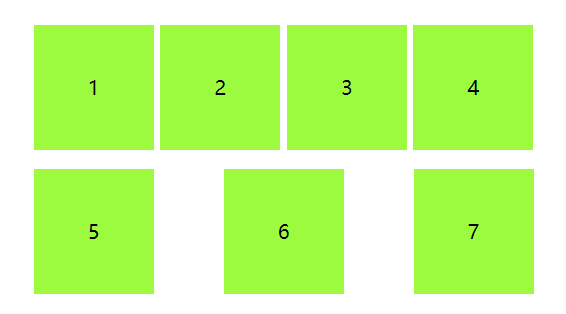
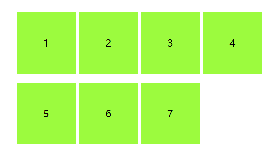
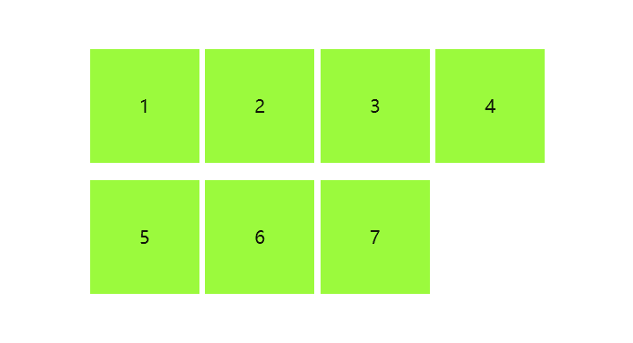
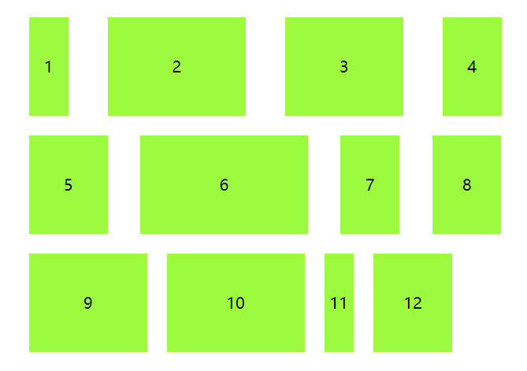
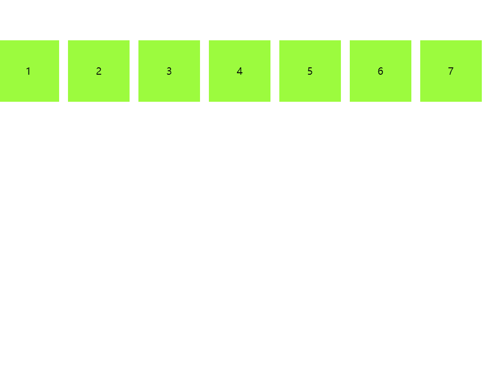
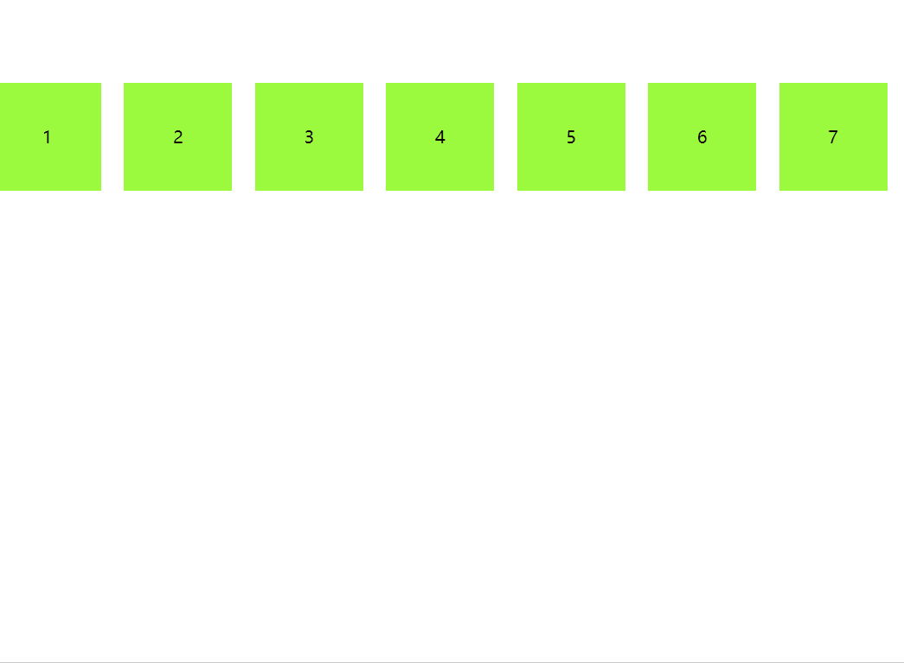

# flex 布局最后一行左对齐

先看下效果图，使用`display:flex;justify-content: space-between;`布局后，第二排布局比较松散，希望靠左对齐。



```html
<div class="container">
  <div class="list">1</div>
  <div class="list">2</div>
  <div class="list">3</div>
  <div class="list">4</div>
  <div class="list">5</div>
  <div class="list">6</div>
  <div class="list">7</div>
</div>
```

```css
<style>
* {
    padding: 0;
    margin: 0;
}
.container {
    width: 400px;
    margin: 100px auto;
    display: flex;
    justify-content: space-between;
    flex-wrap: wrap;
}
.list {
    width: 24%;
    height: 100px;
    line-height: 100px;
    text-align: center;
    background: chartreuse;
    margin-top: 15px;
}
</style>
```

## 1、如果每一行列数是固定的

### 1.1 模拟 space-between 间隙

也就是我们不使用`justify-content: space-between`声明两端对齐，中间的间隙我们可以使用 margin 进行控制。

::: tip 提示
这里主要计算了每个 div 盒子的右边距，而最后一个盒子不用设置右边距，每行固定 4 列的话，则最后一个盒子可以使用 4n 表示

nth-child(): 第几个子元素

:not(): 除去哪个元素
:::



```css
* {
  padding: 0;
  margin: 0;
}
.container {
  width: 400px;
  margin: 100px auto;
  display: flex;
  flex-wrap: wrap;
}
.list {
  width: 24%;
  height: 100px;
  line-height: 100px;
  text-align: center;
  background: chartreuse;
  margin-top: 15px;
}
.list:not(:nth-child(4n)) {
  margin-right: calc(4% / 3);
}
```

### 1.2 根据个数最后一个元素动态设置 margin

由于每一列的数目都是固定的，因此，我们可以计算出不同个数列表应该设置多大的 margin 值。

例如，假设每行 4 个元素，结果最后一行只有 3 个元素，则最后一个元素的 margin-right 大小是“列表宽度+间隙大小”的话，那最后 3 个元素也是可以完美左对齐的。

::: tip 提示
这里主要是使用 css 计算出每行有几个元素，然后针对不同个数设置不同的 margin-right

说明是最后一个元素并且是第 4n - 1 个

.list.last-child.nth-child(4n-1) {}

说明是最后一个元素并且是第 4n - 2 个

.list.last-child.nth-child(4n-2) {}

.last-child 是最后一个元素

.nth-child(4n - x)：是第 4n - x 个子元素
:::



```css
* {
  padding: 0;
  margin: 0;
}
.container {
  width: 400px;
  margin: 100px auto;
  display: flex;
  justify-content: space-between;
  flex-wrap: wrap;
}
.list {
  width: 24%;
  height: 100px;
  line-height: 100px;
  text-align: center;
  background: chartreuse;
  margin-top: 15px;
}
/* 如果最后一行是3个元素 */
.list:last-child:nth-child(4n-1) {
  margin-right: calc(24% + 4% / 3);
}
/* 如果最后一行是2个元素 */
.list:last-child:nth-child(4n-2) {
  margin-right: calc(48% + 8% / 3);
}
```

## 2、如果每一列宽度不是固定的

如果每一列的宽度不是固定的，则间距不能使用计算了。

### 2.1 最后一项 margin-right: auto



```html
<div class="container">
  <div class="list box1">1</div>
  <div class="list box2">2</div>
  <div class="list box3">3</div>
  <div class="list box4">4</div>
  <div class="list box5">5</div>
  <div class="list box6">6</div>
  <div class="list box7">7</div>
  <div class="list box8">8</div>
  <div class="list box9">9</div>
  <div class="list box10">10</div>
  <div class="list box11">11</div>
  <div class="list box12">12</div>
</div>
```

```css
<style>
* {
    padding: 0;
    margin: 0;
}
.container {
    width: 500px;
    max-width: 100%;
    margin: 100px auto;
    display: flex;
    justify-content: space-between;
    flex-wrap: wrap;
}
.list {
    height: 100px;
    line-height: 100px;
    text-align: center;
    background: chartreuse;
    margin: 10px;
}
.list:last-child {
    margin-right: auto;
}
.box1 {
    width: 40px;
}
.box2 {
    width: 140px;
}
.box3 {
    width: 120px;
}
.box4 {
    width: 60px;
}
.box5 {
    width: 80px;
}
.box6 {
    width: 170px;
}
.box7 {
    width: 60px;
}
.box8 {
    width: 70px;
}
.box9 {
    width: 120px;
}
.box10 {
    width: 140px;
}
.box11 {
    width: 30px;
}
.box12 {
    width: 80px;
}
</style>
```

### 2.2 创建伪元素并设置 flex: auto 或 flex: 1


```html
<div class="container">
  <div class="list box1">1</div>
  <div class="list box2">2</div>
  <div class="list box3">3</div>
  <div class="list box4">4</div>
  <div class="list box5">5</div>
  <div class="list box6">6</div>
  <div class="list box7">7</div>
  <div class="list box8">8</div>
  <div class="list box9">9</div>
  <div class="list box10">10</div>
  <div class="list box11">11</div>
  <div class="list box12">12</div>
</div>
```

```css
<style>
* {
    padding: 0;
    margin: 0;
}
.container {
    width: 500px;
    max-width: 100%;
    margin: 100px auto;
    display: flex;
    justify-content: space-between;
    flex-wrap: wrap;
}
.list {
    height: 100px;
    line-height: 100px;
    text-align: center;
    background: chartreuse;
    margin: 10px;
}
.container::after{
    content: "";
    flex: auto
}
.box1 {
    width: 40px;
}
.box2 {
    width: 140px;
}
.box3 {
    width: 120px;
}
.box4 {
    width: 60px;
}
.box5 {
    width: 80px;
}
.box6 {
    width: 170px;
}
.box7 {
    width: 60px;
}
.box8 {
    width: 70px;
}
.box9 {
    width: 120px;
}
.box10 {
    width: 140px;
}
.box11 {
    width: 30px;
}
.box12 {
    width: 80px;
}
</style>
```

## 3、如果每一行列数不固定

如果每一行列数不固定，我们可以使用足够的空白标签进行填充占位，具体的占位数量是由最多列数的个数决定的，例如这个布局最多 7 列，那我们可以使用 7 个空白标签进行填充占位，最多 10 列，那我们需要使用 10 个空白标签。



```html
<div class="container">
  <div class="list">1</div>
  <div class="list">2</div>
  <div class="list">3</div>
  <div class="list">4</div>
  <div class="list">5</div>
  <div class="list">6</div>
  <div class="list">7</div>
  <i></i><i></i><i></i><i></i><i></i><i></i><i></i>
</div>
```

```css
<style>
* {
    padding: 0;
    margin: 0;
}
.container {
    margin: 100px auto;
    display: flex;
    justify-content: space-between;
    flex-wrap: wrap;
}
.list {
    width: 100px;
    height: 100px;
    line-height: 100px;
    text-align: center;
    background: chartreuse;
    margin: 15px 10px 0 0;
}
i {
    width: 100px;
    margin-right: 10px;
}
</style>
```

## 4、如果列数不能固定且 html 不能改变

这种情况可以使用 grid 布局，grid 可以设置间隙 gap，且天然格子对齐排布。



```html
<div class="container">
  <div class="list">1</div>
  <div class="list">2</div>
  <div class="list">3</div>
  <div class="list">4</div>
  <div class="list">5</div>
  <div class="list">6</div>
  <div class="list">7</div>
</div>
```

```css
<style>
* {
    padding: 0;
    margin: 0;
}
.container {
    margin: 100px auto;
    display: grid;
    justify-content: space-between;
    grid-template-columns: repeat(auto-fill, 100px);
    grid-gap: 10px;
}
.list {
    width: 100px;
    height: 100px;
    line-height: 100px;
    text-align: center;
    background: chartreuse;
    margin-top: 5px;
}
</style>
```
