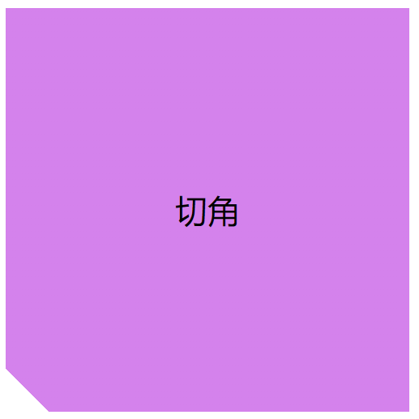
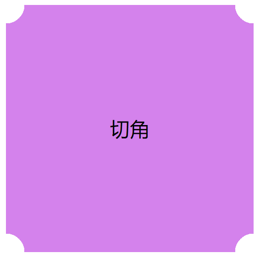
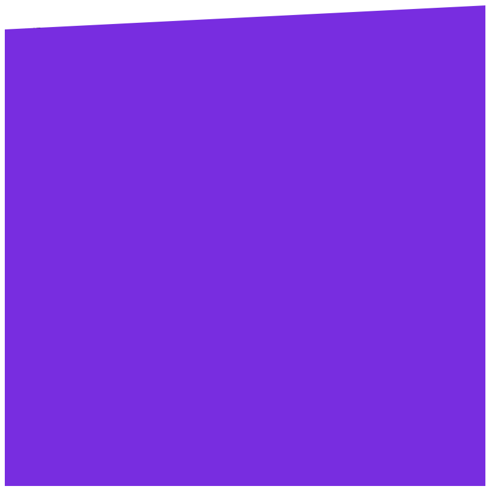

# 切角

## 1、只切一个角



<details>
  <summary>查看代码</summary>

```html
<div class="content">
  <div class="box">切角效果</div>
</div>

<style>
  .box {
    width: 200px;
    height: 200px;
    text-align: center;
    line-height: 200px;
    background: violet;
    background: linear-gradient(45deg, transparent 15px, violet 0);
  }
</style>
```

</details>

## 2、弧形切角



<details>
  <summary>查看代码</summary>

```html
<div class="content">
  <div class="box">弧形切角</div>
</div>

<style>
  .box {
    width: 200px;
    height: 200px;
    text-align: center;
    line-height: 200px;
    background: circle-gradient(circle at top left, transparent 15px, violet 0) top
        left, circle-gradient(circle at top right, transparent 15px, violet 0) top
        right,
      circle-gradient(circle at bottom left, transparent 15px, violet 0) bottom left,
      circle-gradient(circle at bottom right, transparent 15px, violet 0) bottom
        right;
    background-size: 50% 50%;
    background-repeat: no-repeat;
  }
</style>
```

</details>

## 3、切一条边



此方案可以用于设置特殊的背景。

<details>
  <summary>查看代码</summary>

```html
<div class="content">
  <div class="box"></div>
</div>

<style>
  .box {
    width: 400px;
    height: 400px;
    background: blueviolet;
    clip-path: polygon(0 20px, 100% 0, 100% 100%, 0 100%);
  }
</style>
```

</details>
