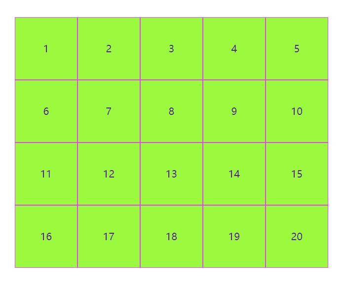
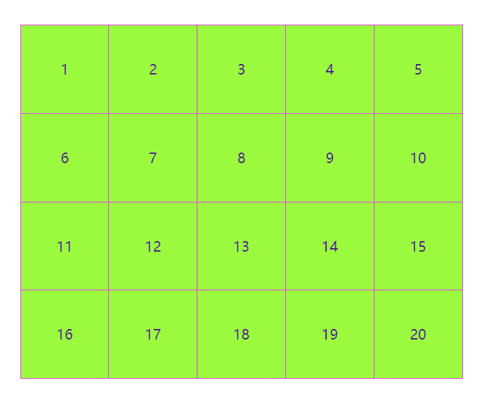

<!--
 * @Author: rk
 * @Description:
 * @Date: 2024-03-12 10:13:49
 * @LastEditors: rk
 * @LastEditTime: 2024-03-12 10:36:50
-->

# 列表边框重合问题解决

当我们使用 ul、li 布局格式时，添加边框可能出现边框重合问题，那么该如何解决？



我们可以通过使用 margin: 0 0 -1px -1px 解决边框重合问题，这块的-1px 就是边框的宽度

但是当我们给 li 设置 hover 时，会发现右边框和下边框会被相邻的 li 压在下边，导致代码没有生效，这种情况可以使用 z-index 层级解决。

:::warning 注意：
给 li 设置 z-index:0 时，必须设置 position:relative 属性，否则不生效
:::


具体代码如下：

```html
<ul>
  <li><a href="">1</a></li>
  <li><a href="">2</a></li>
  <li><a href="">3</a></li>
  <li><a href="">4</a></li>
  <li><a href="">5</a></li>
  <li><a href="">6</a></li>
  <li><a href="">7</a></li>
  <li><a href="">8</a></li>
  <li><a href="">9</a></li>
  <li><a href="">10</a></li>
  <li><a href="">11</a></li>
  <li><a href="">12</a></li>
  <li><a href="">13</a></li>
  <li><a href="">14</a></li>
  <li><a href="">15</a></li>
  <li><a href="">16</a></li>
  <li><a href="">17</a></li>
  <li><a href="">18</a></li>
  <li><a href="">19</a></li>
  <li><a href="">20</a></li>
</ul>
```

```css
<style>
* {
    padding: 0;
    margin: 0;
}
ul {
    width: 510px;
    margin: 100px auto;
}
li {
    list-style: none;
    width: 100px;
    height: 100px;
    text-align: center;
    background: chartreuse;
    float: left;
    border: 1px solid fuchsia;
    margin: 0 0 -1px -1px;
    position: relative;
    z-index: 0;
}
li:hover {
    border: 1px solid snow;
    z-index: 2;
}
a {
    text-decoration: none;
    line-height: 100px;
}
</style>
```
