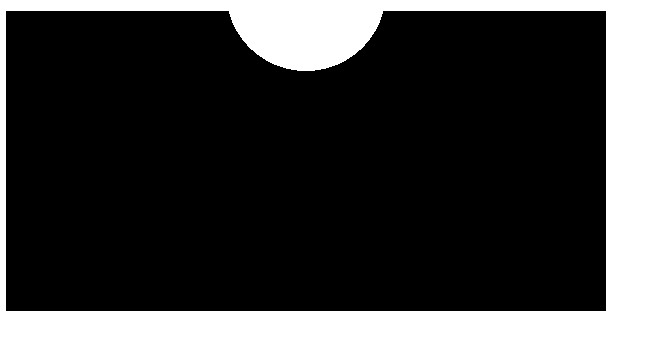
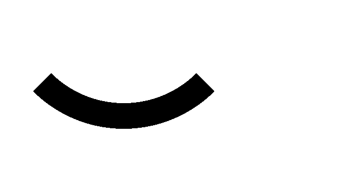
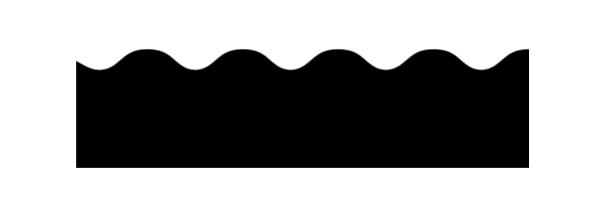
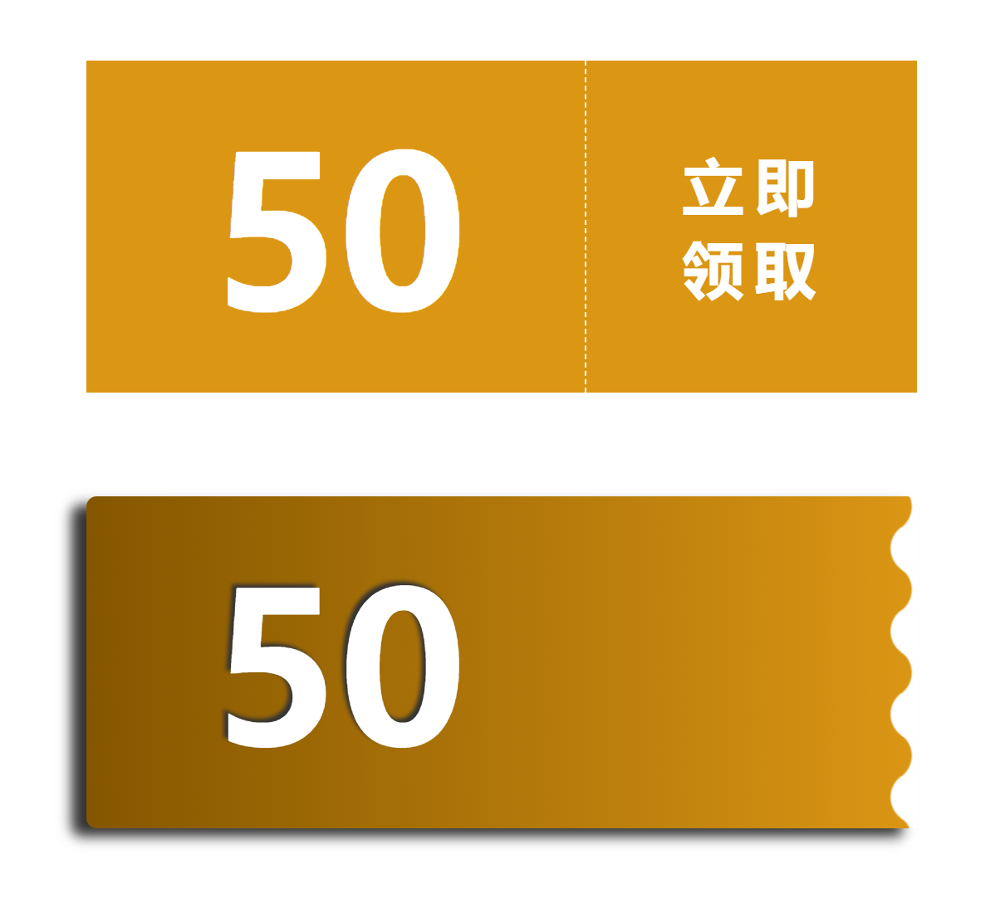

# 滤镜的使用

## 1、通过滤镜将直角变圆角

- filter: blur()： 给图像设置高斯模糊效果。

- filter: contrast()： 调整图像的对比度。



<details>
  <summary>查看代码</summary>

```html
<div class="container">
  <div class="box">
    <div class="filter"></div>
  </div>
</div>

<style>
  .container {
    position: relative;
    width: 300px;
    height: 150px;
  }
  .box {
    height: 150px;
  }
  .filter {
    height: 150px;
    background: radial-gradient(
      circle at 50% -10px,
      transparent 0,
      transparent 40px,
      #000 40px,
      #000
    );
  }
</style>
```

</details>

## 2、通过滤镜实现圆角圆弧



<details>
  <summary>查看代码</summary>

```html
<div class="container"></div>

<style>
  .container {
    width: 250px;
    height: 250px;
    position: relative;
    filter: contrast(20);
    background: #fff;
    overflow: hidden;
  }
  .container::before {
    content: "";
    position: absolute;
    top: 0;
    left: 0;
    bottom: 0;
    right: 0;
    filter: blur(7px);
    border: 25px solid transparent;
    border-bottom: 25px solid #000;
    border-radius: 50%;
  }
</style>
```

</details>

## 3、使用滤镜实现波浪效果

### 3.1、移动的波浪效果



<details>
  <summary>查看代码</summary>

```html
<div class="container">
  <div class="filter"></div>
</div>

<style>
  html,
  body {
    width: 100%;
    height: 100%;
    overflow: hidden;
  }

  body {
    display: flex;
  }
  .container {
    position: relative;
    margin: auto;
    width: 380px;
    padding-top: 100px;
    filter: contrast(20);
    background: #fff;
    overflow: hidden;
  }
  .container::before {
    content: "";
    position: absolute;
    top: 0;
    left: 0;
    bottom: 0;
    right: 0;
    backdrop-filter: blur(10px);
    z-index: 1;
  }
  .filter {
    position: relative;
    width: 480px;
    height: 100px;
    background: radial-gradient(
      circle at 20px 0,
      transparent,
      transparent 20px,
      #000 21px,
      #000 40px
    );
    background-size: 80px 100%;
    animation: move 1s infinite linear;
  }
  @keyframes move {
    100% {
      transform: translate(-82px, 0);
    }
  }
</style>
```

</details>

### 3.2、优惠券样式效果

常见的优惠券就是这种波浪样式，可以使用以下 css 实现。



<details>
  <summary>查看代码</summary>

```html
<div class="coupon">50</div>
<div class="wave">50</div>

<style>
  .coupon {
    position: relative;
    width: 400px;
    height: 160px;
    margin: 50px auto;
    background-image: radial-gradient(
        circle at 1px 8px,
        transparent 6px,
        #f49714 6px,
        #f49714 0px
      ), radial-gradient(circle at 199px 8px, transparent 6px, #f49714 6px, #f49714
          0px);
    background-size: 200px 18px;
    background-position: 0 0, 200px 0;
    -webkit-background-repeat-x: no-repeat;

    font-size: 100px;
    color: #fff;
    font-weight: bold;
    line-height: 160px;
    padding-left: 60px;
    box-sizing: border-box;
    cursor: pointer;
  }
  .coupon::before {
    position: absolute;
    content: "";
    left: 240px;
    top: 0;
    bottom: 0;
    width: 0;
    border-left: 1px dashed #fff;
  }
  .coupon::after {
    position: absolute;
    content: "立即领取";
    font-size: 30px;
    width: 70px;
    top: 50%;
    right: 2%;
    transform: translate(-50%, -50%);
    line-height: 40px;
    letter-spacing: 5px;
  }
  .wave {
    position: relative;
    width: 400px;
    height: 160px;
    margin: 50px auto;
    background: linear-gradient(90deg, #945700 0%, #f49714 100%);
    filter: drop-shadow(-7px 4px 3px #333);
    font-size: 100px;
    color: #fff;
    font-weight: bold;
    line-height: 160px;
    padding-left: 60px;
    box-sizing: border-box;
    cursor: pointer;
    border-radius: 5px;
    text-shadow: -2px -2px 2px #333;
  }
  .wave::before,
  .wave::after {
    content: "";
    position: absolute;
    top: 0;
    right: 0;
    bottom: 0;
  }
  .wave::before {
    width: 10px;
    background-image: radial-gradient(
      circle at -5px 10px,
      transparent 12px,
      #fff 13px,
      #fff 0px
    );
    background-size: 20px 20px;
    background-position: 0 15px;
  }
  .wave::after {
    width: 15px;
    background-image: radial-gradient(
      circle at 15px 10px,
      #fff 12px,
      transparent 13px,
      transparent 0px
    );
    background-size: 20px 40px;
    background-position: 0 15px;
  }
</style>
```

</details>

## 4、使用滤镜实现圆角三角形


<details>
  <summary>查看代码</summary>

```html
<div class="triangle"></div>
<svg width="0">
  <filter id="blur" color-interpolation-filters="sRGB">
    <feGaussianBlur stdDeviation="10" />
    <feComponentTransfer>
      <feFuncA type="table" tableValues="0 0 10" />
    </feComponentTransfer>
  </filter>
</svg>

<style>
  html,
  body {
    width: 100%;
    height: 100%;
  }
  body {
    display: flex;
  }
  .triangle {
    position: relative;
    margin: auto;
    width: 1px;
    height: 1px;
    padding-top: 300px;
    animation: change 10s infinite linear;
  }
  .triangle::before {
    content: "";
    position: absolute;
    top: 0;
    left: 0;
    width: 0;
    height: 0;
    border: 60px solid transparent;
    border-left: 120px solid #f48;
    filter: url(#blur);
  }
  .triangle::after {
    content: "";
    position: absolute;
    top: 12px;
    left: -5px;
    width: 0;
    height: 0;
    border: 60px solid transparent;
    border-left: 120px solid #f48;
    transform: scale(0.75);
    filter: blur(8px);
  }

  .triangle-inset::before {
    filter: url("data:image/svg+xml,%3Csvg xmlns='http://www.w3.org/2000/svg'%3E%3Cfilter id='blur' color-interpolation-filters='sRGB'%3E%3CfeGaussianBlur stdDeviation='10'/%3E%3CfeComponentTransfer%3E%3CfeFuncA type='table' tableValues='0 0 10'/%3E%3C/feComponentTransfer%3E%3C/filter%3E%3C/svg%3E#blur");
  }

  @keyframes change {
    100% {
      filter: hue-rotate(360deg);
    }
  }
</style>
```

</details>

本文介绍了使用 filter: contrast() 配合 filter: blur() 的方式，将直角图形变为圆角图形的方式。

不过，这种方式也有几个小缺陷：

- 使用了 filter: contrast() 之后，图形的尺寸可能相对而言会缩小一点点，要达到固定所需尺寸的话，要一定的调试
- 此方式产生的图形，毕竟经过了一次 filter: blur()，放大来看图形会有一定的锯齿，可以通过调整 contrast 和 blur 的大小尽可能的去除，但是没法完全去掉
