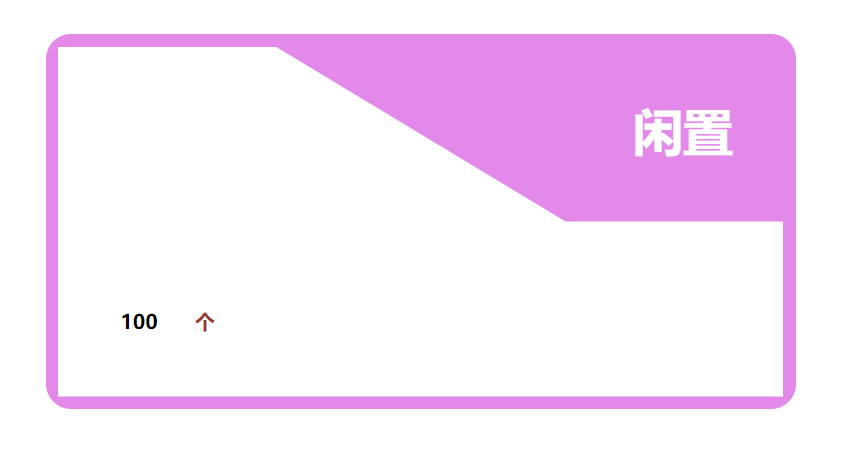

# 长方形中包含一个直角梯形

先看看需要实现的效果图：



可以通过 clip-path 实现：

<details>
  <summary>查看代码</summary>

```
<div class="container">
  <div class="top">闲置</div>
  <div class="bottom">100 <span>个</span></div>
</div>

<style>
* {
  padding: 0;
  margin: 0;
}
.container {
  margin: 100px auto;
  width: 600px;
  height: 300px;
  background: violet;
  border-radius: 20px;
  position: relative;
}
.top {
  text-align: right;
  color: #fff;
  margin: 0 50px;
  padding-top: 50px;
  font-size: 40px;
  font-weight: 700;
}
.bottom {
  width: 580px;
  height: 280px;
  position: absolute;
  top: 10px;
  left: 10px;
  background: #fff;
  display: flex;
  align-items: flex-end;
  font-weight: 700;
  padding-left: 50px;
  padding-bottom: 50px;
  box-sizing: border-box;
  clip-path: polygon(0% 0%, 30% 0px, 70% 50%, 100% 50%, 100% 100%, 0 100%);
}
span {
  color: brown;
  margin-left: 30px;
}
</style>
```

</details>
