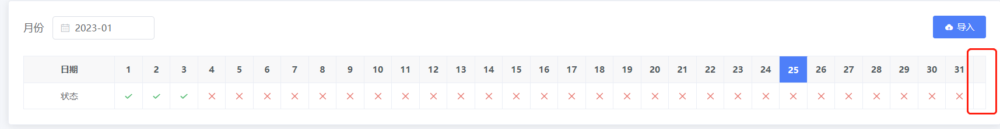
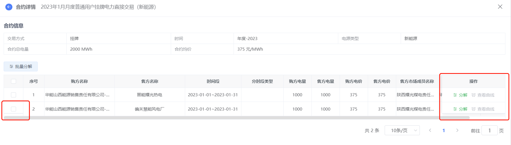
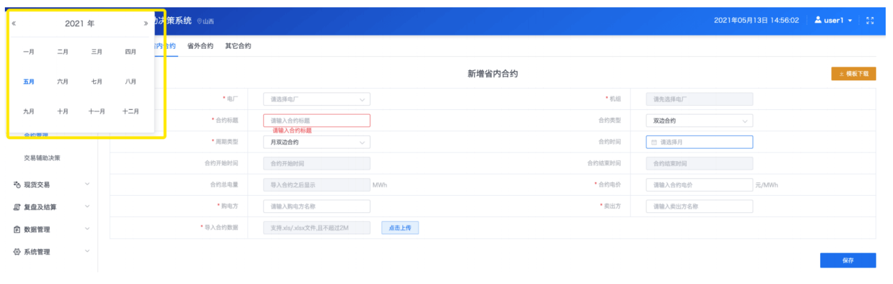

# 开发常见问题-element

## 1、表格动态获取列问题



表格后会多出一列问题，宽度是固定的 17px;是因为给表格添加了高度，这块是显示滚动条导致的，只需将表格的高度去掉。

## 2、表格固定首列和最后一列引发的错乱问题



因为高度没有计算 padding 值所以会导致错乱

> 如果只设置了首列固定，则设置

```javascript
.el-table__fixed {
    height: 100% !important;
}
```

> 如果只设置了右侧固定，则设置

```javascript
.el-table__fixed-right {
    height: 100% !important;
}
```

> 如果前后都固定，则两个都进行设置

```javascript
.el-table__fixed {
    height: 100% !important;
}

.el-table__fixed-right {
    height: 100% !important;
}
```

> 如果固定列下方出现横线

```javascript
  .el-table__fixed::before,
  .el-table__fixed-right::before {
    display: none;
  }
```

> 给左侧固定列设置下边距，主要是解决滚动条不能拖动问题

```javascript
.el-table .el-table__fixed {
    height: auto !important;
    bottom: 10px !important; /* 具体值是多少根据你横向滚动条的高度进行设置 */
  }
```

> 给右侧固定列设置下边距，主要是解决滚动条不能拖动问题

```javascript
.el-table .el-table__fixed-right {
    height: auto !important;
    bottom: 10px !important; /* 具体值是多少根据你横向滚动条的高度进行设置 */
  }
```

## 3、日期选择器定位错乱



切换类型时，日期选择器出现位置紧贴左上边缘问题，有两种解决方案

1、将 v-if 改为 v-show

2、给每一个 el-date-picker 加上唯一 key 即可

## 4、vue 使用 element 做表单提交时，同时验证多个 form

> 项目中遇到多个表单同时提交，内容太多分成两个 form 表单，一个是 basicForm，一个是 advanceForm，点击确定按钮时同时校验，验证通过提交表单，有一个不通过则不提交，以下是代码

```javascript
async saveInfo() {
    try {
        await Promise.all([
            this.$refs.basicForm.validate(),
            this.$refs.advanceForm.validate()
        ])
    } catch(error) {
        return
    }
}
```

## 5、@submit.native.prevent

> 顶部搜索区域只有一个搜索条件并且是输入框时，输入内容回车阻止刷新页面，需要加@submit.native.prevent

## 6、使用 element 给表头单元格添加斜线分割线

先看下效果图，表头第一个单元格使用斜线分割。


html 代码

```javascript
<el-table-column label="时段" align="right" width="150">
  <el-table-column
    prop="month"
    label="月度"
    width="120"
    align="center"
    header-align="left"
  ></el-table-column>
</el-table-column>
```

::: danger 注意：
在 el-table-column 上添加了 align 和 header-align 两个属性，header-align 是表头的对齐方式，而 align 是表格内容的对齐方式，所以可以根据不同的原型图进行相关设置。
:::

css 代码

```javascript
::v-deep .el-table thead.is-group th {
  background: none;
}
::v-deep .el-table thead.is-group tr:first-of-type th:first-of-type {
  border-bottom: none;
}
::v-deep .el-table thead.is-group tr:first-of-type th:first-of-type:before {
  content: "";
  position: absolute;
  width: 1px;
  height: 82px; /*这里需要自己调整，根据td的宽度和高度*/
  top: 0;
  left: 0;
  background-color: #bbb;
  opacity: 0.3;
  display: block;
  transform: rotate(-58deg); /*这里需要自己调整，根据线的位置*/
  transform-origin: top;
}
::v-deep .el-table thead.is-group tr:last-of-type th:first-of-type:before {
  content: "";
  position: absolute;
  width: 1px;
  height: 82px; /*这里需要自己调整，根据td的宽度和高度*/
  bottom: 0;
  right: 0;
  background-color: #bbb;
  opacity: 0.3;
  display: block;
  transform: rotate(-59.9deg); /*这里需要自己调整，根据线的位置*/
  transform-origin: bottom;
}
```

:::danger 注意：
代码中有注释的地方是需要自己手动去微调的，其实就是将时段和月度分成两个元素，然后使用 rotate 调整角度，使两条线完全重合。
:::

## 7、el-input type=number 时输入中文，焦点上移

当 el-input 设置 type="number" 时，输入中文，虽然中文不会显示出来，但焦点会上移

解决方案：

```javascript
<style scoped>
::v-deep .el-input__inner {
    line-height: 1px !important;
}
</style>
```

## 8、el-input type=number 去除聚焦时的上下箭头

解决方案：

```javascript
<el-input class="clear-number-input" type="number"></el-input>

<style scoped>
.clear-number-input ::v-deep input[type="number"]::-webkit-outer-spin-button,
.clear-number-input ::v-deep input[type="number"]::-webkit-inner-spin-button {
    -webkit-appearance: none !important;
}
</style>

```

## 9、el-table 表格多选状态如何禁选

对 elementUI 中 table 表格的多选框进行 可勾选 和 不可勾选 的处理给 type 属性为 selection 的加一个事件:selectable='selected’

```javascript
<el-table-column type="selection" width="55" :selectable="selected"></el-table-column>

selected(row, index) {
	if (row.is_confirm == 1) {
		return false //不可勾选
	} else {
		return true; //可勾选
	}
},

```

## 10、多个 el-table 的数据互串、混淆

同一组件上存在多个 el-table 进行 tabs 和 v-if/v-show 切换时，多表格的数据会相互混淆，串在一起，引发 bug。

:::tip 解决方案：
为每个 table 指定对应且唯一的 key 属性。
:::

## 11、el-select 的 change、el-input 的 input 事件中传递额外参数的实现

el-select 的 change、el-input 的 input 事件都是默认传递了一个参数 -- (value: string | number)。但是很多业务场景，我们都是需要在 change、input 事件中传递自己定义的额外参数。

:::tip 解决方案：
在 change、input 原有事件中多加一层箭头函数传参即可实现

@change="((val)=>{changeStatus(val, xxx)})"

(其中，xxx 即为所传的自定义参数)。
:::

## 12、当 el-select 组件的选择项数据量过大时的处理方法

el-select 下拉框数据从后台获取，如果数据量比较大时，页面非常卡，可以使用以下方式解决

```javascript
// popper-class定义的类，是为了添加loading
<el-select
    v-model="registerNumber"
    placeholder="请选择用户"
    size="mini"
    style="width: 380px"
    class="mr15"
    popper-class="localselect"
    filterable
    remote
    clearable
    v-loadMore="loadmore"
    :remote-method="filterMethodThrottle"
>
    <el-option
        v-for="item in companyList"
        :key="item.registerNumber"
        :label="getCompanyName(item)"
        :value="item.registerNumber"
    >
    </el-option>
</el-select>

computed: {
    // 防抖
    filterMethodThrottle() {
        var time = null;
        return (param) => {
        if (time) {
            clearTimeout(time);
        }
        time = setTimeout(() => {
            // 搜索方法
            this.filterMethod(param);
            clearTimeout(time);
        }, 1000);
        };
    },
},

methods: {
    // 加载更多
    loadmore() {
        this.listData.current++;
        this.getList(false);
    },
    // 模糊搜索
    filterMethod(query) {
      if (query !== "") {
        // 先设置loading效果
        const loading = this.$loading({
          lock: true,
          target: ".localselect",
          spinner: "el-icon-loading",
          background: "rgba(255,255,255,0.8)",
        });
        let obj = {
          size: 99999999,
          current: 1,
        };
        queryUserList(obj).then((res) => {
          if (res) {
            this.companyList = [];
            let companyList = res.map(
              ({ businessCompanyName, registerNumber }) => ({
                name: `${businessCompanyName}(${registerNumber})`,
                businessCompanyName,
                registerNumber,
              })
            );
            setTimeout(() => {
              this.loading = false;
              this.companyList = companyList.filter((item) => {
                return item.name.indexOf(query) > -1 && query.length >= 4;
              });
            }, 200);
            loading.close();
          }
        });
      } else {
        this.companyList = [];
      }
    },
}

```

## 13、前端分页

```javascript
<el-table
    size="mini"
    class="mt15"
    border
    :data="
        tableData.slice(
        (pagination.currentPage - 1) * pagination.pageSize,
        pagination.currentPage * pagination.pageSize
        )
    "
    :row-class-name="tableRowClassName"
    :highlight-current-row="true"
    >
</el-table>
// 分页
<div class="pagination-box text-r mt15">
    <el-pagination
        layout="total, sizes, prev, pager, next, jumper"
        :current-page="pagination.currentPage"
        :page-sizes="pageSizes"
        :page-size="pagination.pageSize"
        :total="pagination.total"
        @size-change="handleSizeChange"
        @current-change="handleCurrentChange"
    ></el-pagination>
</div>
data() {
    return {
        tableData: [],
        // 分页参数
        pagination: {
            currentPage: 1,
            pageSize: 10,
            total: 0,
        },
        pageSizes: [10, 15, 20, 30, 50, 100],
    }
}

methods: {
    handleSizeChange(val) {
      this.pagination.pageSize = val;
    },
    handleCurrentChange(val) {
      this.pagination.currentPage = val;
    },
}

```

## 14、element ui 日期时间选择器取消秒

只需要把展示样式格式改为 format=“yyyy-MM-dd HH:mm” 即可，

如果想把传递给后台的值也去掉秒则加上 value-format=“yyyy-MM-dd HH:mm” 即可

```javascript
<el-date-picker
  v-model="logForm.stop_time"
  format="yyyy-MM-dd HH:mm"
  value-format="yyyy-MM-dd HH:mm"
  type="datetime"
  placeholder="结束时间"
  default-time="18:00:00"
></el-date-picker>
```

## 15、如何让表格在没有数据的情况下，显示--

```javascript
// 在全局CSS中添加以下样式即可：
.el-table tbody td .cell:empty::after {
  content: '--';
}
```
