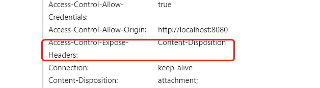
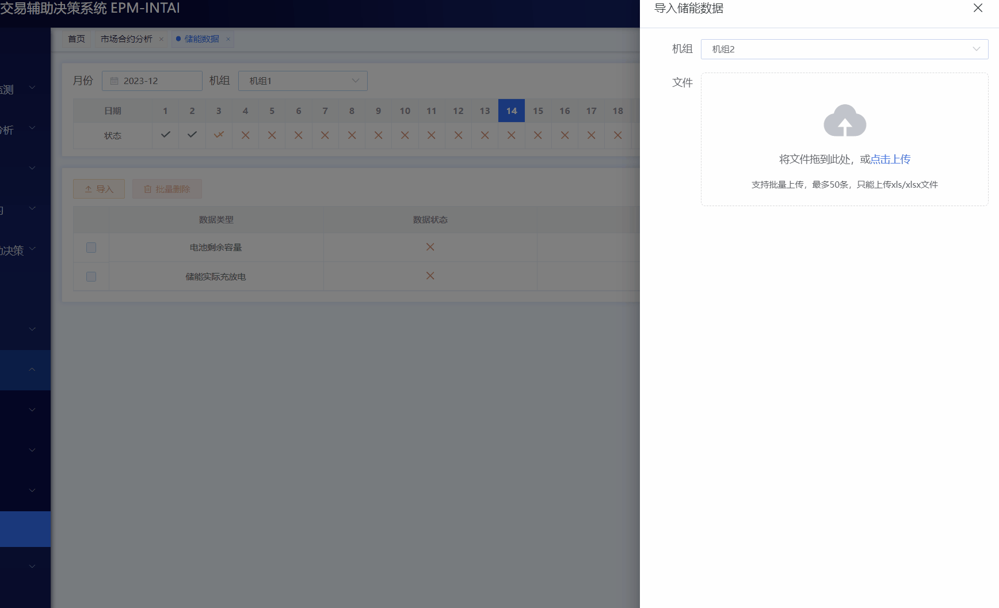

<!--
 * @Author: rk
 * @Description:
 * @Date: 2024-03-01 10:35:04
 * @LastEditors: rk
 * @LastEditTime: 2024-03-18 19:20:51
-->

---

## outline: deep

# 开发常见问题-vue2

## 1、token 设置

系统内嵌到其他系统时，token 不要使用 cookies 存储，而是通过 localStorage 存储
:::tip 提示
由于 Chrome 在 80 版本后，浏览器的 Cookie 新增加了一个 SameSite 属性，用来防止 CSRF 攻击和用户追踪。所以 iframe 内嵌页面无法写入 cookie
:::

## 2、使用 vue 项目中导出时文件名称从后台获取

在做后台管理系统项目时，导出功能后端一般返回文件流或者链接，前端进行相关处理，今天只说文件流相关内容，之前项目中所有的文件名称都是前端进行拼接的，像 xxxx-20231002122415.xlsx 等等，那下载时文件名称如何从后台获取呢？

### 2.1 首先需要后台配置

在响应标头中我们可以看到 Content-Disposition:attachment;filename=xxxxx.xlsx 信息，filename 后边的就是后台返回的文件名称，一般是进行转码的，但是前端一般是拿不到的，需要后端进行配置：

```javascript
response.setHeader("Access-Control-Expose-Headers", "Content-Disposition");
```

### 2.2 配置好后，可以看到相应头部有 Access-Control-Expose-Headers 信息，这个时候可以从 header 中拿到该信息，



```javascript
// 获取后台返回的文件名称
const headerFilename = response.headers["content-disposition"]
  ?.split(";")[1]
  .split("=")[1];
```

拿到 headerFilename 后，因为后端是 encode 过的，所以前端需要 decode 下，但是有时会出现乱码情况，而且 decode 后在其他浏览器可能也存在问题，这里可以一劳永逸的解决。

使用 Node.js 的 iconv-lite 解决中文乱码问题。

```javascript
if (headerFilename) {
  // 对文件名乱码转义--【Node.js】使用iconv-lite解决中文乱码
  let iconv = require("iconv-lite");
  iconv.skipDecodeWarning = true;
  let fileName = iconv.decode(headerFilename, "utf-8");
  data.fileName = fileName;
}
```

## 3、下拉框失焦问题



切换下拉框类型后，然后从文件夹拖文件到导入框，会触发下拉框事件

解决方案：

```javascript
// 新建一个mixins
export default {
  data() {
    return {};
  },
  methods: {
    handleSelectChange(flag) {
      if (flag) {
        this.$refs.selectRef.focus();
      } else {
        this.$refs.selectRef.blur();
      }
    },
  },
};
```

```javascript
// 在下拉框上添加@visible-change事件
<el-select
    ref="selectRef"
    v-model="formParams.gensetId"
    placeholder="请选择机组"
    style="width: 100%"
    filterable
    @visible-change="handleSelectChange"
>
    <el-option
    v-for="item in importParams.gensetList"
    :key="item.id"
    :label="item.label"
    :value="item.id"
    ></el-option>
</el-select>

// 引入mixin
import selectMixin from "@mixins/selectMixin.js";
// 使用mixins
mixins: [selectMixin],
```
