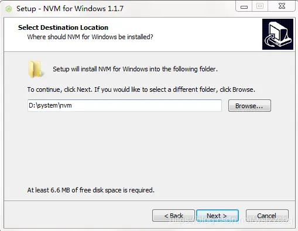
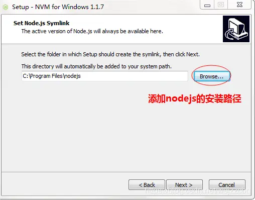

# nvm 安装、使用

## 1、为什么使用 nvm

由于在不同的项目中，所使用的 node 版本可能不一样，所以安装 nvm 可以安装多个 node 版本，这样在不同项目中使用不同的 node。

## 2、[nvm](https://github.com/coreybutler/nvm-windows/releases) 下载地址：

目前已更新到 1.1.12 版本

:::tip 文件介绍：

- nvm-noinstall.zip： 这个是绿色免安装版本，但是使用之前需要配置
- nvm-setup.zip：这是一个安装包，下载之后点击安装，无需配置就可以使用，方便。
- Source code(zip)：zip 压缩的源码
- Sourc code(tar.gz)：tar.gz 的源码，一般用于\*nix 系统

:::

## 3、安装流程

这里以 nvm-setup.zip 安装为准，介绍下安装流程：

### 3.1 安装 nvm 目录



### 3.2 安装 node.js 目录

如果之前有安装 nodejs，这块的目录就是 nodejs 的安装目录，如果之前没有安装，则这块的目录可以自己定义，但是最好和 nvm 放在一起，并且保证目录中没有空格。


安装完成之后，在命令行输入 nvm -v 查看安装版本，显示 nvm 信息则表示安装成功。

## 4、使用

```
 nvm -v： 查看nvm版本
 nvm install 版本号： 安装node版本
 nvm list： 查看已经安装的node版本
 nvm use 版本号： 切换node版本
 nvm uninstall 版本号：卸载指定版本号的node
 npm install -g cnpm --registry=https://registry.npm.taobao.org  //使用淘宝镜像

```
