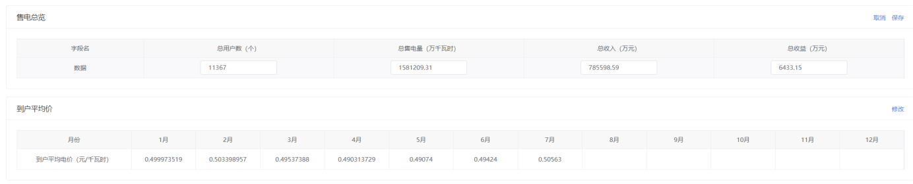

# 前端页面整体布局规范

一般新开发的项目，直接从 vueTemplate 模板复制代码，模板代码是采用最新规范的。

## 1、整体布局

### 1.1 搜索条件

搜索条件在顶部，后边只跟搜索、重置按钮和业务要求的按钮。其他按钮在新的一行位于左侧位置。

### 1.2 模块间距

每个模块之间的间距是 15px，表格和按钮之间的间距是 10px

### 1.3 分页

分页应和表格在一个模块并且靠右位置展示

### 1.4 批量删除

如果列表中有删除，则在顶部按钮中添加批量删除功能（即使原型图没有）

### 1.5 无数据展示

如果页面没有数据，则展示暂无数据组件，如果是 404 或者 500，则跳转到相应页面

## 2、按钮

### 2.1 按钮类型

系统中所有按钮默认采用以下三种类型的按钮，按钮圆角统一为 2px

### 2.2 按钮大小

一级按钮大小 size 采用 small，带图标；二级按钮大小 size 采用 mini，不带图标；三级按钮（文字按钮）默认为 mini，不用设置 size 属性，带图标


### 2.3 方法

按钮上的方法如果不需要传参，则不用加()

### 2.4 confirm 中的按钮大小设置

> 系统中的按钮在 vue2 中使用的是 mini,在 vue3 中使用的是 small

（1）vue2+element

添加 cancelButtonClass 和 confirmButtonClass 属性，对样式进行复写。

```javascript
// 删除
handleDataDelete() {
    this.$confirm("确定删除「" + row.subTypeName + "」吗?", "提示", {
        confirmButtonText: "确定",
        cancelButtonText: "取消",
        cancelButtonClass: "el-button--mini",
        confirmButtonClass: "el-button--mini",
        type: "warning",
      })
}
```

（2）vue3+element-plus

添加 buttonSize 属性，对样式进行复写

```javascript
ElMessageBox.confirm(content, title, {
  confirmButtonText: "确定",
  cancelButtonText: "取消",
  type: "warning",
  buttonSize: "small",
});
```

### 2.5 常用按钮方法名称定义

```javascript
搜索: search(带分页)，getTableList(不带分页)
重置: handleFormReset
刷新: handleDataFresh
新增: handleDataAdd
【修改|编辑】: handleDataEdit
【详情|查看】: handleDetailClick
【删除|批量删除】: handleDataDelete
【导入|上传】: handleFileImport
【导出|下载】: handleFileExport
预览: handleFilePreview
确定: handleDataSure|handleFormSure
提交: handleFormSubmit
保存: handleDataSave
取消: handleCancel
取消弹窗: handleDialogCancel
关闭弹窗: handleDialogClose
关闭抽屉: handleDrawerClose
文件状态改变事件: handleFileChange
文件超出限制事件: handleFileExceed
文件移除事件: handleFileRemove
重新添加事件: handleFileAdd
确认上传事件: handleFileSure
【展开|收起】: handleToggle
```

## 3、表单

### 3.1 搜索条件中的表单

顶部搜索表单大小 size 采用 mini，el-form-item 标签是否显示 label 根据实际情况来定，显示 label 时一般不需要指定 label-width

### 3.2 数据表单

数据表单大小 size 采用 mini，el-form-item 标签显示 label，根据实际情况来确定是否需要指定 label-width，label-position 统一采用左对齐

### 3.3 表单校验

数据表单必填时添加 rule 校验规则，如果有手机号、邮箱等非必填项时，也是需要添加校验的。校验的提示语尽量友好、正面，如：请输入数字和字母，尽量避免出现不能、不要、请勿等给人命令式的语句


### 3.4 表单数据处理

所有的 input 表单绑定数据时，需要添加.trim 去除空格。如果输入需要限制整数、浮点数等，则添加对应的自定义指令

### 3.5 时间范围

时间范围的表单使用一个字段绑定值，传递给后台的是一个数组[start,end]。如果是跳选，则数组为[time1,time2,time3../...]

## 4、表格

### 4.1 属性设置

表格默认显示 border，size 设置 mini

### 4.2 列宽设置

表格中所有的列不要换行，添加表头宽度，表格内容太长需要添加：show-overflow-tooltip=”true”

### 4.3 清除选中状态

表格删除和批量删除要加二次确认。如果是批量操作时，点击二次弹窗中取消，则需要清除表格多选状态

### 4.4 背景色设置

表格中需要给某行某列添加背景色，背景色颜色和表头颜色一致

### 4.5 某个字段无值处理

表格中如果某个字段没有返回值，则使用【-】代替，避免空白展示

### 4.6 添加 max-height

如果是非分页的表格，内容太长，则添加 max-height，使得表格内部滚动

### 4.7 数据处理

表格中数据比较大时，需要使用千分位分隔数据，其他展示区域一致

### 4.8 固定列

表格列比较多时，根据业务需要固定左侧列和右侧列，一般右侧的操作栏需要固定

## 5、弹窗

### 5.1 弹窗样式布局

弹窗标题靠左显示，内容居中，按钮靠右显示

### 5.2 按钮设置

一般弹窗底部的按钮，顺序为：取消|关闭、【下载模板】、保存|确认|确定。取消、保存或者确认文案中间添加空格


## 6、抽屉

### 6.1 导入统一使用抽屉

导入使用抽屉，宽度 500px。使用 el-row 布局，el-col 设置 24，重新添加和确认上传也使用 el-col 包裹。上传提示语不需要使用 slot 插槽，直接在 el-upload\_\_tip 中编写。底部只需要关闭按钮。导入根据业务需要是否展示错误数据弹窗，错误数据是公共组件，直接传值引用


### 6.2 详情

详情或者其他内容比较多的部分，使用抽屉，宽度使用动态计算

vue2 项目用法：

在 mixins 中计算宽度

```javascript
export default {
  data() {
    return {};
  },
  computed: {
    sideWidth() {
      // 此处的sideWidth是左侧菜单栏宽度，展开合起时宽度不一样
      return this.$store.state.settings.sideWidth;
    },
    sizeWidth() {
      return `calc(100% - ${this.sideWidth}px)`;
    },
  },
};
```

在用到的地方引入使用

```javascript
<el-drawer
  :size="sizeWidth"
  :title="detailParams.title"
  :visible.sync="detailParams.visible"
  :append-to-body="true"
  :wrapper-closable="false"
  @close="handleDrawerClose"
  >
</el-drawer>

// mixins
import drawerWidthMixins from "@mixins/drawerWidth.js";
mixins: [drawerWidthMixins],
```

vue3 项目使用：

```javascript
<el-drawer
  v-model="detailParams.visible"
  :size="sizeWidth"
  :close-on-click-modal="false"
  :close-on-press-escape="false"
  :before-close="handleDrawerCancel"
  >
</el-drawer>

// 使用computed获取左侧菜单栏宽度
const sideWidth = computed(() => settingStore.sideWidth)
const sizeWidth = computed(() => `calc(100% - ${sideWidth.value}px)`)
```

### 6.3 抽屉高度设置

抽屉高度根据内容设置高度，抽屉内部上下滚动展示，避免外部页面滚动条也进行滚动

### 6.4 按钮设置

取消、关闭、保存或者确认文案中间添加空格

## 7、卡片

### 7.1 卡片头部的按钮

每一个卡片的内容需要编辑时，将【编辑|修改】、取消、保存按钮放置在卡片头部靠右，按钮需要使用文字按钮


## 8、echarts

### 8.1 折线图相关功能

如果是折线图，则需要加上面积图切换功能和全屏功能。如果需要展示表格，则在图表下边展示表格，使用【收起|展开】按钮控制显隐。如果多个图表 x 轴值相同，则需要添加联动

### 8.2 图表和表格切换

如果图表既要展示表格，又要展示图表，后端只返回表格数据，图表数据需要前端组装需要的结构

### 8.3 图表高度

一般 echarts 自定义高度是 150px 或 180px，不要设置太大


## 9、其他

### 9.1 页面中的字典数据处理

页面中所有的字典数据回显，不要在 dom 结构中去判断不同条件显示不同的值，而是用数组取下标或者封装的字典方法取值


